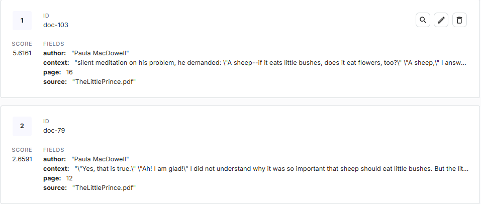

<style>
.custom {
    background-color: #008d8d;
    color: white;
    padding: 0.25em 0.5em 0.25em 0.5em;
    white-space: pre-wrap;       /* css-3 */
    white-space: -moz-pre-wrap;  /* Mozilla, since 1999 */
    white-space: -pre-wrap;      /* Opera 4-6 */
    white-space: -o-pre-wrap;    /* Opera 7 */
    word-wrap: break-word;
}

pre {
    background-color: #027c7c;
    padding-left: 0.5em;
}

</style>

# Pinecone

- Author: [ro__o_jun](https://github.com/ro-jun)
- Design: []()
- Peer Review: 
- This is a part of [LangChain Open Tutorial](https://github.com/LangChain-OpenTutorial/LangChain-OpenTutorial)

[](https://colab.research.google.com/github/LangChain-OpenTutorial/LangChain-OpenTutorial/blob/main/08-Embeeding/01-OpenAIEmbeddings.ipynb) [](https://github.com/LangChain-OpenTutorial/LangChain-OpenTutorial/blob/main/08-Embeeding/01-OpenAIEmbeddings.ipynb)

## Overview

This tutorial provides a comprehensive guide to integrating `Pinecone` with `LangChain` for creating and managing high-performance vector databases.  

It explains how to set up `Pinecone` , `preprocess documents` , and utilize Pinecone's APIs for vector indexing and `document retrieval` .  

Additionally, it demonstrates advanced features like `hybrid search` using `dense` and `sparse embeddings` , `metadata filtering` , and `dynamic reranking` to build efficient and scalable search systems.  

### Table of Contents

- [Overview](#overview)
- [Environment Setup](#environment-setup)
- [What is Pinecone?](#what-is-pinecone)
- [Pinecone setup guide](#Pinecone-setup-guide)
- [Data preprocessing](#data-preprocessing)
- [Pinecone and LangChain Integration Guide: Step by Step](#pinecone-and-langchain-integration-guide-step-by-step)
- [Pinecone: Add to DB Index (Upsert)](#pinecone-add-to-db-index-upsert)
- [Index inquiry/delete](#index-inquirydelete)
- [Create HybridRetrieve](#create-hybridretrieve)

### References

- [Langchain-PineconeVectorStore](https://python.langchain.com/api_reference/pinecone/vectorstores/langchain_pinecone.vectorstores.PineconeVectorStore.html)
- [Langchain-Retrievers](https://python.langchain.com/docs/integrations/retrievers/pinecone_hybrid_search/)
- [Pinecone-Docs](https://docs.pinecone.io/guides/get-started/overview)
- [Pinecone-Docs-integrations](https://docs.pinecone.io/integrations/langchain)
----

## Environment Setup

Set up the environment. You may refer to [Environment Setup](https://wikidocs.net/257836) for more details.

**[Note]**
- `langchain-opentutorial` is a package that provides a set of easy-to-use environment setup, useful functions and utilities for tutorials. 
- You can checkout the [`langchain-opentutorial`](https://github.com/LangChain-OpenTutorial/langchain-opentutorial-pypi) for more details.

```python
%%capture --no-stderr
%pip install langchain-opentutorial
```

<pre class="custom">
    [notice] A new release of pip is available: 24.3.1 -> 25.0.1
    [notice] To update, run: python.exe -m pip install --upgrade pip
</pre>

```python
# Install required packages
from langchain_opentutorial import package

package.install(
    [
        "langchain-pinecone",
        "pinecone[grpc]",
        "nltk",
        "langchain_community",
        "pymupdf",
        "langchain-openai",
        "pinecone-text",
    ],
    verbose=False,
    upgrade=False,
)
```

```python
# Set environment variables
from langchain_opentutorial import set_env

set_env(
    {
        "OPENAI_API_KEY": "",
        "PINECONE_API_KEY": "",
        "LANGCHAIN_API_KEY": "",
        "LANGCHAIN_TRACING_V2": "true",
        "LANGCHAIN_ENDPOINT": "https://api.smith.langchain.com",
        "LANGCHAIN_PROJECT": "Pinecone",
    },
)
```

<pre class="custom">Environment variables have been set successfully.
</pre>

[Note] If you are using a `.env` file, proceed as follows.

```python
from dotenv import load_dotenv

load_dotenv(override=True)
```


<pre class="custom">True</pre>


## What is Pinecone?

`Pinecone` is a **cloud-based** , high-performance vector database for **efficient vector storage and retrieval** in AI and machine learning applications.

**Features** :
1. **Supports SDKs** for Python, Node.js, Java, and Go.
2. **Fully managed** : Reduces the burden of infrastructure management.
3. **Real-time updates** : Supports real-time insertion, updates, and deletions.

**Advantages** :
1. Scalability for large datasets.
2. Real-time data processing.
3. High availability with cloud infrastructure.

**Disadvantages** :
1. Relatively higher cost compared to other vector databases.
2. Limited customization options.

## Pinecone setup guide

This section explains how to set up `Pinecone` , including `API key` creation.

**[steps]**

1. Log in to [Pinecone](https://www.pinecone.io/)
2. Create an API key under the `API Keys` tab.

  
  

## Data preprocessing

Below is the preprocessing process for general documents.  
Reads all `data/*.pdf` files under `ROOT_DIR` and saves them in `document_lsit.`

```python
from utils.pinecone import DocumentProcessor

directory_path = "data/*.pdf"
doc_processor = DocumentProcessor(
    directory_path=directory_path,
    chunk_size=300,
    chunk_overlap=50,
    use_basename=True,
)
split_docs = doc_processor.process_pdf_files(directory_path)

print(f"Number of processed documents: {len(split_docs)}")
```

<pre class="custom">[INFO] Processed 414 documents from 1 files.
    Number of processed documents: 414
</pre>

```python
split_docs[12].page_content
```


<pre class="custom">'up. I have a serious reason: he is the best friend I have in the world. I have another reason: this grown-up understands everything, even books about children. I have a third reason: he lives in France where he is hungry and cold. He needs cheering up. If all these'</pre>


```python
split_docs[12].metadata
```


<pre class="custom">{'source': 'TheLittlePrince.pdf',
     'file_path': 'data\\TheLittlePrince.pdf',
     'page': 2,
     'total_pages': 64,
     'format': 'PDF 1.3',
     'title': '',
     'author': 'Paula MacDowell',
     'subject': '',
     'keywords': '',
     'creator': 'Safari',
     'producer': 'Mac OS X 10.10.5 Quartz PDFContext',
     'creationDate': "D:20160209011144Z00'00'",
     'modDate': "D:20160209011144Z00'00'",
     'trapped': ''}</pre>


Performs document processing to save DB in Pinecone. You can select `metadata_keys` during this process.

You can additionally tag metadata and, if desired, add and process metadata ahead of time in a preprocessing task.

- `split_docs` : List[Document] containing the results of document splitting.
- `metadata_keys` : List containing metadata keys to be added to the document.
- `min_length` : Specifies the minimum length of the document. Documents shorter than this length are excluded.
- `use_basename` : Specifies whether to use the file name based on the source path. The default is `False` .

**Preprocessing of documents**

- Extract the required `metadata` information.
- Filters only data longer than the minimum length.
- Specifies whether to use the document's `basename` . The default is `False` .
- Here, `basename` refers to the very last part of the file.
- For example, `/data/TheLittlePrince.pdf` becomes `TheLittlePrince.pdf`.


```python
contents, metadatas = doc_processor.preprocess_documents(docs=split_docs, min_length=10)

print(f"Number of processed documents: {len(contents)}")
print(f"Metadata keys: {list(metadatas.keys())}")
print(f"Sample 'source' metadata: {metadatas['source'][:5]}")
```

<pre class="custom">Preprocessing documents: 100%|██████████| 414/414 [00:00<00:00, 31331.84it/s]</pre>

    Number of processed documents: 414
    Metadata keys: ['source', 'page', 'author']
    Sample 'source' metadata: ['TheLittlePrince.pdf', 'TheLittlePrince.pdf', 'TheLittlePrince.pdf', 'TheLittlePrince.pdf', 'TheLittlePrince.pdf']
    

    
    

```python
# Check number of documents, check number of sources, check number of pages
len(contents), len(metadatas["source"]), len(metadatas["page"]), len(
    metadatas["author"]
)
```


<pre class="custom">(414, 414, 414, 414)</pre>


## Pinecone and LangChain Integration Guide: Step by Step

This guide outlines the integration of Pinecone and LangChain to set up and utilize a vector database. 

Below are the key steps to complete the integration.

### Pinecone client initialization and vector database setup

The provided code performs the initialization of a Pinecone client, sets up an index in Pinecone, and defines a vector database to store embeddings.

**[caution]**    

If you are considering HybridSearch, specify the metric as dotproduct.  
Basic users cannot use PodSpec.  

### Pinecone index settings

**This explains how to create and check indexes.**

```python
import os
from utils.pinecone import PineconeDocumentManager

# Initialize Pinecone client with API key from environment variables
pc_db = PineconeDocumentManager(api_key=os.environ.get("PINECONE_API_KEY"))
pc_db
```


<pre class="custom"><utils.pinecone.PineconeDocumentManager at 0x18a2d5fffd0></pre>


```python
# Check existing index names
pc_db.check_indexes()
```

<pre class="custom">Existing Indexes: [{
        "name": "langchain-opentutorial-index",
        "dimension": 3072,
        "metric": "dotproduct",
        "host": "langchain-opentutorial-index-9v46jum.svc.aped-4627-b74a.pinecone.io",
        "spec": {
            "serverless": {
                "cloud": "aws",
                "region": "us-east-1"
            }
        },
        "status": {
            "ready": true,
            "state": "Ready"
        },
        "deletion_protection": "disabled"
    }, {
        "name": "langchain-opentutorial-multimodal-1024",
        "dimension": 1024,
        "metric": "dotproduct",
        "host": "langchain-opentutorial-multimodal-1024-9v46jum.svc.aped-4627-b74a.pinecone.io",
        "spec": {
            "serverless": {
                "cloud": "aws",
                "region": "us-east-1"
            }
        },
        "status": {
            "ready": true,
            "state": "Ready"
        },
        "deletion_protection": "disabled"
    }]
</pre>

```python
from pinecone import ServerlessSpec, PodSpec

# Create or reuse the index
index_name = "langchain-opentutorial-index"

# Set to True when using the serverless method, and False when using the PodSpec method.
use_serverless = True
if use_serverless:
    spec = ServerlessSpec(cloud="aws", region="us-east-1")
else:
    spec = PodSpec(environment="us-west1-gcp", pod_type="p1.x1", pods=1)

pc_db.create_index(
    index_name=index_name,
    dimension=3072,
    metric="dotproduct",
    spec=spec,
)
```

<pre class="custom">Using existing index: langchain-opentutorial-index
</pre>


    <pinecone.grpc.index_grpc.GRPCIndex at 0x18a2dea3c50>


**This is how to check the inside of an index.**

```python
index = pc_db.get_index(index_name)
print(index.describe_index_stats())
```

<pre class="custom">{'dimension': 3072,
     'index_fullness': 0.0,
     'namespaces': {'langchain-opentutorial-01': {'vector_count': 414}},
     'total_vector_count': 414}
</pre>


**This is how to clear an index.**

**[Note]** If you want to delete the index, uncomment the lines below and run the code.

```python
# index_name = "langchain-opentutorial-index2"

# pc_db.delete_index(index_name)
# print(pc_db.list_indexes())
```

## Create Sparse Encoder

- Create a sparse encoder.

- Perform stopword processing.

- Learn contents using Sparse Encoder. The encode learned here is used to create a Sparse Vector when storing documents in VectorStore.


Simplified NLTK-based BM25 tokenizer

```python
from utils.pinecone import NLTKBM25Tokenizer

tokenizer = NLTKBM25Tokenizer()
```

<pre class="custom">[INFO] Downloading NLTK stopwords and punkt tokenizer...
    [INFO] NLTK setup completed.
</pre>

    [nltk_data] Downloading package stopwords to
    [nltk_data]     C:\Users\thdgh\AppData\Roaming\nltk_data...
    [nltk_data]   Package stopwords is already up-to-date!
    [nltk_data] Downloading package punkt to
    [nltk_data]     C:\Users\thdgh\AppData\Roaming\nltk_data...
    [nltk_data]   Package punkt is already up-to-date!
    

Tokenization test

```python
text = "This is an example text, and it contains some punctuation and stop words."
tokens = tokenizer(text)

print("Before stop words modification:", tokenizer(text))
tokenizer.add_stop_words(["text", "stop"])
print("\nAfter adding stop words:", tokenizer(text))
tokenizer.remove_stop_words(["text", "stop"])
print("\nAfter removing stop words:", tokenizer(text))
```

<pre class="custom">Before stop words modification: ['example', 'text', 'contains', 'punctuation', 'stop', 'words']
    
    After adding stop words: ['example', 'contains', 'punctuation', 'words']
    
    After removing stop words: ['example', 'text', 'contains', 'punctuation', 'stop', 'words']
</pre>

Create Sparse Encoder

```python
from pinecone_text.sparse import BM25Encoder

sparse_encoder = BM25Encoder()

# Connect custom tokenizer
sparse_encoder._tokenizer = tokenizer
```

```python
# sparse_encoder test
test_corpus = ["This is a text document.", "Another document for testing."]
sparse_encoder.fit(test_corpus)

print(sparse_encoder.encode_documents("Test document."))
```


<pre class="custom">  0%|          | 0/2 [00:00<?, ?it/s]</pre>


    {'indices': [3127628307, 3368723024], 'values': [0.49504950495049505, 0.49504950495049505]}
    

Train the corpus on Sparse Encoder.

- `save_path` : Path to save Sparse Encoder. Later, the Sparse Encoder saved in pickle format will be loaded and used for query embedding. Therefore, specify the path to save it.

```python
import pickle

save_path = "./sparse_encoder.pkl"

# Learn and save Sparse Encoder.
sparse_encoder.fit(contents)
with open(save_path, "wb") as f:
    pickle.dump(sparse_encoder, f)
print(f"[fit_sparse_encoder]\nSaved Sparse Encoder to: {save_path}")
```


<pre class="custom">  0%|          | 0/414 [00:00<?, ?it/s]</pre>


    [fit_sparse_encoder]
    Saved Sparse Encoder to: ./sparse_encoder.pkl
    

[Optional]  
Below is the code to use when you need to reload the learned and saved Sparse Encoder later.

```python
file_path = "./sparse_encoder.pkl"

# It is used later to load the learned sparse encoder.
try:
    with open(file_path, "rb") as f:
        loaded_file = pickle.load(f)
    print(f"[load_sparse_encoder]\nLoaded Sparse Encoder from: {file_path}")
    sparse_encoder = loaded_file
except Exception as e:
    print(f"[load_sparse_encoder]\n{e}")
    sparse_encoder = None
```

<pre class="custom">[load_sparse_encoder]
    Loaded Sparse Encoder from: ./sparse_encoder.pkl
</pre>

## Pinecone: Add to DB Index (Upsert)



- `context`: This is the context of the document.
- `page` : The page number of the document.
- `source` : This is the source of the document.
- `values` : This is an embedding of a document obtained through Embedder.
- `sparse values` : This is an embedding of a document obtained through Sparse Encoder.

Upsert documents in batches without distributed processing.
If the amount of documents is not large, use the method below.

```python
from langchain_openai import OpenAIEmbeddings

openai_embeddings = OpenAIEmbeddings(model="text-embedding-3-large")

# Please set
embedder = openai_embeddings
batch_size = 32
namespace = "langchain-opentutorial-01"

# Running upsert on Pinecone
pc_db.upsert_documents(
    index=index,
    contents=contents,
    metadatas=metadatas,
    embedder=openai_embeddings,
    sparse_encoder=sparse_encoder,
    namespace=namespace,
    batch_size=batch_size,
)
```

<pre class="custom">Processing Batches: 100%|██████████| 13/13 [00:59<00:00,  4.59s/it]</pre>

    {'dimension': 3072,
     'index_fullness': 0.0,
     'namespaces': {'langchain-opentutorial-01': {'vector_count': 414}},
     'total_vector_count': 414}
    

    
    

Below, distributed processing is performed to quickly upsert large documents. Use this for large uploads.

```python
from langchain_openai import OpenAIEmbeddings

openai_embeddings = OpenAIEmbeddings(model="text-embedding-3-large")

embedder = openai_embeddings
# Set batch size and number of workers
batch_size = 32
max_workers = 8
namespace = "langchain-opentutorial-02"

# Running Upsert in Parallel on Pinecone
pc_db.upsert_documents_parallel(
    index=index,
    contents=contents,
    metadatas=metadatas,
    embedder=openai_embeddings,
    sparse_encoder=sparse_encoder,
    namespace=namespace,
    batch_size=batch_size,
    max_workers=max_workers,
)
```

<pre class="custom">Processing Batches in Parallel: 100%|██████████| 13/13 [00:12<00:00,  1.03it/s]
</pre>

    {'dimension': 3072,
     'index_fullness': 0.0,
     'namespaces': {'langchain-opentutorial-01': {'vector_count': 414},
                    'langchain-opentutorial-02': {'vector_count': 0}},
     'total_vector_count': 414}
    

```python
print(index.describe_index_stats())
```

<pre class="custom">{'dimension': 3072,
     'index_fullness': 0.0,
     'namespaces': {'langchain-opentutorial-01': {'vector_count': 414},
                    'langchain-opentutorial-02': {'vector_count': 414}},
     'total_vector_count': 828}
</pre>


## Index inquiry/delete

The `describe_index_stats` method provides statistical information about the contents of an index. This method allows you to obtain information such as the number of vectors and dimensions per namespace.

**Parameter** * `filter` (Optional[Dict[str, Union[str, float, int, bool, List, dict]]]): A filter that returns statistics only for vectors that meet certain conditions. Default is None * `**kwargs`: Additional keyword arguments

**Return value** * `DescribeIndexStatsResponse`: Object containing statistical information about the index

**Usage example** * Default usage: `index.describe_index_stats()` * Apply filter: `index.describe_index_stats(filter={'key': 'value'})`

```python
# Index lookup
index.describe_index_stats()
```


<pre class="custom">{'dimension': 3072,
     'index_fullness': 0.0,
     'namespaces': {'langchain-opentutorial-01': {'vector_count': 414},
                    'langchain-opentutorial-02': {'vector_count': 414}},
     'total_vector_count': 828}</pre>


**Search for documents in the index**

```python
# Define your query
question = "If you come at 4 PM, I will be happy from 3 PM. As time goes by, I will become happier."

# Convert the query into dense and sparse vectors
dense_vector = embedder.embed_query(question)
sparse_vector = sparse_encoder.encode_documents(question)

results = pc_db.search(
    index = index,
    namespace="langchain-opentutorial-01",
    query=dense_vector,
    sparse_vector=sparse_vector,
    top_k=3,
    include_metadata=True,
)

print(results)
```

<pre class="custom">{'matches': [{'id': 'doc-303',
                  'metadata': {'author': 'Paula MacDowell',
                               'context': "o'clock in the afternoon, then at three "
                                          "o'clock I shall begin to be happy. I "
                                          'shall feel happier and happier as the '
                                          "hour advances. At four o'clock, I shall "
                                          'already be worrying and jumping about. '
                                          'I shall show you how',
                               'page': 46.0,
                               'source': 'TheLittlePrince.pdf'},
                  'score': 1.3499277,
                  'sparse_values': {'indices': [], 'values': []},
                  'values': []},
                 {'id': 'doc-304',
                  'metadata': {'author': 'Paula MacDowell',
                               'context': 'happy I am! But if you come at just any '
                                          'time, I shall never know at what hour '
                                          'my heart is to be ready to greet you . '
                                          '. . One must observe the proper rites . '
                                          '. ." "What is a rite?" asked the little '
                                          'prince.',
                               'page': 46.0,
                               'source': 'TheLittlePrince.pdf'},
                  'score': 1.1850042,
                  'sparse_values': {'indices': [], 'values': []},
                  'values': []},
                 {'id': 'doc-98',
                  'metadata': {'author': 'Paula MacDowell',
                               'context': '"I am very fond of sunsets. Come, let '
                                          'us go look at a sunset now." "But we '
                                          'must wait," I said. "Wait? For what?" '
                                          '"For the sunset. We must wait until it '
                                          'is time." At first you seemed to be '
                                          'very much surprised. And then you '
                                          'laughed to yourself. You said to me:',
                               'page': 15.0,
                               'source': 'TheLittlePrince.pdf'},
                  'score': 0.84356034,
                  'sparse_values': {'indices': [], 'values': []},
                  'values': []}],
     'namespace': 'langchain-opentutorial-01',
     'usage': {'read_units': 11}}
</pre>

**Delete namespace**

```python
index.delete(delete_all=True, namespace="langchain-opentutorial-02")
```


<pre class="custom"></pre>


```python
index.describe_index_stats()
```


<pre class="custom">{'dimension': 3072,
     'index_fullness': 0.0,
     'namespaces': {'langchain-opentutorial-01': {'vector_count': 414}},
     'total_vector_count': 414}</pre>


Below are features exclusive to paid users. Metadata filtering is available to paid users.

```python
from pinecone.exceptions import PineconeException

try:
    index.delete(
        filter={"source": {"$eq": "TheLittlePrince.pdf"}},
        namespace="langchain-opentutorial-01",
    )
except PineconeException as e:
    print(f"Error while deleting using filter:\n{e}")

index.describe_index_stats()
```

<pre class="custom">Error while deleting using filter:
    UNKNOWN:Error received from peer  {grpc_message:"Invalid request.", grpc_status:3, created_time:"2025-02-15T15:26:54.3610786+00:00"}
</pre>


    {'dimension': 3072,
     'index_fullness': 0.0,
     'namespaces': {'langchain-opentutorial-01': {'vector_count': 414}},
     'total_vector_count': 414}


## Create HybridRetrieve

**PineconeHybridRetriever initialization parameter settings**

The `init_pinecone_index` function and the `PineconeHybridRetriever` class implement a hybrid search system using Pinecone. This system combines dense and sparse vectors to perform effective document retrieval.

Pinecone index initialization

The `init_pinecone_index` function initializes the Pinecone index and sets up the necessary components.

Parameters 
* `index_name` (str): Pinecone index name 
* `namespace` (str): Namespace to use 
* `api_key` (str): Pinecone API key 
* `sparse_encoder_pkl_path` (str): Sparse encoder pickle file path 
* `stopwords` (List[str]): List of stop words 
* `tokenizer` (str): Tokenizer to use (default: "nltk") 
* `embeddings` (Embeddings): Embedding model 
* `alpha` (float): Weight of dense and sparse vectors Adjustment parameter (default: 0.5)
* `top_k` (int): Maximum number of documents to return (default: 4) 

**Main features** 
1. Pinecone index initialization and statistical information output
2. Sparse encoder (BM25) loading and tokenizer settings
3. Specify namespace


```python
from langchain_openai import OpenAIEmbeddings
from utils.pinecone import PineconeDocumentManager
import os

pc_db = PineconeDocumentManager(api_key=os.environ.get("PINECONE_API_KEY"))

# Settings
index_name = "langchain-opentutorial-index"
namespace = "langchain-opentutorial-01"
embeddings = OpenAIEmbeddings(model="text-embedding-3-large")
sparse_encoder = sparse_encoder  # Pre-initialized BM25Encoder

# Create Hybrid Search Retriever
retriever = pc_db.create_hybrid_search_retriever(
    index_name=index_name,
    embeddings=embeddings,
    sparse_encoder=sparse_encoder,
    namespace=namespace,
    alpha=0.5,
    top_k=4,
)
```

<pre class="custom">[INFO] Hybrid Search Retriever initialized for index 'langchain-opentutorial-index'.
</pre>

**Main properties** 
* `embeddings` : Embedding model for dense vector transformations 
* `sparse_encoder:` Encoder for sparse vector transformations 
* `index` : Pinecone index object 
* `top_k` : Maximum number of documents to return 
* `alpha` : Weight adjustment parameters for dense and sparse vectors 
* `namespace` : Namespace within the Pinecone index.

**Features** 
* HybridSearch Retriever combining dense and sparse vectors 
* Search strategy can be optimized through weight adjustment 
* Various dynamic metadata filtering can be applied (using `search_kwargs` : `filter` , `top_k` , `alpha` , etc.)

**Use example** 
1. Initialize required components with the `init_pinecone_index` function   
2. Create a `PineconeHybridRetriever` instance with initialized components.  
3. Perform a hybrid search using the generated retriever to create a `PineconeHybridRetriever`.

**general search**

```python
query = "If you come at 4 PM, I will be happy from 3 PM. As time goes by, I will become happier."
search_results = retriever(query)

for result in search_results:
    print("Page Content:", result["metadata"]["context"])
    print("Metadata:", result["metadata"])
    print("\n====================\n")
```

<pre class="custom">Page Content: o'clock in the afternoon, then at three o'clock I shall begin to be happy. I shall feel happier and happier as the hour advances. At four o'clock, I shall already be worrying and jumping about. I shall show you how
    Metadata: {'context': "o'clock in the afternoon, then at three o'clock I shall begin to be happy. I shall feel happier and happier as the hour advances. At four o'clock, I shall already be worrying and jumping about. I shall show you how", 'page': 46.0, 'author': 'Paula MacDowell', 'source': 'TheLittlePrince.pdf'}
    
    ====================
    
    Page Content: happy I am! But if you come at just any time, I shall never know at what hour my heart is to be ready to greet you . . . One must observe the proper rites . . ." "What is a rite?" asked the little prince.
    Metadata: {'context': 'happy I am! But if you come at just any time, I shall never know at what hour my heart is to be ready to greet you . . . One must observe the proper rites . . ." "What is a rite?" asked the little prince.', 'page': 46.0, 'author': 'Paula MacDowell', 'source': 'TheLittlePrince.pdf'}
    
    ====================
    
    Page Content: of misunderstandings. But you will sit a little closer to me, every day . . ." The next day the little prince came back. "It would have been better to come back at the same hour," said the fox. "If, for example, you come at four
    Metadata: {'context': 'of misunderstandings. But you will sit a little closer to me, every day . . ." The next day the little prince came back. "It would have been better to come back at the same hour," said the fox. "If, for example, you come at four', 'page': 46.0, 'author': 'Paula MacDowell', 'source': 'TheLittlePrince.pdf'}
    
    ====================
    
    Page Content: "I am very fond of sunsets. Come, let us go look at a sunset now." "But we must wait," I said. "Wait? For what?" "For the sunset. We must wait until it is time." At first you seemed to be very much surprised. And then you laughed to yourself. You said to me:
    Metadata: {'context': '"I am very fond of sunsets. Come, let us go look at a sunset now." "But we must wait," I said. "Wait? For what?" "For the sunset. We must wait until it is time." At first you seemed to be very much surprised. And then you laughed to yourself. You said to me:', 'page': 15.0, 'author': 'Paula MacDowell', 'source': 'TheLittlePrince.pdf'}
    
    ====================
    
</pre>

Using dynamic search_kwargs - k: specify maximum number of documents to return

```python
query = "If you come at 4 PM, I will be happy from 3 PM. As time goes by, I will become happier."

search_kwargs = {"top_k": 2}
search_results = retriever(query, **search_kwargs)

for result in search_results:
    print("Page Content:", result["metadata"]["context"])
    print("Metadata:", result["metadata"])
    print("\n====================\n")
```

<pre class="custom">Page Content: o'clock in the afternoon, then at three o'clock I shall begin to be happy. I shall feel happier and happier as the hour advances. At four o'clock, I shall already be worrying and jumping about. I shall show you how
    Metadata: {'context': "o'clock in the afternoon, then at three o'clock I shall begin to be happy. I shall feel happier and happier as the hour advances. At four o'clock, I shall already be worrying and jumping about. I shall show you how", 'page': 46.0, 'author': 'Paula MacDowell', 'source': 'TheLittlePrince.pdf'}
    
    ====================
    
    Page Content: happy I am! But if you come at just any time, I shall never know at what hour my heart is to be ready to greet you . . . One must observe the proper rites . . ." "What is a rite?" asked the little prince.
    Metadata: {'context': 'happy I am! But if you come at just any time, I shall never know at what hour my heart is to be ready to greet you . . . One must observe the proper rites . . ." "What is a rite?" asked the little prince.', 'page': 46.0, 'author': 'Paula MacDowell', 'source': 'TheLittlePrince.pdf'}
    
    ====================
    
</pre>


Use dynamic `search_kwargs` - `alpha` : Weight adjustment parameters for dense and sparse vectors. Specify a value between 0 and 1. `0.5` is the default, the closer it is to 1, the higher the weight of the dense vector is.

```python
query = "If you come at 4 PM, I will be happy from 3 PM. As time goes by, I will become happier."

search_kwargs = {"alpha": 1, "top_k": 2}
search_results = retriever(query, **search_kwargs)

for result in search_results:
    print("Page Content:", result["metadata"]["context"])
    print("Metadata:", result["metadata"])
    print("\n====================\n")
```

<pre class="custom">Page Content: o'clock in the afternoon, then at three o'clock I shall begin to be happy. I shall feel happier and happier as the hour advances. At four o'clock, I shall already be worrying and jumping about. I shall show you how
    Metadata: {'context': "o'clock in the afternoon, then at three o'clock I shall begin to be happy. I shall feel happier and happier as the hour advances. At four o'clock, I shall already be worrying and jumping about. I shall show you how", 'page': 46.0, 'author': 'Paula MacDowell', 'source': 'TheLittlePrince.pdf'}
    
    ====================
    
    Page Content: of misunderstandings. But you will sit a little closer to me, every day . . ." The next day the little prince came back. "It would have been better to come back at the same hour," said the fox. "If, for example, you come at four
    Metadata: {'context': 'of misunderstandings. But you will sit a little closer to me, every day . . ." The next day the little prince came back. "It would have been better to come back at the same hour," said the fox. "If, for example, you come at four', 'page': 46.0, 'author': 'Paula MacDowell', 'source': 'TheLittlePrince.pdf'}
    
    ====================
    
</pre>

```python
query = "If you come at 4 PM, I will be happy from 3 PM. As time goes by, I will become happier."

search_kwargs = {"alpha": 0, "top_k": 2}
search_results = retriever(query, **search_kwargs)

for result in search_results:
    print("Page Content:", result["metadata"]["context"])
    print("Metadata:", result["metadata"])
    print("\n====================\n")
```

<pre class="custom">Page Content: o'clock in the afternoon, then at three o'clock I shall begin to be happy. I shall feel happier and happier as the hour advances. At four o'clock, I shall already be worrying and jumping about. I shall show you how
    Metadata: {'context': "o'clock in the afternoon, then at three o'clock I shall begin to be happy. I shall feel happier and happier as the hour advances. At four o'clock, I shall already be worrying and jumping about. I shall show you how", 'page': 46.0, 'author': 'Paula MacDowell', 'source': 'TheLittlePrince.pdf'}
    
    ====================
    
    Page Content: happy I am! But if you come at just any time, I shall never know at what hour my heart is to be ready to greet you . . . One must observe the proper rites . . ." "What is a rite?" asked the little prince.
    Metadata: {'context': 'happy I am! But if you come at just any time, I shall never know at what hour my heart is to be ready to greet you . . . One must observe the proper rites . . ." "What is a rite?" asked the little prince.', 'page': 46.0, 'author': 'Paula MacDowell', 'source': 'TheLittlePrince.pdf'}
    
    ====================
    
</pre>

**Metadata filtering**


Using dynamic search_kwargs - filter: Apply metadata filtering

(Example) Search with a value less than 25 pages.

```python
query = "If you come at 4 PM, I will be happy from 3 PM. As time goes by, I will become happier."

search_kwargs = {"alpha": 1, "top_k": 3, "filter": {"page": {"$lt": 25}}}
search_results = retriever(query, **search_kwargs)

for result in search_results:
    print("Page Content:", result["metadata"]["context"])
    print("Metadata:", result["metadata"])
    print("\n====================\n")
```

<pre class="custom">Page Content: "I am very fond of sunsets. Come, let us go look at a sunset now." "But we must wait," I said. "Wait? For what?" "For the sunset. We must wait until it is time." At first you seemed to be very much surprised. And then you laughed to yourself. You said to me:
    Metadata: {'context': '"I am very fond of sunsets. Come, let us go look at a sunset now." "But we must wait," I said. "Wait? For what?" "For the sunset. We must wait until it is time." At first you seemed to be very much surprised. And then you laughed to yourself. You said to me:', 'page': 15.0, 'author': 'Paula MacDowell', 'source': 'TheLittlePrince.pdf'}
    
    ====================
    
    Page Content: Hum! That will be about--about--that will be this evening about twenty minutes to eight. And you will see how well I am obeyed!" The little prince yawned. He was regretting his lost sunset. And then, too, he was already beginning to be a little bored.
    Metadata: {'context': 'Hum! That will be about--about--that will be this evening about twenty minutes to eight. And you will see how well I am obeyed!" The little prince yawned. He was regretting his lost sunset. And then, too, he was already beginning to be a little bored.', 'page': 24.0, 'author': 'Paula MacDowell', 'source': 'TheLittlePrince.pdf'}
    
    ====================
    
    Page Content: "I am always thinking that I am at home!" Just so. Everybody knows that when it is noon in the United States the sun is setting over France. If you could fly to France in one minute, you could go straight into the sunset, right from noon.
    Metadata: {'context': '"I am always thinking that I am at home!" Just so. Everybody knows that when it is noon in the United States the sun is setting over France. If you could fly to France in one minute, you could go straight into the sunset, right from noon.', 'page': 15.0, 'author': 'Paula MacDowell', 'source': 'TheLittlePrince.pdf'}
    
    ====================
    
</pre>

```python
query = "If you come at 4 PM, I will be happy from 3 PM. As time goes by, I will become happier."

search_kwargs = {"alpha": 1, "top_k": 4, "filter": {"page": {"$in": [25, 16]}}}
search_results = retriever(query, **search_kwargs)

for result in search_results:
    print("Page Content:", result["metadata"]["context"])
    print("Metadata:", result["metadata"])
    print("\n====================\n")
```

<pre class="custom">Page Content: He should be able, for example, to order me to be gone by the end of one minute. It seems to me that conditions are favorable . . ." As the king made no answer, the little prince hesitated a moment. Then, with a sigh, he took his leave.
    Metadata: {'context': 'He should be able, for example, to order me to be gone by the end of one minute. It seems to me that conditions are favorable . . ." As the king made no answer, the little prince hesitated a moment. Then, with a sigh, he took his leave.', 'page': 25.0, 'author': 'Paula MacDowell', 'source': 'TheLittlePrince.pdf'}
    
    ====================
    
    Page Content: way." "No," said the king. But the little prince, having now completed his preparations for departure, had no wish to grieve the old monarch. "If Your Majesty wishes to be promptly obeyed," he said, "he should be able to give me a reasonable order.
    Metadata: {'context': 'way." "No," said the king. But the little prince, having now completed his preparations for departure, had no wish to grieve the old monarch. "If Your Majesty wishes to be promptly obeyed," he said, "he should be able to give me a reasonable order.', 'page': 25.0, 'author': 'Paula MacDowell', 'source': 'TheLittlePrince.pdf'}
    
    ====================
    
    Page Content: "And you actually believe that the flowers--" "Oh, no!" I cried. "No, no, no! I don't believe anything. I answered you with the first thing that came into my head. Don't you see--I am very busy with matters of consequence!" He stared at me, thunderstruck. "Matters of consequence!"
    Metadata: {'context': '"And you actually believe that the flowers--" "Oh, no!" I cried. "No, no, no! I don\'t believe anything. I answered you with the first thing that came into my head. Don\'t you see--I am very busy with matters of consequence!" He stared at me, thunderstruck. "Matters of consequence!"', 'page': 16.0, 'author': 'Paula MacDowell', 'source': 'TheLittlePrince.pdf'}
    
    ====================
    
    Page Content: I did not answer. At that instant I was saying to myself: "If this bolt still won't turn, I am going to knock it out with the hammer." Again the little prince disturbed my thoughts: "And you actually believe that the flowers--"
    Metadata: {'context': 'I did not answer. At that instant I was saying to myself: "If this bolt still won\'t turn, I am going to knock it out with the hammer." Again the little prince disturbed my thoughts: "And you actually believe that the flowers--"', 'page': 16.0, 'author': 'Paula MacDowell', 'source': 'TheLittlePrince.pdf'}
    
    ====================
    
</pre>
