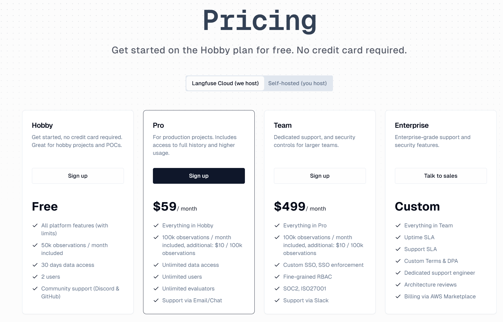
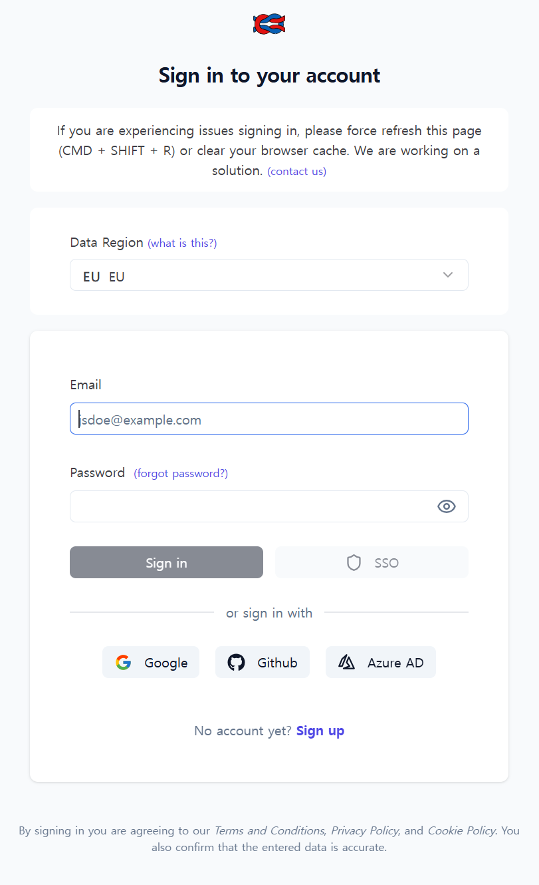
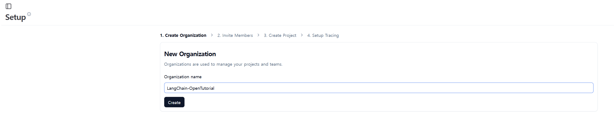
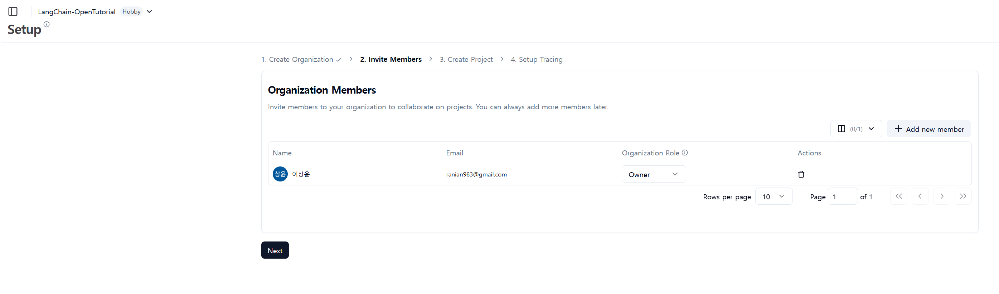
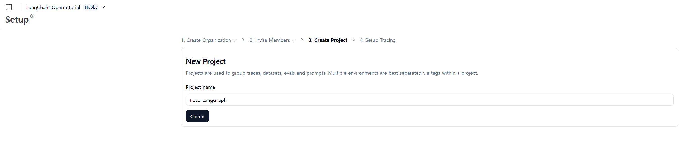
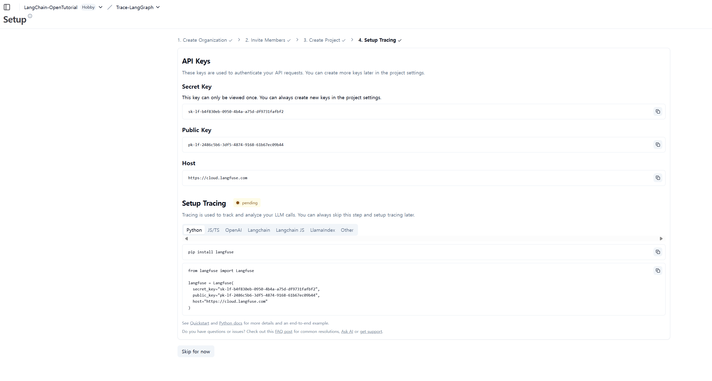
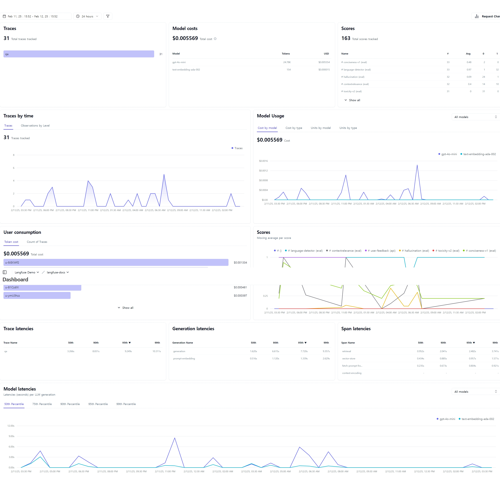
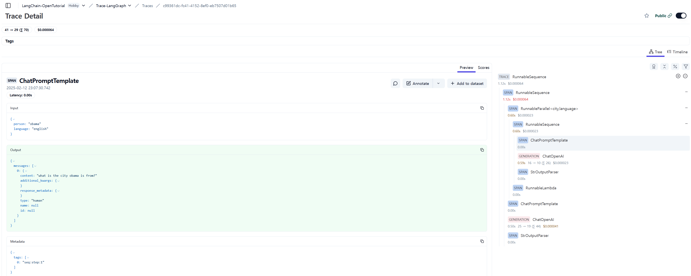
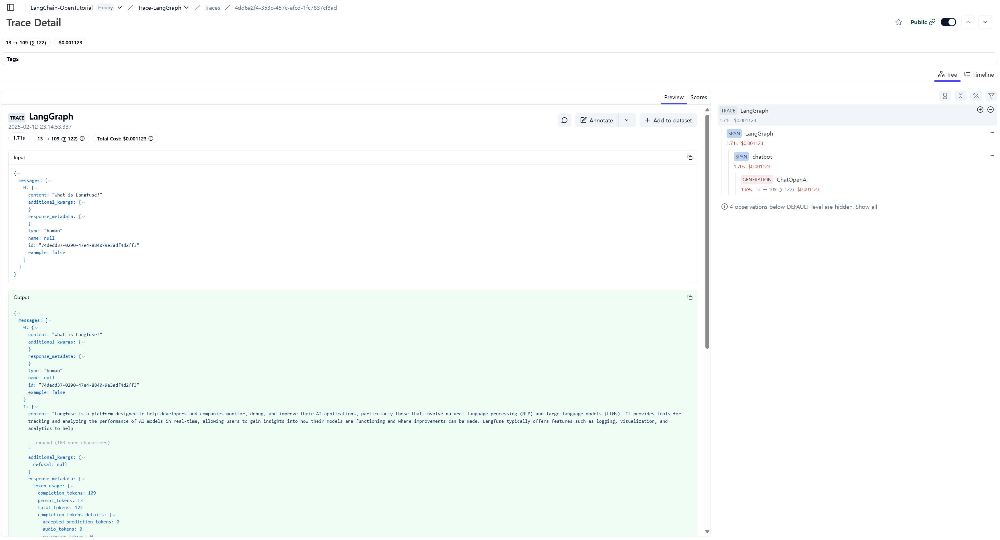
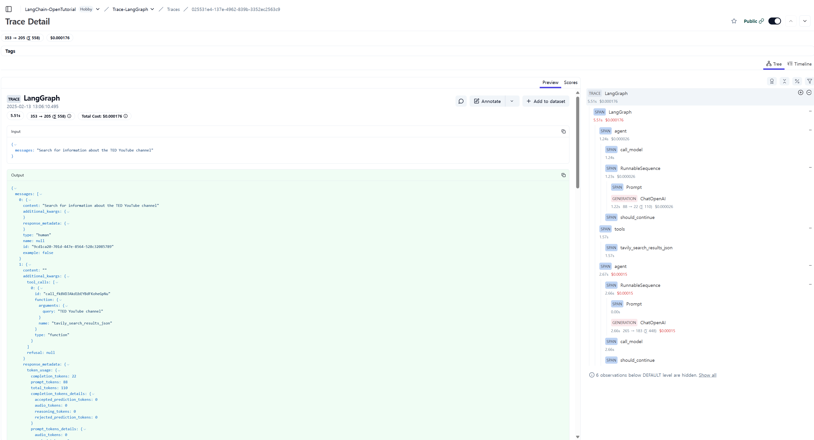

<style>
.custom {
    background-color: #008d8d;
    color: white;
    padding: 0.25em 0.5em 0.25em 0.5em;
    white-space: pre-wrap;       /* css-3 */
    white-space: -moz-pre-wrap;  /* Mozilla, since 1999 */
    white-space: -pre-wrap;      /* Opera 4-6 */
    white-space: -o-pre-wrap;    /* Opera 7 */
    word-wrap: break-word;
}

pre {
    background-color: #027c7c;
    padding-left: 0.5em;
}

</style>

# LangFuse Online Evaluation

- Author: [ranian963](https://github.com/ranian963)
- Peer Review:
- This is a part of [LangChain Open Tutorial](https://github.com/LangChain-OpenTutorial/LangChain-OpenTutorial)

[](https://colab.research.google.com/github/LangChain-OpenTutorial/LangChain-OpenTutorial/blob/main/16-Evaluations/15-LangFuse-Online-Evaluation.ipynb) [](https://github.com/LangChain-OpenTutorial/LangChain-OpenTutorial/blob/main/16-Evaluations/15-LangFuse-Online-Evaluation.ipynb)

## Overview

This tutorial covers the observation and tracing of LangGraph applications using LangFuse.

LangFuse provides a comprehensive logging, debugging, and evaluation framework for LangChain applications.

In this tutorial, we will explore how to integrate LangFuse into a LangGraph application and monitor its execution.

### Table of Contents

- [Overview](#overview)
- [Environment Setup](#environment-setup)
- [Introduction to LangGraph](#introduction-to-langgraph)
- [Introduction LangFuse](#introduction-to-langfuse)
- [Online LangFuse Guide](#Online-LangFuse-Guide)
- [Implementation and Examples](#implementation-and-examples)


### References

- [LangChain Documentation](https://python.langchain.com/docs/get_started/introduction)
- [LangFuse Documentation](https://langfuse.com/docs)
- [LangGraph Documentation](https://python.langchain.com/docs/langgraph)
---

## Environment Setup

Set up the environment. You may refer to [Environment Setup](https://wikidocs.net/257836) for more details.

**[Note]**
- `langchain-opentutorial` is a package that provides a set of easy-to-use environment setup, useful functions and utilities for tutorials. 
- You can checkout the [`langchain-opentutorial`](https://github.com/LangChain-OpenTutorial/langchain-opentutorial-pypi) for more details.

```python
%%capture --no-stderr
%pip install langchain-opentutorial
%pip install langfuse
```

```python
# Install required packages
from langchain_opentutorial import package

package.install(
    [
        "langchain",
        "langchain_community",
        "langchain_openai",
        "langgraph",
    ],
    verbose=False,
    upgrade=False,
)
```

```python
# Set environment variables
from langchain_opentutorial import set_env

set_env(
    {
        "OPENAI_API_KEY": "",
        "TAVILY_API_KEY": "",
        "LANGFUSE_SECRET_KEY": "",
        "LANGFUSE_PUBLIC_KEY": "",
        "LANGFUSE_HOST": "https://cloud.langfuse.com",
    }
)
```

You can alternatively set API keys such as `OPENAI_API_KEY` in a `.env` file and load them.

**[Note]** This is not necessary if you've already set the required API keys in previous steps.

```python
# Load API keys from .env file
from dotenv import load_dotenv

load_dotenv(override=True)
```

## Introduction to LangGraph

LangGraph is an advanced framework designed for building dynamic, multi-step AI workflows.
It enables developers to create complex, structured execution flows for AI applications.

- A structured way to build complex workflows
- State management capabilities
- Integration with various LLM tools and services
- Clear visualization of application flow

### Basic LangGraph Concepts

1. Nodes: Individual processing units
2. Edges: Connections between nodes
3. State: Data maintained throughout the workflow
4. Conditional Logic: Decision making within the graph

## Introduction to LangFuse

LangFuse is an observability platform for LLM-based applications.
It provides structured logs, debugging insights, and evaluation capabilities to improve the performance of AI models.

### Key Features

- **Tracing:** Tracks execution paths in LangGraph.
- **Logging:** Stores and analyzes LLM interactions.
- **Evaluation:** Benchmarks AI-generated responses.

### Why LangFuse?

- Provides detailed insights into LLM application behavior
- Helps identify bottlenecks and optimization opportunities
- Enables data-driven iteration on prompts and workflows
- Supports production monitoring and debugging

## Online LangFuse Guide

To enable online tracking with LangFuse, follow these steps:

1. **Create an API Key** on [LangFuse Cloud](https://cloud.langfuse.com/).
2. **Set Up Environment Variables** in your `.env` file.
3. **Enable Logging and Tracing** in your LangGraph application.

The following sections will provide two practical examples of how LangFuse can be used in an AI application.

### LangFuse Cloud Pricing
LangFuse offers flexible pricing tiers to accommodate different needs, starting with a free Hobby plan that requires no credit card. 

The pricing structure includes:




### Setup and Configuration

1. [LangFuse Cloud](https://cloud.langfuse.com/) Site Access
   - Navigate to the LangFuse Cloud platform to begin the setup process
   
2. Create LangFuse Account
   - Sign up for a new account using your email or OAuth providers
   

3. Create New Organization
   - Set up a new organization to manage your projects and team members
   

4. Member Settings
   - Configure member roles and permissions for your organization
   

5. Project Creation
   - Create a new project to start monitoring your LLM applications
   

6. Obtain API Keys
   - Generate and securely store your public and secret API keys for authentication
   

7. Dashboard Overview
   - Explore the dashboard interface to monitor your application's performance and usage
   

### Basic Implementation

This basic implementation shows:
1. Initialize Langfuse
2. Creating a simple trace
3. Basic logging and generation recording

```python
from langchain.prompts import ChatPromptTemplate
from langchain_openai import ChatOpenAI
from langchain.schema import StrOutputParser
from operator import itemgetter

from langfuse.callback import CallbackHandler

# Environment variables have been set in the previous environment setup section

langfuse_handler = CallbackHandler()

prompt1 = ChatPromptTemplate.from_template("what is the city {person} is from?")
prompt2 = ChatPromptTemplate.from_template(
    "what country is the city {city} in? respond in {language}"
)
model = ChatOpenAI()
chain1 = prompt1 | model | StrOutputParser()
chain2 = (
    {"city": chain1, "language": itemgetter("language")}
    | prompt2
    | model
    | StrOutputParser()
)

chain2.invoke(
    {"person": "obama", "language": "english"}, config={"callbacks": [langfuse_handler]}
)
```

#### View traces in Langfuse

Example trace in Langfuse: https://cloud.langfuse.com/project/cm71ka0zx07yxad079p1kn1bz/traces/c99361dc-fc41-4152-8ef0-eb7507d01b65



## Implementation and Example
In this section, we'll look at two examples of using LangFuse.

1. Basic LangGraph monitoring: Shows simple trace creation and logging of LLM interactions
2. Tool-using agent: Demonstrates how to track an AI agent's interactions with a search tool

### Example 1. Simple chat app with LangGraph

*   Build a support chatbot in LangGraph that can answer common questions
*   Tracing the chatbot's input and output using Langfuse


#### Create Agent

Start by creating a StateGraph. A StateGraph object defines our chatbot's structure as a state machine. 

We will add nodes to represent the LLM and functions the chatbot can call, and edges to specify how the bot transitions between these functions.

```python
from typing import Annotated

from langchain_openai import ChatOpenAI
from langchain_core.messages import HumanMessage
from typing_extensions import TypedDict

from langgraph.graph import StateGraph
from langgraph.graph.message import add_messages


class State(TypedDict):
    # Messages have the type "list". The `add_messages` function in the annotation defines how this state key should be updated
    # (in this case, it appends messages to the list, rather than overwriting them)
    messages: Annotated[list, add_messages]


graph_builder = StateGraph(State)

llm = ChatOpenAI(model="gpt-4o", temperature=0.2)


# The chatbot node function takes the current State as input and returns an updated messages list. This is the basic pattern for all LangGraph node functions.
def chatbot(state: State):
    return {"messages": [llm.invoke(state["messages"])]}


# Add a "chatbot" node. Nodes represent units of work. They are typically regular python functions.
graph_builder.add_node("chatbot", chatbot)

# Add an entry point. This tells our graph where to start its work each time we run it.
graph_builder.set_entry_point("chatbot")

# Set a finish point. This instructs the graph "any time this node is run, you can exit."
graph_builder.set_finish_point("chatbot")

# To be able to run our graph, call "compile()" on the graph builder. This creates a "CompiledGraph" we can use invoke on our state.
graph = graph_builder.compile()
```

#### Add Langfuse as callback to the invocation

Now, we will add then [Langfuse callback handler for LangChain](https://langfuse.com/docs/integrations/langchain/tracing) to trace the steps of our application: `config={"callbacks": [langfuse_handler]}`

```python
from langfuse.callback import CallbackHandler

# Initialize Langfuse CallbackHandler for Langchain (tracing)
langfuse_handler = CallbackHandler()

for s in graph.stream(
    {"messages": [HumanMessage(content="What is Langfuse?")]},
    config={"callbacks": [langfuse_handler]},
):
    print(s)
```

#### View traces in Langfuse

Example trace in Langfuse: https://cloud.langfuse.com/project/cm71ka0zx07yxad079p1kn1bz/traces/4dd6a2f4-353c-457c-afcd-1fc7837cf3ad



#### Visualize the chat app

You can visualize the graph using the `get_graph` method along with a "draw" method

```python
from IPython.display import Image, display

display(Image(graph.get_graph().draw_mermaid_png()))
```

### Example 2. Tool-using agent with LangGraph

*   Build an agent that can search and reason about information using ReAct framework and Tavily search tool
*   Track the agent's reasoning process and tool usage with Langfuse monitoring

#### Import and Create the Search Tool

The Tavily Search API tool is designed to facilitate powerful search capabilities within the chatbot. It retrieves comprehensive and reliable search results, making it ideal for answering questions about current events or topics that require external information.

```python
from langchain_community.tools import TavilySearchResults

# Create the Search Tool
tool = TavilySearchResults(max_results=3)
```

#### Add the Tool to the Tool List

* The search tool is added to a list ( `tools` ). In LangChain, multiple tools can be combined to build more advanced workflows.

```python
tools = [tool]
```

#### Execute the Tool

- The `invoke` method is called to execute the search query "U.S. Presidential Inauguration". 
The search results are returned in JSON format and displayed using the `print` statement.
- The results are page summaries that can be used by the chatbot to answer user questions.

```python
print(tool.invoke("U.S. Presidential Inauguration"))
```

#### Create ReAct Agent

After setting up our search tool, we'll create a ReAct agent using LangGraph's prebuilt functionality.

```python
from langchain_openai import ChatOpenAI
from langgraph.prebuilt import create_react_agent

model = ChatOpenAI(model_name="gpt-4o-mini", temperature=0)
graph = create_react_agent(model, tools)
```

#### Execute the Agent
Now we'll run our agent with LangFuse monitoring enabled. 

```python
from langfuse.callback import CallbackHandler

# Initialize Langfuse CallbackHandler for Langchain (tracing)
langfuse_handler = CallbackHandler()

inputs = {"messages": "Search for information about the TED YouTube channel"}

for event in graph.stream(inputs, stream_mode="values", config={"callbacks": [langfuse_handler]}):
    for key, value in event.items():
        print(f"\n==============\nSTEP: {key}\n==============\n")
        # display_message_tree(value["messages"][-1])
        print(value[-1])
```

#### View traces in Langfuse

Example trace in Langfuse: https://cloud.langfuse.com/project/cm71ka0zx07yxad079p1kn1bz/traces/025531e4-137e-4962-839b-3352ec2563c9



#### Visualize the chat app

You can visualize the graph using the `get_graph` method along with a "draw" method

```python
from IPython.display import Image, display

display(Image(graph.get_graph().draw_mermaid_png()))
```
