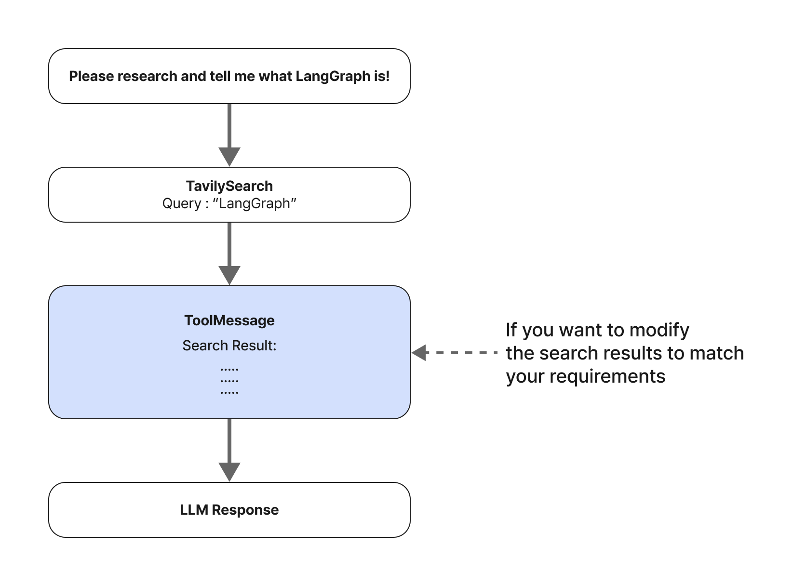
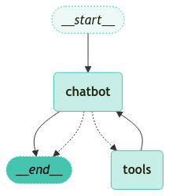

<style>
.custom {
    background-color: #008d8d;
    color: white;
    padding: 0.25em 0.5em 0.25em 0.5em;
    white-space: pre-wrap;       /* css-3 */
    white-space: -moz-pre-wrap;  /* Mozilla, since 1999 */
    white-space: -pre-wrap;      /* Opera 4-6 */
    white-space: -o-pre-wrap;    /* Opera 7 */
    word-wrap: break-word;
}

pre {
    background-color: #027c7c;
    padding-left: 0.5em;
}

</style>

# LangGraph Manual State Update

- Author: [YooKyung Jeon](https://github.com/sirena1)
- Peer Review:
- This is a part of [LangChain Open Tutorial](https://github.com/LangChain-OpenTutorial/LangChain-OpenTutorial)

[](https://colab.research.google.com/github/LangChain-OpenTutorial/LangChain-OpenTutorial/blob/main/17-LangGraph/01-Core-Features/07-LangGraph-Manual-State-Update.ipynb) [](https://github.com/LangChain-OpenTutorial/LangChain-OpenTutorial/blob/main/17-LangGraph/01-Core-Features/07-LangGraph-Manual-State-Update.ipynb)

## Overview

LangGraph provides a way to **manually update the intermediate state**.

By updating the state, you can **control the path by modifying the agent's behavior**, and even revise the past.

This feature is especially useful for **correcting the agent's mistakes**, **exploring alternative routes**, or **modifying the agent's behavior** according to a specific goal.

- Note: The agent used in this tutorial defines the same graph as the previous tutorial.

### Table of Contents

- [Overview](#overview)
- [Environment Setup](#environment-setup)
- [Human in the loop](#human-in-the-loop)
- [Update the message state after an interrupt](#update-the-message-state-after-an-interrupt--continue-the-process)
- [Modify the result of the past snapshot and replay](#modify-the-result-of-the-past-snapshot-and-replay)

### References

- [LangGraph Tutorial](https://langchain-ai.github.io/langgraph/tutorials)
- [How to visualize your graph](https://langchain-ai.github.io/langgraph/how-tos/visualization/)
----

## Environment Setup

Set up the environment. You may refer to [Environment Setup](https://wikidocs.net/257836) for more details.

**[Note]**
- `langchain-opentutorial` is a package that provides a set of easy-to-use environment setup, useful functions and utilities for tutorials. 
- You can checkout the [`langchain-opentutorial`](https://github.com/LangChain-OpenTutorial/langchain-opentutorial-pypi) for more details.

```python
%%capture --no-stderr
%pip install langchain-opentutorial
```

```python
# Install required packages
from langchain_opentutorial import package

package.install(
    [
        "langchain",
        "langchain_openai",
        "langchain_core",
        "langchain_community"
    ],
    verbose=False,
    upgrade=False,
)
```

```python
# Set environment variables
from langchain_opentutorial import set_env

set_env(
    {
        "OPENAI_API_KEY": "",
        "LANGCHAIN_API_KEY": "",
        "TAVILY_API_KEY": "",
        "LANGCHAIN_TRACING_V2": "true",
        "LANGCHAIN_ENDPOINT": "https://api.smith.langchain.com",
        "LANGCHAIN_PROJECT": "07-LangGraph-Manual-State-Update",
    }
)
```

<pre class="custom">Environment variables have been set successfully.
</pre>

```python
from dotenv import load_dotenv

load_dotenv(override=True)
```


<pre class="custom">True</pre>


```python
from typing import Annotated
from typing_extensions import TypedDict

from langchain_community.tools.tavily_search import TavilySearchResults
from langchain_openai import ChatOpenAI
from langgraph.checkpoint.memory import MemorySaver
from langgraph.graph import StateGraph, START, END
from langgraph.graph.message import add_messages
from langgraph.prebuilt import ToolNode, tools_condition
from langchain_opentutorial.graphs import visualize_graph

########## 1. Define State ##########
# Define State
class State(TypedDict):
    # Add comments to the message list
    messages: Annotated[list, add_messages]


########## 2. Tool Definition and Binding ##########
# Tool initialization
tool = TavilySearchResults(max_results=3)

# Define the list of tools
tools = [tool]

# LLM initialization
llm = ChatOpenAI(model="gpt-4o-mini")

# Combine tools with LLM
llm_with_tools = llm.bind_tools(tools)


########## 3. Add Nodes ##########
# Define chatbot function
def chatbot(state: State):
    # Call and return messages
    return {"messages": [llm_with_tools.invoke(state["messages"])]}


# Create state graph
graph_builder = StateGraph(State)

# Add chatbot node
graph_builder.add_node("chatbot", chatbot)


# Create and add tool node
tool_node = ToolNode(tools=tools)

# Add tool node
graph_builder.add_node("tools", tool_node)

# Conditional edges
graph_builder.add_conditional_edges(
    "chatbot",
    tools_condition,
)

########## 4. Add Edges ##########

# tools > chatbot
graph_builder.add_edge("tools", "chatbot")

# START > chatbot
graph_builder.add_edge(START, "chatbot")

# chatbot > END
graph_builder.add_edge("chatbot", END)

########## 5. Graph Compile ##########
# Initialize memory store
memory = MemorySaver()

# Compile graph builder
graph = graph_builder.compile(checkpointer=memory)

########## 6. Graph Visualization ##########
# Graph Visualization
visualize_graph(graph)
```


    

    


```python
from langchain_core.runnables import RunnableConfig

# question
question = "Please research and tell me what LangGraph is!"

# Define initial state
input = State(messages=[("user", question)])

# Define config
config = RunnableConfig(
    configurable={"thread_id": "1"},  # Set thread ID
)
```

First, display the list of channels to show the options where **interrupt_before** and **interrupt_after** can be applied.

```python
# Display the list of graph channels
list(graph.channels)
```


<pre class="custom">['messages',
     '__start__',
     'chatbot',
     'tools',
     'branch:__start__:__self__:chatbot',
     'branch:__start__:__self__:tools',
     'branch:chatbot:__self__:chatbot',
     'branch:chatbot:__self__:tools',
     'branch:tools:__self__:chatbot',
     'branch:tools:__self__:tools',
     'start:chatbot',
     'branch:chatbot:tools_condition:tools']</pre>


```python
# Call graph stream
events = graph.stream(
    input=input, config=config, interrupt_before=["tools"], stream_mode="values"
)

# Iterate over events
for event in events:
    # If the message is included in the event
    if "messages" in event:
        # Pretty print the last message
        event["messages"][-1].pretty_print()
```

<pre class="custom">================================ Human Message =================================
    
    Please research and tell me what LangGraph is!
    ================================== Ai Message ==================================
    Tool Calls:
      tavily_search_results_json (call_9zjnTeRzGGyCGP0MjoNUfzy5)
     Call ID: call_9zjnTeRzGGyCGP0MjoNUfzy5
      Args:
        query: LangGraph
</pre>

The current step is interrupted by `ToolNode`.

Check the most recent message to see that `ToolNode` contains the `query` before performing the search.

Here, the `query` contains only the word `LangGraph`. (The original question was `"Please research and tell me what LangGraph is!"`)

Of course, the web search result may not be what we want.

```python
# Create graph state snapshot
snapshot = graph.get_state(config)

# Extract the most recent message
last_message = snapshot.values["messages"][-1]

# Print the message
last_message.pretty_print()
```

<pre class="custom">================================== Ai Message ==================================
    Tool Calls:
      tavily_search_results_json (call_9zjnTeRzGGyCGP0MjoNUfzy5)
     Call ID: call_9zjnTeRzGGyCGP0MjoNUfzy5
      Args:
        query: LangGraph
</pre>

## Human in the loop

- Modify the **search result** from `TavilySearch` tool

We often find that the result of `ToolMessage` is not satisfactory.

In particular, the answer obtained from web search may contain incorrect information, which can also affect the chatbot's answer.

If you want to modify the `ToolMessage` from the `Tavily Tool` and pass it to the LLM, how can you do it?



Below is a modified virtual web search result that is slightly different from the original web search result.

```python
modified_search_result = """[Modified web search result] 
LangGraph supports building state-based multi-actor applications using LLMs.
LangGraph is an open-source library that provides features such as cyclic flow, controllability, persistence, and cloud deployment capabilities.

For detailed tutorials, refer to [LangGraph Tutorial](https://langchain-ai.github.io/langgraph/tutorials/)."""

print(modified_search_result)
```

<pre class="custom">[Modified web search result] 
    LangGraph supports building state-based multi-actor applications using LLMs.
    LangGraph is an open-source library that provides features such as cyclic flow, controllability, persistence, and cloud deployment capabilities.
    
    For detailed tutorials, refer to [LangGraph Tutorial](https://langchain-ai.github.io/langgraph/tutorials/).
</pre>

Next, inject the modified search result into the `ToolMessage`. 

**Important**

- To modify the message, you need to specify the `tool_call_id` that matches the message you want to modify.

```python
# Extract the `tool_call_id` of the `ToolMessage` you want to modify
tool_call_id = last_message.tool_calls[0]["id"]
print(tool_call_id)
```

<pre class="custom">call_9zjnTeRzGGyCGP0MjoNUfzy5
</pre>

```python
from langchain_core.messages import AIMessage, ToolMessage

new_messages = [
    # A `ToolMessage` that matches the tool call of the LLM API is required
    ToolMessage(
        content=modified_search_result,
        tool_call_id=tool_call_id,
    ),
    # Add content directly to the LLM's response
    # AIMessage(content=modified_search_result),
]

new_messages[-1].pretty_print()
```

<pre class="custom">================================= Tool Message =================================
    
    [Modified web search result] 
    LangGraph supports building state-based multi-actor applications using LLMs.
    LangGraph is an open-source library that provides features such as cyclic flow, controllability, persistence, and cloud deployment capabilities.
    
    For detailed tutorials, refer to [LangGraph Tutorial](https://langchain-ai.github.io/langgraph/tutorials/).
</pre>

### StateGraph's `update_state` Method

The `update_state` method updates the state of the graph with the given values. This method operates as if the values originated from `as_node`.

**Parameters** 

- `config` (RunnableConfig): Execution configuration
- `values` (Optional[Union[dict[str, Any], Any]]): Values to update
- `as_node` (Optional[str]): The node name to consider as the source of the values. The default value is None

**Return** 

- RunnableConfig

**Main Features**

1. Load the previous state through the checkpoint and save the new state.
2. Process the state update for the subgraph.
3. If `as_node` is not specified, find the node that last updated the state.
4. Update the state using the writers of the specified node.
5. Save the updated state to the checkpoint.

**Main Logic**

1. Check the checkpoint and raise a ValueError if it is not found.
2. If the update is for the subgraph, call the `update_state` method of the subgraph. 
3. Load the previous checkpoint and determine `as_node` if necessary.
4. Update the state using the writers of the specified node. 
5. Save the updated state to the new checkpoint.

**Note**

- This method is used when manually updating the state of the graph. 
- Use the checkpoint to ensure version management and persistence of the state.
- `as_node` is automatically determined, but if it is ambiguous, an error may occur.
- Writing to SharedValues is not allowed during state update.

```python
graph.update_state(
    # Specify the state to update
    config,
    # Provide the updated values. `State`'s messages are "add-only" and added to the existing state.
    {"messages": new_messages},
    as_node="tools",
)

print("(Display the most recent message)\n")
print(graph.get_state(config).values["messages"][-1])
```

<pre class="custom">(Display the most recent message)
    
    content='[Modified web search result] \nLangGraph supports building state-based multi-actor applications using LLMs.\nLangGraph is an open-source library that provides features such as cyclic flow, controllability, persistence, and cloud deployment capabilities.\n\nFor detailed tutorials, refer to [LangGraph Tutorial](https://langchain-ai.github.io/langgraph/tutorials/).' id='adf44246-b5ab-45b1-a988-fcce753a846f' tool_call_id='call_9zjnTeRzGGyCGP0MjoNUfzy5'
</pre>

Now, the graph is complete. 

Since the final response message was provided! 

State update simulates the graph step, so it also creates the corresponding `traces`.

`messages` were processed with the predefined `add_messages` function. (This ensures that the existing list is not overwritten directly in the graph and always adds values.)

The same logic is applied here, so the message passed to `update_state` is added in the same way. 

The `update_state` function operates as if it were one of the nodes in the graph! By default, the update process uses the last executed node, but it can be manually specified as shown below. Let's add an update and instruct the graph to treat it as coming from "chatbot."


```python
snapshot = graph.get_state(config)
snapshot.next
```


<pre class="custom">('chatbot',)</pre>


```python
# `None` is not added to the current state
events = graph.stream(None, config, stream_mode="values")

# Iterate over events
for event in events:
    # If the message is included in the event
    if "messages" in event:
        # Pretty print the last message
        event["messages"][-1].pretty_print()
```

<pre class="custom">================================= Tool Message =================================
    
    [Modified web search result] 
    LangGraph supports building state-based multi-actor applications using LLMs.
    LangGraph is an open-source library that provides features such as cyclic flow, controllability, persistence, and cloud deployment capabilities.
    
    For detailed tutorials, refer to [LangGraph Tutorial](https://langchain-ai.github.io/langgraph/tutorials/).
    ================================== Ai Message ==================================
    
    LangGraph is an open-source library designed for building state-based multi-actor applications using large language models (LLMs). It offers features such as cyclic flow, controllability, persistence, and cloud deployment capabilities, making it a versatile tool for developers working with LLMs.
    
    For more detailed information, you can refer to the [LangGraph Tutorial](https://langchain-ai.github.io/langgraph/tutorials/).
</pre>

The following code can be used if you want to modify the state of the final answer.

```python
# Specify the node where this function operates. This node is automatically processed as if it was just executed.
# graph.update_state(
#     config,
#     {
#         "messages": [
#             AIMessage(content="Finally, add the final message to complete the process.")
#         ]
#     },
#     as_node="chatbot",
# )
```

Let's visualize the graph and check the entire output.

```python
from langchain_opentutorial.graphs import visualize_graph

visualize_graph(graph)
```


    

    


Check the current state as before to confirm that the checkpoint reflects the manual update.

```python
# Create a graph state snapshot
snapshot = graph.get_state(config)

# Print the last three messages
for message in snapshot.values["messages"]:
    message.pretty_print()
```

<pre class="custom">================================ Human Message =================================
    
    Please research and tell me what LangGraph is!
    ================================== Ai Message ==================================
    Tool Calls:
      tavily_search_results_json (call_9zjnTeRzGGyCGP0MjoNUfzy5)
     Call ID: call_9zjnTeRzGGyCGP0MjoNUfzy5
      Args:
        query: LangGraph
    ================================= Tool Message =================================
    
    [Modified web search result] 
    LangGraph supports building state-based multi-actor applications using LLMs.
    LangGraph is an open-source library that provides features such as cyclic flow, controllability, persistence, and cloud deployment capabilities.
    
    For detailed tutorials, refer to [LangGraph Tutorial](https://langchain-ai.github.io/langgraph/tutorials/).
    ================================== Ai Message ==================================
    
    LangGraph is an open-source library designed for building state-based multi-actor applications using large language models (LLMs). It offers features such as cyclic flow, controllability, persistence, and cloud deployment capabilities, making it a versatile tool for developers working with LLMs.
    
    For more detailed information, you can refer to the [LangGraph Tutorial](https://langchain-ai.github.io/langgraph/tutorials/).
</pre>

Check if there is a next node to proceed. `()` is empty, indicating that the entire process has been completed normally.

```python
# Print the next state
print(snapshot.next)
```

<pre class="custom">()
</pre>

## Update the message state after an interrupt – continue the process.

- Modify the **search query** in the `TavilySearch` tool

This time, interrupt before proceeding to the next node and update the state, then continue the process.

First, create a new `thread_id`.

Here, we use the `generate_random_hash` function to generate a random hash value.

```python
from langchain_opentutorial.graphs import generate_random_hash

thread_id = generate_random_hash()
print(f"thread_id: {thread_id}")

question = "I want to learn about LangGraph. Can you recommend useful materials?"

# Define the initial input state
input = State(messages=[("user", question)])

# Create a new config
config = {"configurable": {"thread_id": thread_id}}

events = graph.stream(
    input=input,
    config=config,
    interrupt_before=["tools"],
    stream_mode="values",
)
for event in events:
    if "messages" in event:
        event["messages"][-1].pretty_print()
```

<pre class="custom">thread_id: f08cd5
    ================================ Human Message =================================
    
    I want to learn about LangGraph. Can you recommend useful materials?
    ================================== Ai Message ==================================
    Tool Calls:
      tavily_search_results_json (call_6GdSSJua0PzlGTQ5jCXve1LD)
     Call ID: call_6GdSSJua0PzlGTQ5jCXve1LD
      Args:
        query: LangGraph learning materials
</pre>

Next, let's update the tool call for the agent. 

First, get the `Message ID`. 

```python
# Copy config
config_copy = config.copy()
```

```python
from langchain_core.messages import AIMessage

# Get the snapshot state
snapshot = graph.get_state(config)

# Get the last message of messages
existing_message = snapshot.values["messages"][-1]

# Print the message ID
print("Message ID", existing_message.id)
```

<pre class="custom">Message ID run-21c9fdd0-14ca-4d90-9c3b-273822d7db84-0
</pre>

The last message is a message related to the `tavily_web_search` tool call.

The main properties are as follows.

- `name`: The name of the tool
- `args`: The search query
- `id`: The tool call ID
- `type`: The tool call type (tool_call)

```python
# Print the first tool call
print(existing_message.tool_calls[0])
```

<pre class="custom">{'name': 'tavily_search_results_json', 'args': {'query': 'LangGraph learning materials'}, 'id': 'call_6GdSSJua0PzlGTQ5jCXve1LD', 'type': 'tool_call'}
</pre>

Let's update the `query` in `args`. 

Copy the `existing_message` and create a new tool call `new_tool_call`.

Since we used the `copy()` method, all property values are copied.

Then, input the desired **search query** to the `query` parameter.

**Important**

- The `id` uses the same `id` as the existing message. (If the `id` changes, the message reducer will not update the message but instead add it.)


```python
# Copy tool_calls to create a new tool call
new_tool_call = existing_message.tool_calls[0].copy()

# Update the query parameter
new_tool_call["args"] = {"query": "LangGraph site:langchain-opentutorial.gitbook.io/langchain-opentutorial"}
new_tool_call
```


<pre class="custom">{'name': 'tavily_search_results_json',
     'args': {'query': 'LangGraph site:langchain-opentutorial.gitbook.io/langchain-opentutorial'},
     'id': 'call_6GdSSJua0PzlGTQ5jCXve1LD',
     'type': 'tool_call'}</pre>


```python
# Create a new AIMessage
new_message = AIMessage(
    content=existing_message.content,
    tool_calls=[new_tool_call],
    # Important! ID is a method to replace the message instead of adding it to the state.
    id=existing_message.id,
)

print(new_message.id)

# Print the modified message
new_message.pretty_print()
```

<pre class="custom">run-21c9fdd0-14ca-4d90-9c3b-273822d7db84-0
    ================================== Ai Message ==================================
    Tool Calls:
      tavily_search_results_json (call_6GdSSJua0PzlGTQ5jCXve1LD)
     Call ID: call_6GdSSJua0PzlGTQ5jCXve1LD
      Args:
        query: LangGraph site:langchain-opentutorial.gitbook.io/langchain-opentutorial
</pre>

We can see that the search query has been updated.

```python
# Print the updated tool call
print(new_message.tool_calls[0])

# Print the message ID
print("\nMessage ID", new_message.id)

# Update the state
graph.update_state(config, {"messages": [new_message]})
```

<pre class="custom">{'name': 'tavily_search_results_json', 'args': {'query': 'LangGraph site:langchain-opentutorial.gitbook.io/langchain-opentutorial'}, 'id': 'call_6GdSSJua0PzlGTQ5jCXve1LD', 'type': 'tool_call'}
    
    Message ID run-21c9fdd0-14ca-4d90-9c3b-273822d7db84-0
</pre>


    {'configurable': {'thread_id': 'f08cd5',
      'checkpoint_ns': '',
      'checkpoint_id': '1efd8c9f-1ff2-621f-8002-80b07f16150f'}}


Check the `tool_calls` of the updated last message.

- The `query` in `args` has been updated.

```python
# Get the tool call of the last message
graph.get_state(config).values["messages"][-1].tool_calls
```


<pre class="custom">[{'name': 'tavily_search_results_json',
      'args': {'query': 'LangGraph site:langchain-opentutorial.gitbook.io/langchain-opentutorial'},
      'id': 'call_6GdSSJua0PzlGTQ5jCXve1LD',
      'type': 'tool_call'}]</pre>


You can see that the search query has been changed from the original **"LangGraph"** to the updated query **"LangGraph site:github.com/LangChain-OpenTutorial/LangChain-GitBook"**.

Continue streaming the graph using the previous settings and a `None` input.


```python
# Receive events from the graph stream
events = graph.stream(None, config, stream_mode="values")

# Process each event
for event in events:
    # If the message is included in the event
    if "messages" in event:
        event["messages"][-1].pretty_print()
```

<pre class="custom">================================== Ai Message ==================================
    Tool Calls:
      tavily_search_results_json (call_6GdSSJua0PzlGTQ5jCXve1LD)
     Call ID: call_6GdSSJua0PzlGTQ5jCXve1LD
      Args:
        query: LangGraph site:langchain-opentutorial.gitbook.io/langchain-opentutorial
    ================================= Tool Message =================================
    Name: tavily_search_results_json
    
    [{"url": "https://langchain-opentutorial.gitbook.io/langchain-opentutorial/13-langchain-expression-language/02-inspectrunnables", "content": "In this tutorial, we introduce how to inspect and visualize various components (including the graph structure) of a Runnable chain. Understanding the underlying graph structure can help diagnose and optimize complex chain flows."}, {"url": "https://langchain-opentutorial.gitbook.io/langchain-opentutorial/09-vectorstore/01-vector-stores", "content": "This tutorial provides a comprehensive guide to vector stores, which are specialized databases for indexing and retrieving information using vector representations (embeddings)."}, {"url": "https://langchain-opentutorial.gitbook.io/langchain-opentutorial/15-agent/11-react-agent", "content": "The code below uses create_react_agent from langgraph to easily build a ReAct Agent and visualize its structure as a graph. Copy from langchain_openai import ChatOpenAI from langgraph. checkpoint. memory import MemorySaver from langgraph. prebuilt import create_react_agent # Memory and model configuration memory = MemorySaver ()"}]
    ================================== Ai Message ==================================
    
    Here are some useful materials to learn about LangGraph:
    
    1. **Inspecting and Visualizing Runnable Chains**:
       - This tutorial introduces how to inspect and visualize various components, including the graph structure of a Runnable chain. It helps in understanding the underlying graph structure, which is crucial for diagnosing and optimizing complex chain flows. 
       - [Read more here](https://langchain-opentutorial.gitbook.io/langchain-opentutorial/13-langchain-expression-language/02-inspectrunnables).
    
    2. **Guide to Vector Stores**:
       - This tutorial provides a comprehensive guide to vector stores, which are specialized databases for indexing and retrieving information using vector representations (embeddings). This is relevant for understanding how data is managed and utilized within LangGraph.
       - [Explore the guide here](https://langchain-opentutorial.gitbook.io/langchain-opentutorial/09-vectorstore/01-vector-stores).
    
    3. **Building a ReAct Agent with LangGraph**:
       - This tutorial illustrates how to use `create_react_agent` from LangGraph to easily build a ReAct Agent and visualize its structure as a graph. It includes code examples and explanations for memory and model configuration.
       - [Learn how to build it here](https://langchain-opentutorial.gitbook.io/langchain-opentutorial/15-agent/11-react-agent).
    
    These resources should provide a solid foundation for understanding LangGraph and its applications.
</pre>

```python
# Create an event stream
events = graph.stream(
    {
        "messages": (
            "user",
            "Please provide a kind and detailed answer in English about what I have learned so far! Be sure to include the sources!",
        )
    },
    config,
    stream_mode="values",
)

# Process message events
for event in events:
    if "messages" in event:
        # Print the last message
        event["messages"][-1].pretty_print()
```

<pre class="custom">================================ Human Message =================================
    
    Please provide a kind and detailed answer in English about what I have learned so far! Be sure to include the sources!
    ================================== Ai Message ==================================
    
    Certainly! Here's a detailed summary of what you've learned about LangGraph based on the materials provided:
    
    ---
    
    ### Overview of LangGraph
    
    LangGraph is a framework that facilitates the building and visualization of complex data flows within machine learning and artificial intelligence applications. It enables users to create and manage various components, known as "Runnable chains," which can be inspected and optimized for better performance.
    
    ### Key Materials Learned
    
    1. **Inspecting and Visualizing Runnable Chains**:
       - In this tutorial, you learned how to **inspect and visualize** different components of a Runnable chain. Understanding the graph structure of these chains is crucial for diagnosing issues and optimizing complex workflows. By visualizing the interactions and dependencies between components, developers can gain insights into the performance and efficiency of their data processing tasks.
       - **Source**: [Inspecting Runnable Chains](https://langchain-opentutorial.gitbook.io/langchain-opentutorial/13-langchain-expression-language/02-inspectrunnables).
    
    2. **Understanding Vector Stores**:
       - You explored a comprehensive guide on **vector stores**, which are specialized databases designed for indexing and retrieving information based on vector representations (also known as embeddings). This concept is essential for managing data efficiently, especially in applications that require quick access to large datasets. Vector stores play a significant role in enhancing the performance of machine learning models by enabling faster retrieval of relevant information.
       - **Source**: [Guide to Vector Stores](https://langchain-opentutorial.gitbook.io/langchain-opentutorial/09-vectorstore/01-vector-stores).
    
    3. **Building a ReAct Agent with LangGraph**:
       - In this section, you learned about using the `create_react_agent` function from LangGraph to build a ReAct Agent. This tutorial provides practical code examples and explains how to visualize the agent's structure as a graph. It covers crucial aspects such as memory and model configuration, which are vital for creating effective agents that can interact with users or other systems.
       - **Source**: [Building a ReAct Agent](https://langchain-opentutorial.gitbook.io/langchain-opentutorial/15-agent/11-react-agent).
    
    ### Conclusion
    
    By exploring these materials, you have gained valuable insights into the functionalities and capabilities of LangGraph. You now understand how to visualize and optimize data flows, manage vector representations, and build interactive agents, all of which are integral to developing robust AI applications. For further exploration, consider diving deeper into each topic through the provided links.
    
    --- 
    
    This summary encapsulates the core concepts you've learned about LangGraph and its functionalities. If you have any more questions or need further information, feel free to ask!
</pre>

Check the last message in `messages` of the final state. (This is the final response message.)

```python
graph.get_state(config).values["messages"][-1].pretty_print()
```

<pre class="custom">================================== Ai Message ==================================
    
    Certainly! Here's a detailed summary of what you've learned about LangGraph based on the materials provided:
    
    ---
    
    ### Overview of LangGraph
    
    LangGraph is a framework that facilitates the building and visualization of complex data flows within machine learning and artificial intelligence applications. It enables users to create and manage various components, known as "Runnable chains," which can be inspected and optimized for better performance.
    
    ### Key Materials Learned
    
    1. **Inspecting and Visualizing Runnable Chains**:
       - In this tutorial, you learned how to **inspect and visualize** different components of a Runnable chain. Understanding the graph structure of these chains is crucial for diagnosing issues and optimizing complex workflows. By visualizing the interactions and dependencies between components, developers can gain insights into the performance and efficiency of their data processing tasks.
       - **Source**: [Inspecting Runnable Chains](https://langchain-opentutorial.gitbook.io/langchain-opentutorial/13-langchain-expression-language/02-inspectrunnables).
    
    2. **Understanding Vector Stores**:
       - You explored a comprehensive guide on **vector stores**, which are specialized databases designed for indexing and retrieving information based on vector representations (also known as embeddings). This concept is essential for managing data efficiently, especially in applications that require quick access to large datasets. Vector stores play a significant role in enhancing the performance of machine learning models by enabling faster retrieval of relevant information.
       - **Source**: [Guide to Vector Stores](https://langchain-opentutorial.gitbook.io/langchain-opentutorial/09-vectorstore/01-vector-stores).
    
    3. **Building a ReAct Agent with LangGraph**:
       - In this section, you learned about using the `create_react_agent` function from LangGraph to build a ReAct Agent. This tutorial provides practical code examples and explains how to visualize the agent's structure as a graph. It covers crucial aspects such as memory and model configuration, which are vital for creating effective agents that can interact with users or other systems.
       - **Source**: [Building a ReAct Agent](https://langchain-opentutorial.gitbook.io/langchain-opentutorial/15-agent/11-react-agent).
    
    ### Conclusion
    
    By exploring these materials, you have gained valuable insights into the functionalities and capabilities of LangGraph. You now understand how to visualize and optimize data flows, manage vector representations, and build interactive agents, all of which are integral to developing robust AI applications. For further exploration, consider diving deeper into each topic through the provided links.
    
    --- 
    
    This summary encapsulates the core concepts you've learned about LangGraph and its functionalities. If you have any more questions or need further information, feel free to ask!
</pre>

## Modify the result of the past snapshot and replay

This time, we will look at how to modify the result of the past snapshot and replay.

Check the past snapshot and return to a specific node, then **modify the state and continue from that node**.

This is called Replay.

First, get the state of the past snapshot.

```python
to_replay_state = None

# Get the state history
for state in graph.get_state_history(config):

    messages = state.values["messages"]

    if len(messages) > 0:
        print(state.values["messages"][-1].id)
        # Print the number of messages and the next state
        print("the number of chat messages: ", len(state.values["messages"]), "next node: ", state.next)
        print("-" * 80)
        # Select the specific state based on the number of chat messages
        if len(state.values["messages"]) == 2:
            # Select the specific message ID
            to_replay_state = state
```

<pre class="custom">run-75bb7014-47e8-40b1-b4d0-580391949bd8-0
    the number of chat messages:  6 next node:  ()
    --------------------------------------------------------------------------------
    d35ee58d-acbe-4687-a7a2-ee12e865a937
    the number of chat messages:  5 next node:  ('chatbot',)
    --------------------------------------------------------------------------------
    run-283f6d35-635a-4259-b58f-b2c3634664b9-0
    the number of chat messages:  4 next node:  ('__start__',)
    --------------------------------------------------------------------------------
    run-283f6d35-635a-4259-b58f-b2c3634664b9-0
    the number of chat messages:  4 next node:  ()
    --------------------------------------------------------------------------------
    da87b138-70bd-4510-8b12-18ce8822ef87
    the number of chat messages:  3 next node:  ('chatbot',)
    --------------------------------------------------------------------------------
    run-21c9fdd0-14ca-4d90-9c3b-273822d7db84-0
    the number of chat messages:  2 next node:  ('tools',)
    --------------------------------------------------------------------------------
    run-21c9fdd0-14ca-4d90-9c3b-273822d7db84-0
    the number of chat messages:  2 next node:  ('tools',)
    --------------------------------------------------------------------------------
    2222f619-4e73-4703-b61b-222cf328c78d
    the number of chat messages:  1 next node:  ('chatbot',)
    --------------------------------------------------------------------------------
</pre>

Check the content of the selected message.

```python
from langchain_opentutorial.messages import display_message_tree

# Get the selected message
existing_message = to_replay_state.values["messages"][-1]

# Print the message tree
display_message_tree(existing_message)
```

<pre class="custom">    content: ""
        additional_kwargs:
            tool_calls:
                index [0]
                    id: "call_6GdSSJua0PzlGTQ5jCXve1LD"
                    function: {"arguments": "{"query":"LangGraph learning materials"}", "name": "tavily_search_results_json"}
                    type: "function"
            refusal: None
        response_metadata:
            token_usage:
                completion_tokens: 22
                prompt_tokens: 93
                total_tokens: 115
                completion_tokens_details: {"accepted_prediction_tokens": 0, "audio_tokens": 0, "reasoning_tokens": 0, "rejected_prediction_tokens": 0}
                prompt_tokens_details: {"audio_tokens": 0, "cached_tokens": 0}
            model_name: "gpt-4o-mini-2024-07-18"
            system_fingerprint: "fp_72ed7ab54c"
            finish_reason: "tool_calls"
            logprobs: None
        type: "ai"
        name: None
        id: "run-21c9fdd0-14ca-4d90-9c3b-273822d7db84-0"
        example: False
        tool_calls:
            index [0]
                name: "tavily_search_results_json"
                args: {"query": "LangGraph learning materials"}
                id: "call_6GdSSJua0PzlGTQ5jCXve1LD"
                type: "tool_call"
        invalid_tool_calls:
        usage_metadata:
            input_tokens: 93
            output_tokens: 22
            total_tokens: 115
            input_token_details: {"audio": 0, "cache_read": 0}
            output_token_details: {"audio": 0, "reasoning": 0}
</pre>

Check if the search query has been updated.

```python
tool_call = existing_message.tool_calls[0].copy()
tool_call["args"] = {"query": "LangGraph human-in-the-loop workflow site:reddit.com"}
tool_call
```


<pre class="custom">{'name': 'tavily_search_results_json',
     'args': {'query': 'LangGraph human-in-the-loop workflow site:reddit.com'},
     'id': 'call_6GdSSJua0PzlGTQ5jCXve1LD',
     'type': 'tool_call'}</pre>


Create an updated AIMessage.

```python
# Create an updated AIMessage
new_message = AIMessage(
    content=existing_message.content,
    tool_calls=[tool_call],
    # Important! ID is a method to replace the message instead of adding it to the state.
    id=existing_message.id,
)

# Print the updated message
new_message.tool_calls[0]["args"]
```


<pre class="custom">{'query': 'LangGraph human-in-the-loop workflow site:reddit.com'}</pre>


Below is the message before the update.

```python
# Check the message before the update
graph.get_state(to_replay_state.config).values["messages"][-1].tool_calls
```


<pre class="custom">[{'name': 'tavily_search_results_json',
      'args': {'query': 'LangGraph learning materials'},
      'id': 'call_6GdSSJua0PzlGTQ5jCXve1LD',
      'type': 'tool_call'}]</pre>


Use the `update_state` method in `graph` to update the state. 

Save the updated state to `updated_state`.

```python
# Update the state
updated_state = graph.update_state(
    to_replay_state.config,
    {"messages": [new_message]},
)
updated_state
```


<pre class="custom">{'configurable': {'thread_id': 'f08cd5',
      'checkpoint_ns': '',
      'checkpoint_id': '1efd8c9f-c4e8-6a70-8002-83185f6b4785'}}</pre>


Now, stream the updated state. Here, the input is `None` to replay.

```python
# Pass the `updated_state` to the config. This involves passing an arbitrarily updated state.
for event in graph.stream(None, updated_state, stream_mode="values"):
    # If the message is included in the event
    if "messages" in event:
        # display the last message
        event["messages"][-1].pretty_print()
```

<pre class="custom">================================== Ai Message ==================================
    Tool Calls:
      tavily_search_results_json (call_6GdSSJua0PzlGTQ5jCXve1LD)
     Call ID: call_6GdSSJua0PzlGTQ5jCXve1LD
      Args:
        query: LangGraph human-in-the-loop workflow site:reddit.com
    ================================= Tool Message =================================
    Name: tavily_search_results_json
    
    [{"url": "https://www.reddit.com/r/LangChain/comments/1bjnmu4/human_intervention_in_agent_workflows/", "content": "When building LLM workflows with LangChain/LangGraph what's the best way to build a node in the workflow where a human can validate/approve/reject a flow? I know there is a Human-in-the-loop component in LangGraph that will prompt the user for input. But what if I'm not creating a user-initiated chat conversation, but a flow that reacts to e.g"}, {"url": "https://www.reddit.com/r/LangChain/comments/1bsblmu/langgraph_workflow_for_quality_assurance/", "content": "Get app Get the Reddit app Log In Log in to Reddit Get the Reddit app I've been working on a concept to automate the Quality Assurance (QA) process for complex legal documents using LangGraph, aiming to streamline the workflow, reduce manual effort, and improve compliance efficiency. Handling specific parts of the QA process using AI rather human reviews, from initial document submission to final approval. Policy Compliance Checker Node (PCCN): Checks documents against policy rules. Quality Assurance Node (QAN): Final review to ensure document quality. Has anyone automated a Quality Assurance process with langchain/graph? Communities Best of Reddit Topics Reddit, Inc. Password New to Reddit? Enter the 6-digit code from your authenticator app Use a code from an authenticator app Password Password Choose a Reddit account to continue"}, {"url": "https://www.reddit.com/r/LangChain/comments/1cvavh7/example_of_a_chatless_agentic_workflow_that_keeps/", "content": "Reddit - Dive into anything r/LangChain A chip A close button Get app Get the Reddit app Log In Log in to Reddit Log In / Sign Up Advertise on Reddit Shop Collectible Avatars Get the Reddit app Go to LangChain r/LangChain r/LangChain Communities Best of Reddit Topics Reddit, Inc. Password New to Reddit? Enter the 6-digit code from your authenticator app Check code Use a code from an authenticator app Check code Reddit is anonymous, so your username is what you’ll go by here. Password Reddit is anonymous, so your username is what you’ll go by here. Password Enter your email address or username and we’ll send you a link to reset your password Choose a Reddit account to continue"}]
    ================================== Ai Message ==================================
    Tool Calls:
      tavily_search_results_json (call_QiaBP9WE64FTVBKRjCnEtMPx)
     Call ID: call_QiaBP9WE64FTVBKRjCnEtMPx
      Args:
        query: LangGraph tutorials and documentation
    ================================= Tool Message =================================
    Name: tavily_search_results_json
    
    [{"url": "https://langchain-ai.github.io/langgraph/", "content": "Documentation¶ Tutorials: Learn to build with LangGraph through guided examples. How-to Guides: Accomplish specific things within LangGraph, from streaming, to adding memory & persistence, to common design patterns (branching, subgraphs, etc.), these are the place to go if you want to copy and run a specific code snippet."}, {"url": "https://langchain-ai.github.io/langgraph/tutorials/", "content": "Tutorials¶. New to LangGraph or LLM app development? Read this material to get up and running building your first applications. Get Started 🚀¶. LangGraph Quickstart: Build a chatbot that can use tools and keep track of conversation history.Add human-in-the-loop capabilities and explore how time-travel works."}, {"url": "https://github.com/langchain-ai/langgraph/blob/main/docs/docs/tutorials/index.md", "content": "langgraph/docs/docs/tutorials/index.md at main · langchain-ai/langgraph · GitHub GitHub Copilot Write better code with AI GitHub Copilot Enterprise-grade AI features Search code, repositories, users, issues, pull requests... These notebooks introduce LangGraph through building various language agents and applications. Learn the basics of LangGraph through a comprehensive quick start in which you will build an agent from scratch. Agentic RAG Language Agent Tree Search: Use reflection and rewards to drive a tree search over agents Agent-based: Evaluate chatbots via simulated user interactions Web Navigation: Build an agent that can navigate and interact with websites Competitive Programming: Build an agent with few-shot \"episodic memory\" and human-in-the-loop collaboration to solve problems from the USA Computing Olympiad; adapted from the \"Can Language Models Solve Olympiad Programming?\" paper by Shi, Tang, Narasimhan, and Yao. Complex data extraction: Build an agent that can use function calling to do complex extraction tasks"}]
    ================================== Ai Message ==================================
    
    Here are some useful materials to help you learn about LangGraph:
    
    ### Documentation and Tutorials:
    1. **[LangGraph Documentation](https://langchain-ai.github.io/langgraph/)**: This is the official documentation where you can find tutorials, how-to guides, and specific information about using LangGraph. It covers various topics including streaming, adding memory, persistence, and design patterns.
      
    2. **[LangGraph Quickstart](https://langchain-ai.github.io/langgraph/tutorials/)**: This tutorial is aimed at beginners and will guide you through building your first applications with LangGraph, including a chatbot that utilizes tools and maintains conversation history.
    
    3. **[GitHub Tutorials](https://github.com/langchain-ai/langgraph/blob/main/docs/docs/tutorials/index.md)**: This GitHub page provides notebooks that introduce LangGraph through building various language agents and applications. It includes projects like agent-based evaluations and complex data extraction.
    
    ### Community Discussions:
    1. **[Human Intervention in Agent Workflows](https://www.reddit.com/r/LangChain/comments/1bjnmu4/human_intervention_in_agent_workflows/)**: This Reddit discussion focuses on incorporating human-in-the-loop components in workflows using LangGraph, which could provide insights into practical applications.
    
    2. **[Quality Assurance Automation](https://www.reddit.com/r/LangChain/comments/1bsblmu/langgraph_workflow_for_quality_assurance/)**: A discussion about automating the Quality Assurance process for legal documents using LangGraph. This could give you ideas on using LangGraph in specific application scenarios.
    
    These resources should provide you with a comprehensive understanding and practical insights into LangGraph. Happy learning!
</pre>

Output the final result.

The `config` used here is not to retrieve the final state but serves as the initial `config` to obtain the final state.

```python
# Output the final result
for msg in graph.get_state(config).values["messages"]:
    msg.pretty_print()
```

<pre class="custom">================================ Human Message =================================
    
    I want to learn about LangGraph. Can you recommend useful materials?
    ================================== Ai Message ==================================
    Tool Calls:
      tavily_search_results_json (call_6GdSSJua0PzlGTQ5jCXve1LD)
     Call ID: call_6GdSSJua0PzlGTQ5jCXve1LD
      Args:
        query: LangGraph human-in-the-loop workflow site:reddit.com
    ================================= Tool Message =================================
    Name: tavily_search_results_json
    
    [{"url": "https://www.reddit.com/r/LangChain/comments/1bjnmu4/human_intervention_in_agent_workflows/", "content": "When building LLM workflows with LangChain/LangGraph what's the best way to build a node in the workflow where a human can validate/approve/reject a flow? I know there is a Human-in-the-loop component in LangGraph that will prompt the user for input. But what if I'm not creating a user-initiated chat conversation, but a flow that reacts to e.g"}, {"url": "https://www.reddit.com/r/LangChain/comments/1bsblmu/langgraph_workflow_for_quality_assurance/", "content": "Get app Get the Reddit app Log In Log in to Reddit Get the Reddit app I've been working on a concept to automate the Quality Assurance (QA) process for complex legal documents using LangGraph, aiming to streamline the workflow, reduce manual effort, and improve compliance efficiency. Handling specific parts of the QA process using AI rather human reviews, from initial document submission to final approval. Policy Compliance Checker Node (PCCN): Checks documents against policy rules. Quality Assurance Node (QAN): Final review to ensure document quality. Has anyone automated a Quality Assurance process with langchain/graph? Communities Best of Reddit Topics Reddit, Inc. Password New to Reddit? Enter the 6-digit code from your authenticator app Use a code from an authenticator app Password Password Choose a Reddit account to continue"}, {"url": "https://www.reddit.com/r/LangChain/comments/1cvavh7/example_of_a_chatless_agentic_workflow_that_keeps/", "content": "Reddit - Dive into anything r/LangChain A chip A close button Get app Get the Reddit app Log In Log in to Reddit Log In / Sign Up Advertise on Reddit Shop Collectible Avatars Get the Reddit app Go to LangChain r/LangChain r/LangChain Communities Best of Reddit Topics Reddit, Inc. Password New to Reddit? Enter the 6-digit code from your authenticator app Check code Use a code from an authenticator app Check code Reddit is anonymous, so your username is what you’ll go by here. Password Reddit is anonymous, so your username is what you’ll go by here. Password Enter your email address or username and we’ll send you a link to reset your password Choose a Reddit account to continue"}]
    ================================== Ai Message ==================================
    Tool Calls:
      tavily_search_results_json (call_QiaBP9WE64FTVBKRjCnEtMPx)
     Call ID: call_QiaBP9WE64FTVBKRjCnEtMPx
      Args:
        query: LangGraph tutorials and documentation
    ================================= Tool Message =================================
    Name: tavily_search_results_json
    
    [{"url": "https://langchain-ai.github.io/langgraph/", "content": "Documentation¶ Tutorials: Learn to build with LangGraph through guided examples. How-to Guides: Accomplish specific things within LangGraph, from streaming, to adding memory & persistence, to common design patterns (branching, subgraphs, etc.), these are the place to go if you want to copy and run a specific code snippet."}, {"url": "https://langchain-ai.github.io/langgraph/tutorials/", "content": "Tutorials¶. New to LangGraph or LLM app development? Read this material to get up and running building your first applications. Get Started 🚀¶. LangGraph Quickstart: Build a chatbot that can use tools and keep track of conversation history.Add human-in-the-loop capabilities and explore how time-travel works."}, {"url": "https://github.com/langchain-ai/langgraph/blob/main/docs/docs/tutorials/index.md", "content": "langgraph/docs/docs/tutorials/index.md at main · langchain-ai/langgraph · GitHub GitHub Copilot Write better code with AI GitHub Copilot Enterprise-grade AI features Search code, repositories, users, issues, pull requests... These notebooks introduce LangGraph through building various language agents and applications. Learn the basics of LangGraph through a comprehensive quick start in which you will build an agent from scratch. Agentic RAG Language Agent Tree Search: Use reflection and rewards to drive a tree search over agents Agent-based: Evaluate chatbots via simulated user interactions Web Navigation: Build an agent that can navigate and interact with websites Competitive Programming: Build an agent with few-shot \"episodic memory\" and human-in-the-loop collaboration to solve problems from the USA Computing Olympiad; adapted from the \"Can Language Models Solve Olympiad Programming?\" paper by Shi, Tang, Narasimhan, and Yao. Complex data extraction: Build an agent that can use function calling to do complex extraction tasks"}]
    ================================== Ai Message ==================================
    
    Here are some useful materials to help you learn about LangGraph:
    
    ### Documentation and Tutorials:
    1. **[LangGraph Documentation](https://langchain-ai.github.io/langgraph/)**: This is the official documentation where you can find tutorials, how-to guides, and specific information about using LangGraph. It covers various topics including streaming, adding memory, persistence, and design patterns.
      
    2. **[LangGraph Quickstart](https://langchain-ai.github.io/langgraph/tutorials/)**: This tutorial is aimed at beginners and will guide you through building your first applications with LangGraph, including a chatbot that utilizes tools and maintains conversation history.
    
    3. **[GitHub Tutorials](https://github.com/langchain-ai/langgraph/blob/main/docs/docs/tutorials/index.md)**: This GitHub page provides notebooks that introduce LangGraph through building various language agents and applications. It includes projects like agent-based evaluations and complex data extraction.
    
    ### Community Discussions:
    1. **[Human Intervention in Agent Workflows](https://www.reddit.com/r/LangChain/comments/1bjnmu4/human_intervention_in_agent_workflows/)**: This Reddit discussion focuses on incorporating human-in-the-loop components in workflows using LangGraph, which could provide insights into practical applications.
    
    2. **[Quality Assurance Automation](https://www.reddit.com/r/LangChain/comments/1bsblmu/langgraph_workflow_for_quality_assurance/)**: A discussion about automating the Quality Assurance process for legal documents using LangGraph. This could give you ideas on using LangGraph in specific application scenarios.
    
    These resources should provide you with a comprehensive understanding and practical insights into LangGraph. Happy learning!
</pre>
