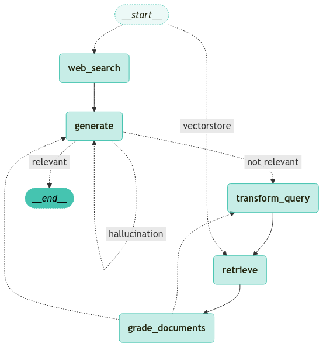

<style>
.custom {
    background-color: #008d8d;
    color: white;
    padding: 0.25em 0.5em 0.25em 0.5em;
    white-space: pre-wrap;       /* css-3 */
    white-space: -moz-pre-wrap;  /* Mozilla, since 1999 */
    white-space: -pre-wrap;      /* Opera 4-6 */
    white-space: -o-pre-wrap;    /* Opera 7 */
    word-wrap: break-word;
}

pre {
    background-color: #027c7c;
    padding-left: 0.5em;
}

</style>

# Adaptive RAG

- Author: [Yoonji Oh](https://github.com/samdaseuss)
- Design: [LeeYuChul](https://github.com/LeeYuChul)
- Peer Review: 
- This is a part of [LangChain Open Tutorial](https://github.com/LangChain-OpenTutorial/LangChain-OpenTutorial)

[](https://colab.research.google.com/github/LangChain-OpenTutorial/LangChain-OpenTutorial/blob/main/99-TEMPLATE/00-BASE-TEMPLATE-EXAMPLE.ipynb) [](https://github.com/LangChain-OpenTutorial/LangChain-OpenTutorial/blob/main/99-TEMPLATE/00-BASE-TEMPLATE-EXAMPLE.ipynb)

## Overview

This tutorial introduces Adaptive RAG, which finds information and generates answers in a smarter way. Adaptive RAG is a system that analyzes the nature of questions using AI, selects the most appropriate method such as web search or internal document search to find information, and creates the best possible answer by trying different methods when necessary. In this tutorial, we implement routing between web search and internal document search using LangGraph.

The purpose of this tutorial is to help users understand the concept of Adaptive RAG and learn how to implement it using LangGraph. Through this, users can perform web searches for questions related to recent events and utilize internal document search with self-correcting capabilities for questions related to indexed content.

**What We Will Learn** 

* **Preparing Data (Create Index)**  
  Convert documents into a format our system can understand and load them
  
* **Using AI (LLMs)**  
  Use AI to analyze questions and evaluate how good our retrieved documents are
  
* **Building Web Search Tool (Web Search Tool)**  
  Set up tools to search for up-to-date information on the web
  
* **Designing System Structure (Construct the Graph)**  
  Design how our system will work and in what order
  
* **Completing the System (Compile Graph)**  
  Turn our design into a working system
  
* **Testing in Action (Use Graph)**  
  Run our completed system and verify it works properly


### Table of Contents

- [Overview](#overview)
- [Environement Setup](#environment-setup)
- [Why Adaptive RAG?](#why-adaptive-rag)
- [Creating a Basic PDF-based Retrieval Chain](#creating-a-basic-pdf-based-retrieval-chain)
- [Query Routing and Document Evaluation](#query-routing-and-document-evaluation)
- [Tools](#tools)
- [Graph Construction](#graph-construction) 
- [Define Graph Flows](#define-graph-flows)
- [Graph Utilization](#graph-utilization)

### References

- [LangChain: Query Construction](https://blog.langchain.dev/query-construction/)
- [LangGraph: Self-Reflective RAG](https://blog.langchain.dev/agentic-rag-with-langgraph/)
- [Adaptive-RAG: Learning to Adapt Retrieval-Augmented Large Language Models through Question Complexity](https://arxiv.org/abs/2403.14403)
----

## Environment Setup

Set up the environment. You may refer to [Environment Setup](https://wikidocs.net/257836) for more details.

**[Note]**
- `langchain-opentutorial` is a package that provides a set of easy-to-use environment setup, useful functions and utilities for tutorials. 
- You can checkout the [`langchain-opentutorial`](https://github.com/LangChain-OpenTutorial/langchain-opentutorial-pypi) for more details.

```python
%%capture --no-stderr
%pip install langchain-opentutorial
```

```python
# Install required packages
from langchain_opentutorial import package

package.install(
    [
        "langchain",
        "langchain_core",
        "langchain_community",
        "langchain_openai",
    ],
    verbose=False,
    upgrade=False,
)
```

<pre class="custom">
    [notice] A new release of pip is available: 24.3.1 -> 25.0
    [notice] To update, run: pip install --upgrade pip
</pre>

```python
# Set environment variables
from langchain_opentutorial import set_env

set_env(
    {
        "OPENAI_API_KEY": "",
        "LANGCHAIN_API_KEY": "",
        "LANGCHAIN_TRACING_V2": "true",
        "LANGCHAIN_ENDPOINT": "https://api.smith.langchain.com",
        "LANGCHAIN_PROJECT": "Adaptive-RAG"
    }
)
```

<pre class="custom">Environment variables have been set successfully.
</pre>

You can alternatively set API keys such as `OPENAI_API_KEY` in a `.env` file and load them.

[NOTE] 

This is not necessary if you've already set the required API keys in previous steps.

```python
# Load API keys from .env file
from dotenv import load_dotenv

load_dotenv(override=True)
```


<pre class="custom">True</pre>


## Why Adaptive RAG?
Let's say an astrophysicist asks these questions to an AI chatbot:

1. "Sagittarius A* just released an unprecedented burst of X-rays - why is this significant?"
2. "Can you analyze how Sagittarius A*'s X-ray emission patterns have changed over the past 5 years?"

While a conventional RAG system would approach information retrieval the same way every time, Adaptive RAG recognizes the different nature of these questions and responds accordingly:

* **Current X-ray burst** → Search the web for real-time observations and urgent analysis from scientists
* **X-ray emission patterns** → Analyze 5 years of observational records from our astrophysics database
* Ability to self-correct if the answer is inaccurate

**Adaptive RAG** is a **RAG** strategy that combines (1) **query analysis** and (2) **Self-Reflective RAG**.

The paper "Adaptive-RAG: Learning to Adapt Retrieval-Augmented Large Language Models through Question Complexity" performs routing through query analysis in the following ways:
* `No Retrieval` 
* `Single-shot RAG` 
* `Iterative RAG` 

We implement this using LangGraph.
In this implementation, we perform the following routing:
* **Web Search** : Used for questions about recent events
* **Self-correcting RAG** : Used for questions about indexed content

<div style="text-align: center;">
    
</div>

## Creating a Basic PDF-based Retrieval Chain
Here we create a Retrieval Chain based on PDF documents. This is the most basic structure of a Retrieval Chain.
Note that in LangGraph, we create the Retriever and Chain separately. This allows us to process each node in detail.

**Note**
* Since this was covered in the previous tutorial, we'll skip the detailed explanations.

```python
%pip install -qU langchain langchain-chroma
```

<pre class="custom">
    [notice] A new release of pip is available: 24.3.1 -> 25.0
    [notice] To update, run: pip install --upgrade pip
    Note: you may need to restart the kernel to use updated packages.
</pre>

```python
file_path = 'data/A European Approach to Artificial Intelligence - A Policy Perspective.pdf'
```

```python
from enum import Enum

class LLMs(Enum):
    GPT4o_MINI = "gpt-4o-mini"
    GPT4o = "gpt-4o"
    GPT4 = GPT4o_MINI

    O1_PREVIEW = "o1-preview"
    O1_MINI = "o1-mini"
    O1 = O1_MINI

    CLAUDE_SONNET = "claude-3-5-sonnet-20241022"
    CLAUDE_HAIKU = "claude-3-5-haiku-20241022"
    CLAUDE = CLAUDE_SONNET

    UPSTAGE_SOLAR_MINI = "solar-mini"
    UPSTAGE_SOLAR_PRO = "solar-pro"
    UPSTAGE = UPSTAGE_SOLAR_PRO

def get_model_name(model: LLMs) -> str:
    """
    :type model: LLMs
    :rtype: str
    """
    try:
        # Return the final value if the value is an Enum member
        current_value = model.value
        while isinstance(current_value, Enum):
            current_value = current_value.value
        return current_value
    except AttributeError:
        return None
```

```python
from langchain_community.document_loaders import PDFPlumberLoader
from langchain_chroma import Chroma
from langchain_openai.embeddings import OpenAIEmbeddings
from langchain_core.prompts import ChatPromptTemplate
from langchain.chains.combine_documents import create_stuff_documents_chain
from langchain_core.runnables import RunnablePassthrough
from langchain_openai import ChatOpenAI

# Create document loader
loader = PDFPlumberLoader(file_path)

# Load documents
documents = loader.load()

# Create embeddings
embeddings = OpenAIEmbeddings()

# Create vector store
vectorstore = Chroma.from_documents(documents, embeddings)

# Create retriever
pdf_retriever = vectorstore.as_retriever()

# Get the latest LLM model name
MODEL_NAME = get_model_name(LLMs.GPT4o)

# Initialize LLM and generate structured output through function calling
llm = ChatOpenAI(model=MODEL_NAME, temperature=0)

prompt = ChatPromptTemplate.from_template("""Answer the following question based on the provided context:\n\nContext: {context}\nQuestion: {question}\n\nAnswer the question based only on the above context.""")

# Create document chain
document_chain = create_stuff_documents_chain(llm, prompt)

# Create retrieval chain
chain = (
    {"context": pdf_retriever, "question": RunnablePassthrough()} 
    | document_chain
)
```

## Query Routing and Document Evaluation
The **LLMs** stage performs **query routing** and **document evaluation** . This process is a crucial part of **Adaptive RAG** , contributing to efficient information retrieval and generation.

* **Query Routing** : Analyzes user queries to route them to appropriate information sources. This enables setting the optimal search path based on the query's purpose.
* **Document Evaluation** : Assesses the quality and relevance of retrieved documents to enhance the accuracy of final results. This process is essential for maximizing the performance of **LLMs** .

This stage supports the core functionality of **Adaptive RAG** and aims to provide accurate and reliable information.

```python
from typing import Literal
from langchain_core.prompts import ChatPromptTemplate
from pydantic import BaseModel, Field

# Data model for routing user queries to the most relevant data source
class RouteQuery(BaseModel):
   """Route a user query to the most relevant datasource."""

   # Literal type field for selecting data source
   datasource: Literal["vectorstore", "web_search"] = Field(
       ...,
       description="Given a user question choose to route it to web search or a vectorstore.",
   )

structured_llm_router = llm.with_structured_output(RouteQuery)

# Create prompt template containing system message and user question
system = """You are an expert at routing a user question to a vectorstore or web search.
The vectorstore contains documents related to "A European Approach to Artificial Intelligence - A Policy Perspective".
Use the vectorstore for questions on European AI policy and regulations. Otherwise, use web-search."""

# Create prompt template for routing
route_prompt = ChatPromptTemplate(
   [
       ("system", system),
       ("human", "{question}"),
   ]
)

# Combine prompt template and structured LLM router to create question router
question_router = route_prompt | structured_llm_router
```

Now let's pass questions to our `rag_chain` to generate responses.

```python
# Question that needs document search
question_router.invoke({"question": "According to the European approach, what are the current limitations of AI applications in healthcare settings?According to the European approach, what are the current limitations of AI applications in healthcare settings?"})
```

<pre class="custom">Failed to multipart ingest runs: langsmith.utils.LangSmithError: Failed to POST https://api.smith.langchain.com/runs/multipart in LangSmith API. HTTPError('403 Client Error: Forbidden for url: https://api.smith.langchain.com/runs/multipart', '{"detail":"Forbidden"}')
</pre>


    RouteQuery(datasource='vectorstore')


```python
# Question that needs web search
question_router.invoke({"question": "Who are the confirmed headliners for Austin City Limits Music Festival 2025?"})
```

<pre class="custom">Failed to multipart ingest runs: langsmith.utils.LangSmithError: Failed to POST https://api.smith.langchain.com/runs/multipart in LangSmith API. HTTPError('403 Client Error: Forbidden for url: https://api.smith.langchain.com/runs/multipart', '{"detail":"Forbidden"}')
    Failed to multipart ingest runs: langsmith.utils.LangSmithError: Failed to POST https://api.smith.langchain.com/runs/multipart in LangSmith API. HTTPError('403 Client Error: Forbidden for url: https://api.smith.langchain.com/runs/multipart', '{"detail":"Forbidden"}')
    Failed to multipart ingest runs: langsmith.utils.LangSmithError: Failed to POST https://api.smith.langchain.com/runs/multipart in LangSmith API. HTTPError('403 Client Error: Forbidden for url: https://api.smith.langchain.com/runs/multipart', '{"detail":"Forbidden"}')
    Failed to multipart ingest runs: langsmith.utils.LangSmithError: Failed to POST https://api.smith.langchain.com/runs/multipart in LangSmith API. HTTPError('403 Client Error: Forbidden for url: https://api.smith.langchain.com/runs/multipart', '{"detail":"Forbidden"}')
    Failed to multipart ingest runs: langsmith.utils.LangSmithError: Failed to POST https://api.smith.langchain.com/runs/multipart in LangSmith API. HTTPError('403 Client Error: Forbidden for url: https://api.smith.langchain.com/runs/multipart', '{"detail":"Forbidden"}')
    Failed to multipart ingest runs: langsmith.utils.LangSmithError: Failed to POST https://api.smith.langchain.com/runs/multipart in LangSmith API. HTTPError('403 Client Error: Forbidden for url: https://api.smith.langchain.com/runs/multipart', '{"detail":"Forbidden"}')
    Failed to multipart ingest runs: langsmith.utils.LangSmithError: Failed to POST https://api.smith.langchain.com/runs/multipart in LangSmith API. HTTPError('403 Client Error: Forbidden for url: https://api.smith.langchain.com/runs/multipart', '{"detail":"Forbidden"}')
    Failed to multipart ingest runs: langsmith.utils.LangSmithError: Failed to POST https://api.smith.langchain.com/runs/multipart in LangSmith API. HTTPError('403 Client Error: Forbidden for url: https://api.smith.langchain.com/runs/multipart', '{"detail":"Forbidden"}')
    Failed to multipart ingest runs: langsmith.utils.LangSmithError: Failed to POST https://api.smith.langchain.com/runs/multipart in LangSmith API. HTTPError('403 Client Error: Forbidden for url: https://api.smith.langchain.com/runs/multipart', '{"detail":"Forbidden"}')
    Failed to multipart ingest runs: langsmith.utils.LangSmithError: Failed to POST https://api.smith.langchain.com/runs/multipart in LangSmith API. HTTPError('403 Client Error: Forbidden for url: https://api.smith.langchain.com/runs/multipart', '{"detail":"Forbidden"}')
    Failed to multipart ingest runs: langsmith.utils.LangSmithError: Failed to POST https://api.smith.langchain.com/runs/multipart in LangSmith API. HTTPError('403 Client Error: Forbidden for url: https://api.smith.langchain.com/runs/multipart', '{"detail":"Forbidden"}')
    Failed to multipart ingest runs: langsmith.utils.LangSmithError: Failed to POST https://api.smith.langchain.com/runs/multipart in LangSmith API. HTTPError('403 Client Error: Forbidden for url: https://api.smith.langchain.com/runs/multipart', '{"detail":"Forbidden"}')
    Failed to multipart ingest runs: langsmith.utils.LangSmithError: Failed to POST https://api.smith.langchain.com/runs/multipart in LangSmith API. HTTPError('403 Client Error: Forbidden for url: https://api.smith.langchain.com/runs/multipart', '{"detail":"Forbidden"}')
    Failed to multipart ingest runs: langsmith.utils.LangSmithError: Failed to POST https://api.smith.langchain.com/runs/multipart in LangSmith API. HTTPError('403 Client Error: Forbidden for url: https://api.smith.langchain.com/runs/multipart', '{"detail":"Forbidden"}')
    Failed to multipart ingest runs: langsmith.utils.LangSmithError: Failed to POST https://api.smith.langchain.com/runs/multipart in LangSmith API. HTTPError('403 Client Error: Forbidden for url: https://api.smith.langchain.com/runs/multipart', '{"detail":"Forbidden"}')
    Failed to multipart ingest runs: langsmith.utils.LangSmithError: Failed to POST https://api.smith.langchain.com/runs/multipart in LangSmith API. HTTPError('403 Client Error: Forbidden for url: https://api.smith.langchain.com/runs/multipart', '{"detail":"Forbidden"}')
    Failed to multipart ingest runs: langsmith.utils.LangSmithError: Failed to POST https://api.smith.langchain.com/runs/multipart in LangSmith API. HTTPError('403 Client Error: Forbidden for url: https://api.smith.langchain.com/runs/multipart', '{"detail":"Forbidden"}')
    Failed to multipart ingest runs: langsmith.utils.LangSmithError: Failed to POST https://api.smith.langchain.com/runs/multipart in LangSmith API. HTTPError('403 Client Error: Forbidden for url: https://api.smith.langchain.com/runs/multipart', '{"detail":"Forbidden"}')
    Failed to multipart ingest runs: langsmith.utils.LangSmithError: Failed to POST https://api.smith.langchain.com/runs/multipart in LangSmith API. HTTPError('403 Client Error: Forbidden for url: https://api.smith.langchain.com/runs/multipart', '{"detail":"Forbidden"}')
</pre>


    RouteQuery(datasource='web_search')


### Retrieval Grader

```python
from pydantic import BaseModel, Field
from langchain_openai import ChatOpenAI
from langchain_core.prompts import ChatPromptTemplate

# Define data model for document evaluation
class GradeDocuments(BaseModel):
   """Binary score for relevance check on retrieved documents."""

   binary_score: str = Field(
       description="Documents are relevant to the question, 'yes' or 'no'"
   )

# Initialize LLM and generate structured output through function calling
llm = ChatOpenAI(model=MODEL_NAME, temperature=0)
structured_llm_grader = llm.with_structured_output(GradeDocuments)

# Create prompt template containing system message and user question
system = """You are a grader assessing relevance of a retrieved document to a user question. \n 
   If the document contains keyword(s) or semantic meaning related to the user question, grade it as relevant. \n
   It does not need to be a stringent test. The goal is to filter out erroneous retrievals. \n
   Give a binary score 'yes' or 'no' score to indicate whether the document is relevant to the question."""

grade_prompt = ChatPromptTemplate(
   [
       ("system", system),
       ("human", "Retrieved document: \n\n {document} \n\n User question: {question}"),
   ]
)

# Create document retrieval grader
retrieval_grader = grade_prompt | structured_llm_grader
```

Using the created `retrieval_grader` to evaluate the document retrieval results.

```python
# Set user question
question = "According to the European approach, what are the current limitations of AI applications in healthcare settings?According to the European approach, what are the current limitations of AI applications in healthcare settings?"

# Retrieve relevant documents for the question
docs = pdf_retriever.invoke(question)

# Get content from retrieved document
retrieved_doc = docs[0].page_content

# Print evaluation results
print(retrieval_grader.invoke({"question": question, "document": retrieved_doc}))
```

<pre class="custom">binary_score='yes'
</pre>

### Creating RAG Chain for Answer Generation

```python
import yaml
from langchain_core.output_parsers import StrOutputParser
from langchain_openai import ChatOpenAI
from langchain_core.prompts.prompt import PromptTemplate

# Get prompt from LangChain Hub (RAG prompt can be freely modified)
def load_prompt_template(file_path: str) -> dict:
    with open(file_path, 'r', encoding='utf-8') as file:
        template_data = yaml.safe_load(file)
    return template_data

template = load_prompt_template('rag/prompts/rag-prompt.yaml')["template"]

# Use PromptTemplate object instead of string
prompt = PromptTemplate(
    template=template,
    input_variables=["question", "context"]
)

# Initialize LLM
llm = ChatOpenAI(model_name=MODEL_NAME, temperature=0)

# Document formatting function
def format_docs(docs):
    return "\n\n".join(
        [
            f'<document><content>{doc.page_content}</content><source>{doc.metadata["source"]}</source><page>{doc.metadata["page"]+1}</page></document>'
            for doc in docs
        ]
    )

# Create RAG chain
rag_chain = prompt | llm | StrOutputParser()
```

Now we'll use our `rag_chain` to generate responses by passing questions to it. 

```python
# Generate answer by passing question to RAG chain
generation = rag_chain.invoke({"context": format_docs(docs), "question": question})
print(generation)
```

<pre class="custom">AI applications in healthcare settings in Europe face several limitations: 
    
    1. **Data Privacy and Trust**: There are concerns about data privacy and patient trust, as AI tools need to demonstrate that they handle data privacy with care beyond GDPR requirements.
    
    2. **Data Governance**: AI tools must prove a clear return on investment, and there is a need for a common language and understanding between data experts and healthcare professionals.
    
    3. **Organizational and Skill Challenges**: There is a need for upskilling or reskilling healthcare practitioners to understand AI's potential, and specific healthcare training should be provided to data scientists.
    
    4. **Regulatory Harmonization**: New AI regulations need to be harmonized with existing regulations, such as medical device regulations, to avoid fragmentation.
    
    5. **Fragmentation of Healthcare Systems**: Fragmented healthcare systems and standards across EU Member States pose challenges for data access and interoperability.
    
    6. **Data Ownership**: There are issues with data ownership, as it varies widely across EU Member States.
    
    **Source**
    - data/A European Approach to Artificial Intelligence - A Policy Perspective.pdf (pages 15-16)
</pre>

### Adding Hallucination Checker for Responses

```python
# Define data model for hallucination check
class GradeHallucinations(BaseModel):
   """Binary score for hallucination present in generation answer."""
   binary_score: str = Field(
       description="Answer is grounded in the facts, 'yes' or 'no'"
   )

# Initialize LLM with function calling
llm = ChatOpenAI(model=MODEL_NAME, temperature=0)
structured_llm_grader = llm.with_structured_output(GradeHallucinations)

# Set up prompt
system = """You are a grader assessing whether an LLM generation is grounded in / supported by a set of retrieved facts. \n 
   Give a binary score 'yes' or 'no'. 'Yes' means that the answer is grounded in / supported by the set of facts."""

# Create prompt template
hallucination_prompt = ChatPromptTemplate(
   [
       ("system", system),
       ("human", "Set of facts: \n\n {documents} \n\n LLM generation: {generation}"),
   ]
)

# Create hallucination grader
hallucination_grader = hallucination_prompt | structured_llm_grader
```

Evaluate hallucinations in the generated response using our created `hallucination_grader` .

```python
# Evaluate hallucinations in generated response using grader
hallucination_grader.invoke({"documents": docs, "generation": generation})
```


<pre class="custom">GradeHallucinations(binary_score='yes')</pre>


```python
class GradeAnswer(BaseModel):
   """Binary scoring to evaluate the appropriateness of answers to questions"""
   binary_score: str = Field(
       description="Indicate 'yes' or 'no' whether the answer solves the question"
   )

# Initialize LLM with function calling
llm = ChatOpenAI(model=MODEL_NAME, temperature=0)
structured_llm_grader = llm.with_structured_output(GradeAnswer)

# Set up prompt
system = """You are a grader assessing whether an answer addresses / resolves a question \n 
    Give a binary score 'yes' or 'no'. Yes' means that the answer resolves the question."""

# Create prompt template
answer_prompt = ChatPromptTemplate(
   [
       ("system", system),
       ("human", "User question: \n\n {question} \n\n LLM generation: {generation}"),
   ]
)

# Create answer grader by combining prompt template and structured LLM grader
answer_grader = answer_prompt | structured_llm_grader
```

```python
# Evaluate if the generated answer resolves the question using grader
answer_grader.invoke({"question": question, "generation": generation})
```


<pre class="custom">GradeAnswer(binary_score='yes')</pre>


### Query Rewriter

```python
from langchain_openai import ChatOpenAI
from langchain_core.prompts import ChatPromptTemplate
from langchain_core.output_parsers import StrOutputParser

# Initialize LLM
llm = ChatOpenAI(model=MODEL_NAME, temperature=0)

# Define Query Rewriter prompt (can be freely modified)
system = """You a question re-writer that converts an input question to a better version that is optimized \n 
for vectorstore retrieval. Look at the input and try to reason about the underlying semantic intent / meaning."""

# Create Query Rewriter prompt template
re_write_prompt = ChatPromptTemplate(
    [
        ("system", system),
        (
            "human",
            "Here is the initial question: \n\n {question} \n Formulate an improved question.",
        ),
    ]
)

# Create Query Rewriter
question_rewriter = re_write_prompt | llm | StrOutputParser()
```

Create an enhanced question by submitting a query to the generated `question_rewriter` .

```python
# Generate an improved question by passing a question to the query rewriter
question_rewriter.invoke({"question": question})
```


<pre class="custom">'What are the current limitations of AI applications in healthcare settings as identified by the European approach?'</pre>


## Tools

### Web Search Tool
The **Web Search Tool** is a critical component of **Adaptive RAG** , used to retrieve the latest information. This tool supports users in obtaining quick and accurate answers to questions related to recent events.

* **Setup** : Prepare the web search tool to search for the most current information.
* **Perform Search** : Search the web for relevant information based on the user's query.
* **Result Analysis** : Analyze the retrieved search results to provide the most appropriate information for the user's question.

```python
from langchain_core.tools import BaseTool
from pydantic import BaseModel, Field
from tavily import TavilyClient
from typing import Literal, Sequence, Optional
import json
import os


class TavilySearchInput(BaseModel):
    """Input for the Tavily tool."""

    query: str = Field(description="검색 쿼리")


def format_search_result(result: dict, include_raw_content: bool = False) -> str:
    """
    Utility functions for formatting search results.

    Args:
        result (dict): Original search result

    Returns:
        str: Formatted search result in XML format
    """

    title = json.dumps(result["title"], ensure_ascii=False)[1:-1]
    content = json.dumps(result["content"], ensure_ascii=False)[1:-1]
    raw_content = ""
    if (
        include_raw_content
        and "raw_content" in result
        and result["raw_content"] is not None
        and len(result["raw_content"].strip()) > 0
    ):
        raw_content = f"<raw>{result['raw_content']}</raw>"

    return f"<document><title>{title}</title><url>{result['url']}</url><content>{content}</content>{raw_content}</document>"


class TavilySearch(BaseTool):
    """
    Tool that queries the Tavily Search API and gets back json
    """

    name: str = "tavily_web_search"
    description: str = (
        "A search engine optimized for comprehensive, accurate, and trusted results. "
        "Useful for when you need to answer questions about current events. "
        "Input should be a search query. [IMPORTANT] Input(query) should be over 5 characters."
    )
    args_schema: type[BaseModel] = TavilySearchInput
    client: TavilyClient = None
    include_domains: list = []
    exclude_domains: list = []
    max_results: int = 3
    topic: Literal["general", "news"] = "general"
    days: int = 3
    search_depth: Literal["basic", "advanced"] = "basic"
    include_answer: bool = False
    include_raw_content: bool = True
    include_images: bool = False
    format_output: bool = False

    def __init__(
        self,
        api_key: Optional[str] = None,
        include_domains: list = [],
        exclude_domains: list = [],
        max_results: int = 3,
        topic: Literal["general", "news"] = "general",
        days: int = 3,
        search_depth: Literal["basic", "advanced"] = "basic",
        include_answer: bool = False,
        include_raw_content: bool = True,
        include_images: bool = False,
        format_output: bool = False,
    ):
        """
        Initializes an instance of the TavilySearch class.

        Args:
            api_key (str): Tavily API key
            include_domains (list): List of domains to include in the search
            exclude_domains (list): List of domains to exclude from the search
            max_results (int): Default number of search results
        """
        super().__init__()
        if api_key is None:
            api_key = os.environ.get("TAVILY_API_KEY", None)

        if api_key is None:
            raise ValueError("Tavily API key is not set.")

        self.client = TavilyClient(api_key=api_key)
        self.include_domains = include_domains
        self.exclude_domains = exclude_domains
        self.max_results = max_results
        self.topic = topic
        self.days = days
        self.search_depth = search_depth
        self.include_answer = include_answer
        self.include_raw_content = include_raw_content
        self.include_images = include_images
        self.format_output = format_output

    def _run(self, query: str) -> str:
        results = self.search(query)
        return results

    def search(
        self,
        query: str,
        search_depth: Literal["basic", "advanced"] = None,
        topic: Literal["general", "news"] = None,
        days: int = None,
        max_results: int = None, 
        include_domains: Sequence[str] = None,
        exclude_domains: Sequence[str] = None,
        include_answer: bool = None,
        include_raw_content: bool = None,
        include_images: bool = None,
        format_output: bool = None,
        **kwargs,
    ) -> list:
        """
        Perform search and return results.

        Args:
            query (str): Search query
            search_depth (str): Search depth ("basic" or "advanced") 
            topic (str): Search topic ("general" or "news")
            days (int): Date range to search
            max_results (int): Maximum number of search results
            include_domains (list): List of domains to include in search
            exclude_domains (list): List of domains to exclude from search 
            include_answer (bool): Whether to include answer
            include_raw_content (bool): Whether to include raw content
            include_images (bool): Whether to include images
            format_output (bool): Whether to format output
            **kwargs: Additional keyword arguments

        Returns:
            list: List of search results
        """

        params = {
            "query": query,
            "search_depth": search_depth or self.search_depth,
            "topic": topic or self.topic,
            "max_results": max_results or self.max_results,
            "include_domains": include_domains or self.include_domains,
            "exclude_domains": exclude_domains or self.exclude_domains,
            "include_answer": (
                include_answer if include_answer is not None else self.include_answer
            ),
            "include_raw_content": (
                include_raw_content 
                if include_raw_content is not None
                else self.include_raw_content
            ),
            "include_images": (
                include_images if include_images is not None else self.include_images
            ),
            **kwargs,
        }

        # Handle days parameter
        if days is not None:
            if params["topic"] == "general":
                print(
                    "Warning: days parameter is ignored for 'general' topic search. Set topic parameter to 'news' to use days."
                )
            else:
                params["days"] = days

        # Call API
        response = self.client.search(**params)

        format_output = (
            format_output if format_output is not None else self.format_output
        )
        if format_output:
            return [
                format_search_result(r, params["include_raw_content"])
                for r in response["results"]
            ]
        else:
            return response["results"]

    def get_search_context(
        self,
        query: str,
        search_depth: Literal["basic", "advanced"] = "basic",
        topic: Literal["general", "news"] = "general",
        days: int = 3,
        max_results: int = 5,
        include_domains: Sequence[str] = None,
        exclude_domains: Sequence[str] = None,
        max_tokens: int = 4000,
        format_output: bool = True,
        **kwargs,
    ) -> str:
        """
        Retrieves context for a search query. Useful for getting relevant content from websites without 
        needing to handle context extraction and limitation manually.

        Args:
            query (str): Search query
            search_depth (str): Search depth ("basic" or "advanced")
            topic (str): Search topic ("general" or "news")
            days (int): Date range to search
            max_results (int): Maximum number of search results 
            include_domains (list): List of domains to include in search
            exclude_domains (list): List of domains to exclude from search
            max_tokens (int): Maximum number of tokens to return (based on openai token counting). Defaults to 4000.
            format_output (bool): Whether to format output
            **kwargs: Additional keyword arguments

        Returns:
            str: JSON string containing search context up to token limit
        """
        response = self.client.search(
            query,
            search_depth=search_depth,
            topic=topic,
            days=days,
            max_results=max_results,
            include_domains=include_domains,
            exclude_domains=exclude_domains,
            include_answer=False,
            include_raw_content=False,
            include_images=False,
            **kwargs,
        )

        sources = response.get("results", [])
        if format_output:
            context = [
                format_search_result(source, include_raw_content=False)
                for source in sources
            ]
        else:
            context = [
                {
                    "url": source["url"],
                    "content": json.dumps(
                        {"title": source["title"], "content": source["content"]},
                        ensure_ascii=False,
                    ),
                }
                for source in sources
            ]

        # Logic for max_tokens handling needs to be implemented here
        # Currently returns all context simply
        return json.dumps(context, ensure_ascii=False)

```

```python
# Create web search tool
web_search_tool = TavilySearch(max_results=3)
```

Run the web search tool and check the results.

```python
# Call the web search tool
result = web_search_tool.search("Who are the confirmed headliners for Austin City Limits Music Festival 2025?")
print(result)
```

<pre class="custom">[{'title': 'Austin City Limits 2025 - Get Tickets & See Lineup', 'url': 'https://austincitylimits.us/', 'content': 'Wed Mar 57:30 PM ApocalypticaACL Live At The Moody Theater, Austin, TX Get Tickets Sat Mar 228:00 PM Wanda SykesACL Live At The Moody Theater, Austin, TX Get Tickets Sun Mar 237:00 PM Nikki GlaserACL Live At The Moody Theater, Austin, TX Get Tickets Tue Mar 258:00 PM How Did This Get Made?ACL Live At The Moody Theater, Austin, TX Get Tickets Sat Apr 199:00 PM Soul CoughingACL Live At The Moody Theater, Austin, TX Get Tickets Sat Apr 267:00 PM Felipe EsparzaACL Live At The Moody Theater, Austin, TX Get Tickets Sat May 315:00 PM Taylor TomlinsonACL Live At The Moody Theater, Austin, TX Get Tickets Sat May 318:00 PM Taylor TomlinsonACL Live At The Moody Theater, Austin, TX Get Tickets', 'score': 0.81770587, 'raw_content': "Austin City Limits 2025 - Get Tickets & See Lineup\nSkip to content\nAustin City Limits 2025\n\nAustin City Limits 2025\n\nAustin City Limits 2025\nBe ready for the most prestigious music festivals on the planet in 2025. Austin City Limits (ACL) is scheduled to return in 2025! The festival is held in the lively Austin city Austin, Texas, ACL is renowned for its varied lineup, spectacular ambience, and unparalleled mix of music, tradition, and culture. The event will be held over two weekends in the famous Zilker Park, ACL 2025 promises to provide an unforgettable experience featuring performances by global stars as well as rising stars and all things between. If you’re a fervent fan of music or are just wanting to have a blast, ACL is the place to be!\nConcert Dates & Discounted Tickets\nFri Jan 248:00 PM PhantogramACL Live At The Moody Theater, Austin, TX Get Tickets\nSat Jan 258:00 PM Travis - The BandACL Live At The Moody Theater, Austin, TX Get Tickets\nThu Jan 308:00 PM The Temptations & The Four TopsACL Live At The Moody Theater, Austin, TX Get Tickets\nSat Feb 17:00 PM Ali SiddiqACL Live At The Moody Theater, Austin, TX Get Tickets\nSun Feb 28:00 PM Mania - The ABBA TributeACL Live At The Moody Theater, Austin, TX Get Tickets\nFri Feb 78:00 PM The Fab Four - The Ultimate TributeACL Live At The Moody Theater, Austin, TX Get Tickets\nFri Feb 148:00 PM Bob SchneiderACL Live At The Moody Theater, Austin, TX Get Tickets\nTue Feb 188:00 PM Jorja SmithACL Live At The Moody Theater, Austin, TX Get Tickets\nThu Feb 208:00 PM David GrayACL Live At The Moody Theater, Austin, TX Get Tickets\nFri Feb 218:00 PM Three Dog NightACL Live At The Moody Theater, Austin, TX Get Tickets\nSat Feb 227:00 PM Texas Songwriters Hall of Fame AwardsACL Live At The Moody Theater, Austin, TX Get Tickets\nThu Feb 277:30 PM Bright EyesACL Live At The Moody Theater, Austin, TX Get Tickets\nFri Feb 288:30 PM Imagine Muny IVACL Live At The Moody Theater, Austin, TX Get Tickets\nTue Mar 46:00 PM Blippi LiveACL Live At The Moody Theater, Austin, TX Get Tickets\nWed Mar 57:30 PM ApocalypticaACL Live At The Moody Theater, Austin, TX Get Tickets\nThu Mar 68:00 PM Yacht Rock RevueACL Live At The Moody Theater, Austin, TX Get Tickets\nThu Mar 208:00 PM Trombone Shorty And Orleans Avenue & Tank and The BangasACL Live At The Moody Theater, Austin, TX Get Tickets\nFri Mar 218:00 PM Violent FemmesACL Live At The Moody Theater, Austin, TX Get Tickets\nSat Mar 228:00 PM Wanda SykesACL Live At The Moody Theater, Austin, TX Get Tickets\nSun Mar 237:00 PM Nikki GlaserACL Live At The Moody Theater, Austin, TX Get Tickets\nMon Mar 248:00 PM JohnnyswimACL Live At The Moody Theater, Austin, TX Get Tickets\nTue Mar 258:00 PM How Did This Get Made?ACL Live At The Moody Theater, Austin, TX Get Tickets\nThu Mar 277:30 PM Nitty Gritty Dirt BandACL Live At The Moody Theater, Austin, TX Get Tickets\nFri Mar 287:00 PM Anjelah Johnson-ReyesACL Live At The Moody Theater, Austin, TX Get Tickets\nSat Mar 298:00 PM Jimmy O. YangACL Live At The Moody Theater, Austin, TX Get Tickets\nSun Mar 307:00 PM Anjelah Johnson-ReyesACL Live At The Moody Theater, Austin, TX Get Tickets\nMon Mar 317:00 PM Half AliveACL Live At The Moody Theater, Austin, TX Get Tickets\nWed Apr 28:00 PM Chicago - The BandACL Live At The Moody Theater, Austin, TX Get Tickets\nThu Apr 38:00 PM Jason Isbell & The 400 UnitACL Live At The Moody Theater, Austin, TX Get Tickets\nFri Apr 48:00 PM Jason Isbell & The 400 UnitACL Live At The Moody Theater, Austin, TX Get Tickets\nSat Apr 58:00 PM Jason Isbell & The 400 UnitACL Live At The Moody Theater, Austin, TX Get Tickets\nWed Apr 98:00 PM Jim Henson's Labyrinth - In ConcertACL Live At The Moody Theater, Austin, TX Get Tickets\nSun Apr 137:30 PM Amos LeeACL Live At The Moody Theater, Austin, TX Get Tickets\nTue Apr 157:00 PM Meshuggah, Cannibal Corpse & CarcassACL Live At The Moody Theater, Austin, TX Get Tickets\nThu Apr 177:30 PM Bitch SeshACL Live At The Moody Theater, Austin, TX Get Tickets\nSat Apr 199:00 PM Soul CoughingACL Live At The Moody Theater, Austin, TX Get Tickets\nWed Apr 238:00 PM Japanese BreakfastACL Live At The Moody Theater, Austin, TX Get Tickets\nThu Apr 249:00 PM Eric ChurchACL Live At The Moody Theater, Austin, TX Get Tickets\nSat Apr 267:00 PM Felipe EsparzaACL Live At The Moody Theater, Austin, TX Get Tickets\nSun Apr 278:00 PM Matt MathewsACL Live At The Moody Theater, Austin, TX Get Tickets\nThu May 18:00 PM Joe Russo's Almost DeadACL Live At The Moody Theater, Austin, TX Get Tickets\nSat May 37:00 PM Mayday ParadeACL Live At The Moody Theater, Austin, TX Get Tickets\nSun May 48:00 PM Jack WhiteACL Live At The Moody Theater, Austin, TX Get Tickets\nMon May 58:00 PM Jack WhiteACL Live At The Moody Theater, Austin, TX Get Tickets\nTue May 68:00 PM Get The Led Out - Tribute BandACL Live At The Moody Theater, Austin, TX Get Tickets\nThu May 88:00 PM Blackberry SmokeACL Live At The Moody Theater, Austin, TX Get Tickets\nSun May 117:30 PM Alton Brown: Last BiteACL Live At The Moody Theater, Austin, TX Get Tickets\nThu May 157:00 PM Nikki GlaserACL Live At The Moody Theater, Austin, TX Get Tickets\nThu May 159:30 PM Nikki GlaserACL Live At The Moody Theater, Austin, TX Get Tickets\nSat May 178:00 PM Ha*AshACL Live At The Moody Theater, Austin, TX Get Tickets\nSun May 187:30 PM Trisha PaytasACL Live At The Moody Theater, Austin, TX Get Tickets\nWed May 218:00 PM Hippo Campus & Hotline TNTACL Live At The Moody Theater, Austin, TX Get Tickets\nFri May 238:00 PM Ryan AdamsACL Live At The Moody Theater, Austin, TX Get Tickets\nThu May 297:30 PM Samara JoyACL Live At The Moody Theater, Austin, TX Get Tickets\nFri May 307:00 PM Taylor TomlinsonACL Live At The Moody Theater, Austin, TX Get Tickets\nSat May 315:00 PM Taylor TomlinsonACL Live At The Moody Theater, Austin, TX Get Tickets\nSat May 318:00 PM Taylor TomlinsonACL Live At The Moody Theater, Austin, TX Get Tickets\nTue Jun 38:00 PM OMD - Orchestral Manoeuvres In The DarkACL Live At The Moody Theater, Austin, TX Get Tickets\nSat Jun 78:00 PM The Righteous BrothersACL Live At The Moody Theater, Austin, TX Get Tickets\nWed Jun 116:00 PM The WigglesACL Live At The Moody Theater, Austin, TX Get Tickets\nSat Jun 147:00 PM Kevin JamesACL Live At The Moody Theater, Austin, TX Get Tickets\nSat Aug 28:00 PM Brit FloydACL Live At The Moody Theater, Austin, TX Get Tickets\nSun Sep 217:00 PM Stardew Valley: Symphony Of SeasonsACL Live At The Moody Theater, Austin, TX Get Tickets\nSat Sep 277:00 PM Matt RifeACL Live At The Moody Theater, Austin, TX Get Tickets\nSat Sep 2710:00 PM Matt RifeACL Live At The Moody Theater, Austin, TX Get Tickets\nSun Sep 285:00 PM Matt RifeACL Live At The Moody Theater, Austin, TX Get Tickets\nSun Sep 288:00 PM Matt RifeACL Live At The Moody Theater, Austin, TX Get Tickets\nFri Oct 3TBD Austin City Limits Music Festival: Weekend One - 3 Day PassZilker Park, Austin, TX Get Tickets\nFri Oct 312:00 PM Austin City Limits Music Festival: Weekend One - FridayZilker Park, Austin, TX Get Tickets\nSat Oct 411:00 AM Austin City Limits Music Festival: Weekend One - SaturdayZilker Park, Austin, TX Get Tickets\nSun Oct 511:00 AM Austin City Limits Music Festival: Weekend One - SundayZilker Park, Austin, TX Get Tickets\nFri Oct 10TBD Austin City Limits Music Festival: Weekend Two - 3 Day PassZilker Park, Austin, TX Get Tickets\nFri Oct 1012:00 PM Austin City Limits Music Festival: Weekend Two - FridayZilker Park, Austin, TX Get Tickets\nSat Oct 1111:00 AM Austin City Limits Music Festival: Weekend Two - SaturdayZilker Park, Austin, TX Get Tickets\nSun Oct 1211:00 AM Austin City Limits Music Festival: Weekend Two - SundayZilker Park, Austin, TX Get Tickets\nWed Oct 158:00 PM Killer QueenACL Live At The Moody Theater, Austin, TX Get Tickets\nWed Nov 127:00 PM Sarah MillicanACL Live At The Moody Theater, Austin, TX Get Tickets\nWhy Austin City Limits 2025 Is a Must-Attend Festival\nAustin City Limits is more than a mere music festival. It’s an event of culture that brings fans from across the globe to enjoy the universal music language. With its diverse selection of music genres as well as delicious local food and a warm, welcoming environment, ACL has something for all. Here’s a few reasons to make plans to go to Austin City Limits 2025:\n\nA Lineup With Something for everyone: ACL is famous for its diverse lineup of artists that range that range from rock and indie to electronic, hip-hop country, and even beyond. The lineups of the past have included the famous likes Billie Eilish, The Red Hot Chili Peppers, Kendrick Lamar as well as Stevie Nicks. The 2025 lineup has not yet announced but you can anticipate to see a variety of chart-topping headliners as well as legendary acts and emerging artists, making sure there’s plenty of music for everyone.\nTwo weekends of non-stop music Two consecutive weekends of live performances on various stages, the ACL 2025 festival offers the chance to enjoy your favourite artists in person and experience new music in an exciting festival-like setting. The festival’s layout makes simple to get between stages, so that you can attend as many events as you can.\nAn ode to Austin’s Unique Culture known for being the Live Music Capital of the World, Austin provides the ideal backdrop for ACL. Beyond the music, festival goers are able to enjoy Austin’s famed food scene, with a range of local vendors selling anything from barbecue and tacos to vegan delicacies and gourmet food. ACL also has local artists market, crafts, and interactive experiences that highlight Austin’s artistic flair.\n\nWhat to Expect at Austin City Limits 2025\nImagine yourself in the pleasant Texas sun in the midst of the sound of music on the radio, scent of mouthwatering food and a large crowd of festival-goers who are happy. Austin City Limits 2025 promises to provide all of this and many more. What can you anticipate from ACL:\n\nMultiple stages with non-stop music With a variety of stages that are set up in Zilker Park, ACL provides continuous music, with intimate performances on smaller stages, to large performances at the central stage. If you’re a fan of hip-hop, rock, pop electronic or other genres of music, you’ll be able to find the stage that is perfect for you.\nLocal Food and Drinks One of the highlights of ACL is the fact that it’s committed to showcase local food and drinks vendors. From famous Austin BBQ restaurants to craft breweries, as well as innovative vegan alternatives, the festival provides the same culinary experiences that are as varied and thrilling as the music lineup. Don’t miss the renowned Austin Eats food court, which is where you can sample of Austin’s finest offerings.\nActivities, Art and more: ACL isn’t just about music. The festival also offers many activities and experiences between sets. Take a look at the artwork or shop for unique items at the market for crafts or relax on any of the shady relaxing areas. Family-friendly, ACL is also offering Austin Kiddie Limits which is a mini-festival that is part of the festival, featuring kids-friendly entertainment, activities and arts and crafts.\n\nHow to Secure Your Tickets\nTickets to Austin City Limits 2025 are anticipated to sell out fast Here’s ways to ensure that you’re a part of this unforgettable experience:\n\nStay updated Keep up to date by following Austin City Limits on social media and keep an eye on the official site often for news about tickets auctions, line-up announcements and much more. Joining their newsletter is an excellent way to get early access to tickets as well as special deals.\nPick your experience: ACL offers a wide range of ticket options, which include single-day passes as well as three-day weekend passes and Platinum and VIP experiences. Each offer offers different levels of accessibility and amenities, so choose which type of experience you’d like to have and make sure you are ready to buy your tickets as soon as they are available for purchase.\nBe ready to act quickly Tickets are available and you are unsure, Austin City Limits has a reputation to sell out fast. Make a note of the date and time of sale and be ready to reserve your tickets as soon they are available.\n\nExperience the Magic of Austin City Limits Live\nAustin City Limits 2025 won’t be just another festival for music, it’s an expression of music and culture as well as community, set against the vibrant background in Austin, Texas. If you’re an experienced festival goer or a novice, ACL offers a unique experience that’s both thrilling and absorbing and combines live music at its best and the vibrant spirit of Austin.\nGather your friends Get ready to party, and prepare for a weekend filled with amazing music, delicious food and unforgettable memories. Austin City Limits 2025 is coming and it’s a party you’ll not wish to miss!\nAustin City Limits 2025\nAbout\n\nTeam\nHistory\nCareers\n\nPrivacy\n\nPrivacy Policy\nTerms and Conditions\nContact Us\n\nSocial\n\nFacebook\nInstagram\nTwitter/X\n\nDesigned with WordPress"}, {'title': 'Austin City Limits Music Festival 2025 - Holler', 'url': 'https://holler.country/festivals/austin-city-limits-music-festival-2025', 'content': "Austin City Limits Music Festival 2025: Line-Up, Dates & Tickets | Holler Austin City Limits Music Festival 2025 Full name Austin City Limits Music Festival 2025 * The dates for Austin City Limits Music Festival 2025 are yet to be confirmed - October 3-5 and 10-12 are speculative dates. Austin City Limits Music Festival is one of the year's most exciting events, regardless of your genre preferences. Here, we'll have all the up-to-date news on line-up announcements, the latest ticket and festival pass details, and any further exciting info and details for 2025. When tickets for Austin City Limits Music Festival 2025 are released, they'll be available to purchase below: To support Holler, book your stay for Austin City Limits Music Festival 2025 below:", 'score': 0.5758033, 'raw_content': "Austin City Limits Music Festival 2025: Line-Up, Dates & Tickets | Holler\nnews•lists•festivals•videos•playlists•reviews•features•tours\n\nTickets•about•artists•contributors\n\n\n\nfestival\nAustin City Limits Music Festival 2025\nBy Lydia Farthing\nOctober 16, 2024 4:53 pm GMT\n\n\n\nLink copied\n\n\nFull name Austin City Limits Music Festival 2025\n\n\nDates Oct 3 - 12, 2025\n\n\nLocation Austin, Texas\n\n\nLine up TBC\n\n\nTickets Get Tickets\n\n\n* The dates for Austin City Limits Music Festival 2025 are yet to be confirmed - October 3-5 and 10-12 are speculative dates.\nAustin City Limits Music Festival is one of the year's most exciting events, regardless of your genre preferences. Welcoming acts from all across the musical spectrum, ACL is a once in a lifetime experience that just so happens to take place twice a year.\nBoasting two consecutive weekends jam-packed with sizzling up-and-comers, established hitmakers and award-winning entertainers, it's an unforgettable spread that will likely make its return to Austin, Texas in October of 2025.\nHere, we'll have all the up-to-date news on line-up announcements, the latest ticket and festival pass details, and any further exciting info and details for 2025.\nSince opening its gates in 2002, ACL has hosted well over 130 artists and welcomed more than 225,000 attendees to Zilker Park every year.\nWith a truly sprawling lineup of talent teed up across the 2024 weekends, organizers were able to snag acts like Chris Stapleton, Sturgill Simpson, Dua Lipa, Tyler the Creator, Blink-182 and more as headliners for the thrilling installment.\nRepresenting the country, Americana and roots genres across the event were Caamp, The Red Clay Strays, Orville Peck, Medium Build, Mickey Guyton, Asleep at the Wheel, Richy Mitch & the Coal Miners, Katie Pruitt, Tanner Adell, Emily Nenni, Tyler Halverson and viral sensation Dasha, among others.\nWhen tickets for Austin City Limits Music Festival 2025 are released, they'll be available to purchase below:\nBuy tickets here\nTo support Holler, book your stay for Austin City Limits Music Festival 2025 below:\nBook your stay\nCheck out other country festivals set for 2024 and 2025.\nWritten by Lydia Farthing\nRELATED CONTENT\n\nnews\n“Let's Ride”: Jelly Roll Features in John Cena's New TV Series, ‘What Drives You’\n\nnews\n“I'm Just Asking For a Little Bit of Grace”: Bailey Zimmerman Apologises for Drunken Crash My Playa Performance\n\nnews\n“There's an Awful Lot of Freedom to The Songs”: Kenny Chesney Finalises Setlist Ahead of Las Vegas Sphere Residency\n\nnews\nWATCH: Parker McCollum Covers Toby Keith's ‘Courtesy of the Red, White and Blue’ at Liberty Ball for Trump's Inauguration\nGet the best of Country in your inbox\nSubmit\nPrivacy and Cookies Terms and ConditionsAboutEditorial Policy\n© HOLLER 2025. ALL RIGHTS RESERVED.\nNewsReviewsFeaturesVideosPlaylists\nArtistsFestivalsToursListsTickets\n\n"}, {'title': 'Austin City Limits Music Festival | Austin, TX | October 3-5 & 10-12, 2025', 'url': 'https://www.aclfestival.com/', 'content': 'Austin City Limits Music Festival will be presented at Zilker Park, in Austin, TX on October 3-5 & 10-12, 2025. Stay connected for upcoming announcements, artist news, giveaways, and more!', 'score': 0.5608546, 'raw_content': "Home\nTickets\nLineup\n\u200d\nBook Hotel\nACL Fest Returns Oct 4-6 & 11-13, 2024!\nSign up to be the first to know about the 2024 lineup, presale, & more!\nSign Up Via Text\nMobile Numbers from US Carriers Only\nOr Sign Up Via Email\nBook your hotel today at the best locations near ACL Fest, featuring exclusive rates from our official hotel partner IHG® Hotels & Resorts.\nBook Hotel\nExperience ACL Fest with a GA+, VIP, or Platinum Ticket!\nTickets\nFind quick answers to your questions on all things ACL Fest.\nVisit The Help Center\nMusic. Lots of it.\nACL Festival features a diverse lineup of acts every year with 9 stages, 100+ performances — and best of all, two weekends.\nBest Bites in town!\nTacos, brews, vegan options and more. The ACL Eats Food Court at ACL Fest offers the most delicious festival food, drinks and sweets from Austin and the surrounding area’s favorite restaurants.\nMore to explore.\nThere’s plenty to do in between sets, including a mini-fest for kids, photogenic spaces, sponsored giveaways and merch to bring home with you.\nUltimate access & Luxury perks!\nTake your ACL Fest experience to the next level with our GA+, VIP and Platinum Tickets. Enjoy prime views, luxury indulgences and getaways from the crowd.\nPartners\nAmex\nHonda\nT-Mobile\nTito's\nBMI\nIHG\nElectrolit\nTexas Children's Hospital\nCoke\nAperol\nHEB\nLifeway\nHendrick's Gin\nRambler\nFestival\nTickets\nLineup\nHelp\nContact Us\nHelp Center\nSafety\nAccessibility\nSocial\nInstagram\nTikTok\nFacebook\nTwitter\nYouTube\nDiscord\nReddit\nSubscribe"}]
</pre>

```python
# heck the first result of the web search result
result[0]
```


<pre class="custom">{'title': 'Austin City Limits 2025 - Get Tickets & See Lineup',
     'url': 'https://austincitylimits.us/',
     'content': 'Wed Mar 57:30 PM ApocalypticaACL Live At The Moody Theater, Austin, TX Get Tickets Sat Mar 228:00 PM Wanda SykesACL Live At The Moody Theater, Austin, TX Get Tickets Sun Mar 237:00 PM Nikki GlaserACL Live At The Moody Theater, Austin, TX Get Tickets Tue Mar 258:00 PM How Did This Get Made?ACL Live At The Moody Theater, Austin, TX Get Tickets Sat Apr 199:00 PM Soul CoughingACL Live At The Moody Theater, Austin, TX Get Tickets Sat Apr 267:00 PM Felipe EsparzaACL Live At The Moody Theater, Austin, TX Get Tickets Sat May 315:00 PM Taylor TomlinsonACL Live At The Moody Theater, Austin, TX Get Tickets Sat May 318:00 PM Taylor TomlinsonACL Live At The Moody Theater, Austin, TX Get Tickets',
     'score': 0.81770587,
     'raw_content': "Austin City Limits 2025 - Get Tickets & See Lineup\nSkip to content\nAustin City Limits 2025\n\nAustin City Limits 2025\n\nAustin City Limits 2025\nBe ready for the most prestigious music festivals on the planet in 2025. Austin City Limits (ACL) is scheduled to return in 2025! The festival is held in the lively Austin city Austin, Texas, ACL is renowned for its varied lineup, spectacular ambience, and unparalleled mix of music, tradition, and culture. The event will be held over two weekends in the famous Zilker Park, ACL 2025 promises to provide an unforgettable experience featuring performances by global stars as well as rising stars and all things between. If you’re a fervent fan of music or are just wanting to have a blast, ACL is the place to be!\nConcert Dates & Discounted Tickets\nFri Jan 248:00 PM PhantogramACL Live At The Moody Theater, Austin, TX Get Tickets\nSat Jan 258:00 PM Travis - The BandACL Live At The Moody Theater, Austin, TX Get Tickets\nThu Jan 308:00 PM The Temptations & The Four TopsACL Live At The Moody Theater, Austin, TX Get Tickets\nSat Feb 17:00 PM Ali SiddiqACL Live At The Moody Theater, Austin, TX Get Tickets\nSun Feb 28:00 PM Mania - The ABBA TributeACL Live At The Moody Theater, Austin, TX Get Tickets\nFri Feb 78:00 PM The Fab Four - The Ultimate TributeACL Live At The Moody Theater, Austin, TX Get Tickets\nFri Feb 148:00 PM Bob SchneiderACL Live At The Moody Theater, Austin, TX Get Tickets\nTue Feb 188:00 PM Jorja SmithACL Live At The Moody Theater, Austin, TX Get Tickets\nThu Feb 208:00 PM David GrayACL Live At The Moody Theater, Austin, TX Get Tickets\nFri Feb 218:00 PM Three Dog NightACL Live At The Moody Theater, Austin, TX Get Tickets\nSat Feb 227:00 PM Texas Songwriters Hall of Fame AwardsACL Live At The Moody Theater, Austin, TX Get Tickets\nThu Feb 277:30 PM Bright EyesACL Live At The Moody Theater, Austin, TX Get Tickets\nFri Feb 288:30 PM Imagine Muny IVACL Live At The Moody Theater, Austin, TX Get Tickets\nTue Mar 46:00 PM Blippi LiveACL Live At The Moody Theater, Austin, TX Get Tickets\nWed Mar 57:30 PM ApocalypticaACL Live At The Moody Theater, Austin, TX Get Tickets\nThu Mar 68:00 PM Yacht Rock RevueACL Live At The Moody Theater, Austin, TX Get Tickets\nThu Mar 208:00 PM Trombone Shorty And Orleans Avenue & Tank and The BangasACL Live At The Moody Theater, Austin, TX Get Tickets\nFri Mar 218:00 PM Violent FemmesACL Live At The Moody Theater, Austin, TX Get Tickets\nSat Mar 228:00 PM Wanda SykesACL Live At The Moody Theater, Austin, TX Get Tickets\nSun Mar 237:00 PM Nikki GlaserACL Live At The Moody Theater, Austin, TX Get Tickets\nMon Mar 248:00 PM JohnnyswimACL Live At The Moody Theater, Austin, TX Get Tickets\nTue Mar 258:00 PM How Did This Get Made?ACL Live At The Moody Theater, Austin, TX Get Tickets\nThu Mar 277:30 PM Nitty Gritty Dirt BandACL Live At The Moody Theater, Austin, TX Get Tickets\nFri Mar 287:00 PM Anjelah Johnson-ReyesACL Live At The Moody Theater, Austin, TX Get Tickets\nSat Mar 298:00 PM Jimmy O. YangACL Live At The Moody Theater, Austin, TX Get Tickets\nSun Mar 307:00 PM Anjelah Johnson-ReyesACL Live At The Moody Theater, Austin, TX Get Tickets\nMon Mar 317:00 PM Half AliveACL Live At The Moody Theater, Austin, TX Get Tickets\nWed Apr 28:00 PM Chicago - The BandACL Live At The Moody Theater, Austin, TX Get Tickets\nThu Apr 38:00 PM Jason Isbell & The 400 UnitACL Live At The Moody Theater, Austin, TX Get Tickets\nFri Apr 48:00 PM Jason Isbell & The 400 UnitACL Live At The Moody Theater, Austin, TX Get Tickets\nSat Apr 58:00 PM Jason Isbell & The 400 UnitACL Live At The Moody Theater, Austin, TX Get Tickets\nWed Apr 98:00 PM Jim Henson's Labyrinth - In ConcertACL Live At The Moody Theater, Austin, TX Get Tickets\nSun Apr 137:30 PM Amos LeeACL Live At The Moody Theater, Austin, TX Get Tickets\nTue Apr 157:00 PM Meshuggah, Cannibal Corpse & CarcassACL Live At The Moody Theater, Austin, TX Get Tickets\nThu Apr 177:30 PM Bitch SeshACL Live At The Moody Theater, Austin, TX Get Tickets\nSat Apr 199:00 PM Soul CoughingACL Live At The Moody Theater, Austin, TX Get Tickets\nWed Apr 238:00 PM Japanese BreakfastACL Live At The Moody Theater, Austin, TX Get Tickets\nThu Apr 249:00 PM Eric ChurchACL Live At The Moody Theater, Austin, TX Get Tickets\nSat Apr 267:00 PM Felipe EsparzaACL Live At The Moody Theater, Austin, TX Get Tickets\nSun Apr 278:00 PM Matt MathewsACL Live At The Moody Theater, Austin, TX Get Tickets\nThu May 18:00 PM Joe Russo's Almost DeadACL Live At The Moody Theater, Austin, TX Get Tickets\nSat May 37:00 PM Mayday ParadeACL Live At The Moody Theater, Austin, TX Get Tickets\nSun May 48:00 PM Jack WhiteACL Live At The Moody Theater, Austin, TX Get Tickets\nMon May 58:00 PM Jack WhiteACL Live At The Moody Theater, Austin, TX Get Tickets\nTue May 68:00 PM Get The Led Out - Tribute BandACL Live At The Moody Theater, Austin, TX Get Tickets\nThu May 88:00 PM Blackberry SmokeACL Live At The Moody Theater, Austin, TX Get Tickets\nSun May 117:30 PM Alton Brown: Last BiteACL Live At The Moody Theater, Austin, TX Get Tickets\nThu May 157:00 PM Nikki GlaserACL Live At The Moody Theater, Austin, TX Get Tickets\nThu May 159:30 PM Nikki GlaserACL Live At The Moody Theater, Austin, TX Get Tickets\nSat May 178:00 PM Ha*AshACL Live At The Moody Theater, Austin, TX Get Tickets\nSun May 187:30 PM Trisha PaytasACL Live At The Moody Theater, Austin, TX Get Tickets\nWed May 218:00 PM Hippo Campus & Hotline TNTACL Live At The Moody Theater, Austin, TX Get Tickets\nFri May 238:00 PM Ryan AdamsACL Live At The Moody Theater, Austin, TX Get Tickets\nThu May 297:30 PM Samara JoyACL Live At The Moody Theater, Austin, TX Get Tickets\nFri May 307:00 PM Taylor TomlinsonACL Live At The Moody Theater, Austin, TX Get Tickets\nSat May 315:00 PM Taylor TomlinsonACL Live At The Moody Theater, Austin, TX Get Tickets\nSat May 318:00 PM Taylor TomlinsonACL Live At The Moody Theater, Austin, TX Get Tickets\nTue Jun 38:00 PM OMD - Orchestral Manoeuvres In The DarkACL Live At The Moody Theater, Austin, TX Get Tickets\nSat Jun 78:00 PM The Righteous BrothersACL Live At The Moody Theater, Austin, TX Get Tickets\nWed Jun 116:00 PM The WigglesACL Live At The Moody Theater, Austin, TX Get Tickets\nSat Jun 147:00 PM Kevin JamesACL Live At The Moody Theater, Austin, TX Get Tickets\nSat Aug 28:00 PM Brit FloydACL Live At The Moody Theater, Austin, TX Get Tickets\nSun Sep 217:00 PM Stardew Valley: Symphony Of SeasonsACL Live At The Moody Theater, Austin, TX Get Tickets\nSat Sep 277:00 PM Matt RifeACL Live At The Moody Theater, Austin, TX Get Tickets\nSat Sep 2710:00 PM Matt RifeACL Live At The Moody Theater, Austin, TX Get Tickets\nSun Sep 285:00 PM Matt RifeACL Live At The Moody Theater, Austin, TX Get Tickets\nSun Sep 288:00 PM Matt RifeACL Live At The Moody Theater, Austin, TX Get Tickets\nFri Oct 3TBD Austin City Limits Music Festival: Weekend One - 3 Day PassZilker Park, Austin, TX Get Tickets\nFri Oct 312:00 PM Austin City Limits Music Festival: Weekend One - FridayZilker Park, Austin, TX Get Tickets\nSat Oct 411:00 AM Austin City Limits Music Festival: Weekend One - SaturdayZilker Park, Austin, TX Get Tickets\nSun Oct 511:00 AM Austin City Limits Music Festival: Weekend One - SundayZilker Park, Austin, TX Get Tickets\nFri Oct 10TBD Austin City Limits Music Festival: Weekend Two - 3 Day PassZilker Park, Austin, TX Get Tickets\nFri Oct 1012:00 PM Austin City Limits Music Festival: Weekend Two - FridayZilker Park, Austin, TX Get Tickets\nSat Oct 1111:00 AM Austin City Limits Music Festival: Weekend Two - SaturdayZilker Park, Austin, TX Get Tickets\nSun Oct 1211:00 AM Austin City Limits Music Festival: Weekend Two - SundayZilker Park, Austin, TX Get Tickets\nWed Oct 158:00 PM Killer QueenACL Live At The Moody Theater, Austin, TX Get Tickets\nWed Nov 127:00 PM Sarah MillicanACL Live At The Moody Theater, Austin, TX Get Tickets\nWhy Austin City Limits 2025 Is a Must-Attend Festival\nAustin City Limits is more than a mere music festival. It’s an event of culture that brings fans from across the globe to enjoy the universal music language. With its diverse selection of music genres as well as delicious local food and a warm, welcoming environment, ACL has something for all. Here’s a few reasons to make plans to go to Austin City Limits 2025:\n\nA Lineup With Something for everyone: ACL is famous for its diverse lineup of artists that range that range from rock and indie to electronic, hip-hop country, and even beyond. The lineups of the past have included the famous likes Billie Eilish, The Red Hot Chili Peppers, Kendrick Lamar as well as Stevie Nicks. The 2025 lineup has not yet announced but you can anticipate to see a variety of chart-topping headliners as well as legendary acts and emerging artists, making sure there’s plenty of music for everyone.\nTwo weekends of non-stop music Two consecutive weekends of live performances on various stages, the ACL 2025 festival offers the chance to enjoy your favourite artists in person and experience new music in an exciting festival-like setting. The festival’s layout makes simple to get between stages, so that you can attend as many events as you can.\nAn ode to Austin’s Unique Culture known for being the Live Music Capital of the World, Austin provides the ideal backdrop for ACL. Beyond the music, festival goers are able to enjoy Austin’s famed food scene, with a range of local vendors selling anything from barbecue and tacos to vegan delicacies and gourmet food. ACL also has local artists market, crafts, and interactive experiences that highlight Austin’s artistic flair.\n\nWhat to Expect at Austin City Limits 2025\nImagine yourself in the pleasant Texas sun in the midst of the sound of music on the radio, scent of mouthwatering food and a large crowd of festival-goers who are happy. Austin City Limits 2025 promises to provide all of this and many more. What can you anticipate from ACL:\n\nMultiple stages with non-stop music With a variety of stages that are set up in Zilker Park, ACL provides continuous music, with intimate performances on smaller stages, to large performances at the central stage. If you’re a fan of hip-hop, rock, pop electronic or other genres of music, you’ll be able to find the stage that is perfect for you.\nLocal Food and Drinks One of the highlights of ACL is the fact that it’s committed to showcase local food and drinks vendors. From famous Austin BBQ restaurants to craft breweries, as well as innovative vegan alternatives, the festival provides the same culinary experiences that are as varied and thrilling as the music lineup. Don’t miss the renowned Austin Eats food court, which is where you can sample of Austin’s finest offerings.\nActivities, Art and more: ACL isn’t just about music. The festival also offers many activities and experiences between sets. Take a look at the artwork or shop for unique items at the market for crafts or relax on any of the shady relaxing areas. Family-friendly, ACL is also offering Austin Kiddie Limits which is a mini-festival that is part of the festival, featuring kids-friendly entertainment, activities and arts and crafts.\n\nHow to Secure Your Tickets\nTickets to Austin City Limits 2025 are anticipated to sell out fast Here’s ways to ensure that you’re a part of this unforgettable experience:\n\nStay updated Keep up to date by following Austin City Limits on social media and keep an eye on the official site often for news about tickets auctions, line-up announcements and much more. Joining their newsletter is an excellent way to get early access to tickets as well as special deals.\nPick your experience: ACL offers a wide range of ticket options, which include single-day passes as well as three-day weekend passes and Platinum and VIP experiences. Each offer offers different levels of accessibility and amenities, so choose which type of experience you’d like to have and make sure you are ready to buy your tickets as soon as they are available for purchase.\nBe ready to act quickly Tickets are available and you are unsure, Austin City Limits has a reputation to sell out fast. Make a note of the date and time of sale and be ready to reserve your tickets as soon they are available.\n\nExperience the Magic of Austin City Limits Live\nAustin City Limits 2025 won’t be just another festival for music, it’s an expression of music and culture as well as community, set against the vibrant background in Austin, Texas. If you’re an experienced festival goer or a novice, ACL offers a unique experience that’s both thrilling and absorbing and combines live music at its best and the vibrant spirit of Austin.\nGather your friends Get ready to party, and prepare for a weekend filled with amazing music, delicious food and unforgettable memories. Austin City Limits 2025 is coming and it’s a party you’ll not wish to miss!\nAustin City Limits 2025\nAbout\n\nTeam\nHistory\nCareers\n\nPrivacy\n\nPrivacy Policy\nTerms and Conditions\nContact Us\n\nSocial\n\nFacebook\nInstagram\nTwitter/X\n\nDesigned with WordPress"}</pre>


## Graph Construction

### Defining graph states

```python
from typing import List
from typing_extensions import TypedDict, Annotated

# Define the state of the graph
class GraphState(TypedDict):
    """
    Data model representing the state of the graph
    Attributes:
        question: Question
        generation: LLM generated answer
        documents: List of documents
    """
    question: Annotated[str, "User question"]
    generation: Annotated[str, "LLM generated answer"]
    documents: Annotated[List[str], "List of documents"]
```

## Define Graph Flows

**Graph Flow** is defined to clarify the operation of **Adaptive RAG** . In this stage, the graph's state and transitions are established to enhance query processing efficiency.

- **State Definition** : Clearly define each state of the graph to track the progression of the query.
- **Transition Setup** : Configure transitions between states to ensure the query follows the appropriate path.
- **Flow Optimization** : Optimize the graph's flow to improve the accuracy of information retrieval and generation.

### Define Nodes

Define the nodes to be utilized:

- `retrieve` : Document retrieval node
- `generate` : Answer generation node
- `grade_documents` : Document relevance evaluation node
- `transform_query` : Question rewriting node
- `web_search` : Web search node
- `route_question` : Question routing node
- `decide_to_generate` : Answer generation decision node
- `hallucination_check` : Hallucination assessment node

```python
from langchain_core.documents import Document

# Document retrieval node
def retrieve(state):
    print("==== [RETRIEVE] ====")
    question = state["question"]

    # Perform document retrieval
    documents = pdf_retriever.invoke(question)
    return {"documents": documents}


# Answer generation node
def generate(state):
    print("==== [GENERATE] ====")
    # Get question and retrieved documents
    question = state["question"]
    documents = state["documents"]

    # Generate RAG answer
    generation = rag_chain.invoke({"context": documents, "question": question})
    return {"generation": generation}


# Document relevance evaluation node
def grade_documents(state):
    print("==== [CHECK DOCUMENT RELEVANCE TO QUESTION] ====")
    # Get question and retrieved documents
    question = state["question"]
    documents = state["documents"]

    # Calculate relevance score for each document
    filtered_docs = []
    for d in documents:
        score = retrieval_grader.invoke(
            {"question": question, "document": d.page_content}
        )
        grade = score.binary_score
        if grade == "yes":
            print("---GRADE: DOCUMENT RELEVANT---")
            # Add relevant documents
            filtered_docs.append(d)
        else:
            # Skip irrelevant documents
            print("---GRADE: DOCUMENT NOT RELEVANT---")
            continue
    return {"documents": filtered_docs}


# Question rewriting node
def transform_query(state):
    print("==== [TRANSFORM QUERY] ====")
    # Get question and retrieved documents
    question = state["question"]

    # Rewrite question
    better_question = question_rewriter.invoke({"question": question})
    return {"question": better_question}


# Web search node
def web_search(state):
    print("==== [WEB SEARCH] ====")
    # Get question and retrieved documents
    question = state["question"]

    # Perform web search
    web_results = web_search_tool.invoke({"query": question})
    web_results_docs = [
        Document(
            page_content=web_result["content"],
            metadata={"source": web_result["url"]},
        )
        for web_result in web_results
    ]

    return {"documents": web_results_docs}


# Question routing node
def route_question(state):
    print("==== [ROUTE QUESTION] ====")
    # Get question
    question = state["question"]
    # Route question
    source = question_router.invoke({"question": question})
    # Route nodes based on routing result
    if source.datasource == "web_search":
        print("==== [ROUTE QUESTION TO WEB SEARCH] ====")
        return "web_search"
    elif source.datasource == "vectorstore":
        print("==== [ROUTE QUESTION TO VECTORSTORE] ====")
        return "vectorstore"


# Document relevance evaluation node
def decide_to_generate(state):
    print("==== [DECISION TO GENERATE] ====")
    # Get document retrieval results
    filtered_documents = state["documents"]

    if not filtered_documents:
        # If all documents are irrelevant
        print(
            "==== [DECISION: ALL DOCUMENTS ARE NOT RELEVANT TO QUESTION, TRANSFORM QUERY] ===="
        )
        return "transform_query"
    else:
        # If there are relevant documents
        print("==== [DECISION: GENERATE] ====")
        return "generate"


def hallucination_check(state):
    print("==== [CHECK HALLUCINATIONS] ====")
    # Get question and retrieved documents
    question = state["question"]
    documents = state["documents"]
    generation = state["generation"]

    # Hallucination evaluation
    score = hallucination_grader.invoke(
        {"documents": documents, "generation": generation}
    )
    grade = score.binary_score

    # Check for hallucination
    if grade == "yes":
        print("==== [DECISION: GENERATION IS GROUNDED IN DOCUMENTS] ====")

        # Evaluate answer relevance
        print("==== [GRADE GENERATED ANSWER vs QUESTION] ====")
        score = answer_grader.invoke({"question": question, "generation": generation})
        grade = score.binary_score

        # Process based on relevance evaluation results
        if grade == "yes":
            print("==== [DECISION: GENERATED ANSWER ADDRESSES QUESTION] ====")
            return "relevant"
        else:
            print("==== [DECISION: GENERATED ANSWER DOES NOT ADDRESS QUESTION] ====")
            return "not relevant"
    else:
        print("==== [DECISION: GENERATION IS NOT GROUNDED IN DOCUMENTS, RE-TRY] ====")
        return "hallucination"
```

### Define Edges

```python
# Question routing node
def route_question(state):
    print("==== [ROUTE QUESTION] ====")
    # Get question
    question = state["question"]
    # Route question
    source = question_router.invoke({"question": question})
    # Route nodes based on routing result
    if source.datasource == "web_search":
        print("==== [ROUTE QUESTION TO WEB SEARCH] ====")
        return "web_search"
    elif source.datasource == "vectorstore":
        print("==== [ROUTE QUESTION TO VECTORSTORE] ====")
        return "vectorstore"

# Document relevance evaluation node
def decide_to_generate(state):
    print("==== [DECISION TO GENERATE] ====")
    # Get question and document search results
    filtered_documents = state["documents"]
    if not filtered_documents:
        # If all documents are irrelevant, rewrite the question
        print(
            "==== [DECISION: ALL DOCUMENTS ARE NOT RELEVANT TO QUESTION, TRANSFORM QUERY] ===="
        )
        return "transform_query"
    else:
        # If relevant documents exist, generate answer
        print("==== [DECISION: GENERATE] ====")
        return "generate"

def hallucination_check(state):
    print("==== [CHECK HALLUCINATIONS] ====")
    # Get question and document search results
    question = state["question"]
    documents = state["documents"]
    generation = state["generation"]
    # Hallucination evaluation
    score = hallucination_grader.invoke(
        {"documents": documents, "generation": generation}
    )
    grade = score.binary_score
    # Check for hallucination
    if grade == "yes":
        print("==== [DECISION: GENERATION IS GROUNDED IN DOCUMENTS] ====")
        # Evaluate answer relevance
        print("==== [GRADE GENERATED ANSWER vs QUESTION] ====")
        score = answer_grader.invoke({"question": question, "generation": generation})
        grade = score.binary_score
        # Process based on relevance evaluation results
        if grade == "yes":
            print("==== [DECISION: GENERATED ANSWER ADDRESSES QUESTION] ====")
            return "relevant"
        else:
            print("==== [DECISION: GENERATED ANSWER DOES NOT ADDRESS QUESTION] ====")
            return "not relevant"
    else:
        print("==== [DECISION: GENERATION IS NOT GROUNDED IN DOCUMENTS, RE-TRY] ====")
        return "hallucination"
```

### **Graph Compilation**

In the **Graph Compilation** stage, the **Adaptive RAG** workflow is constructed and brought to an executable state. This process defines the entire query processing flow by connecting each node and edge of the graph.

* **Node Definition** : Define each node to clarify the graph's states and transitions.
* **Edge Configuration** : Set up edges between nodes to ensure the query follows the appropriate path.
* **Workflow Construction** : Build the overall graph flow to maximize the efficiency of information retrieval and generation.

```python
from langgraph.graph import END, StateGraph, START
from langgraph.checkpoint.memory import MemorySaver

# Initialize graph state
workflow = StateGraph(GraphState)

# Define nodes
workflow.add_node("web_search", web_search)  # Web search
workflow.add_node("retrieve", retrieve)  # Document retrieval
workflow.add_node("grade_documents", grade_documents)  # Document evaluation
workflow.add_node("generate", generate)  # Answer generation
workflow.add_node("transform_query", transform_query)  # Query transformation

# Build graph
workflow.add_conditional_edges(
   START,
   route_question,
   {
       "web_search": "web_search",  # Route to web search
       "vectorstore": "retrieve",  # Route to vectorstore
   },
)
workflow.add_edge("web_search", "generate")  # Generate answer after web search
workflow.add_edge("retrieve", "grade_documents")  # Evaluate documents after retrieval
workflow.add_conditional_edges(
   "grade_documents",
   decide_to_generate,
   {
       "transform_query": "transform_query",  # Query transformation needed
       "generate": "generate",  # Answer generation possible
   },
)
workflow.add_edge("transform_query", "retrieve")  # Retrieve documents after query transformation
workflow.add_conditional_edges(
   "generate",
   hallucination_check,
   {
       "hallucination": "generate",  # Regenerate if hallucination occurs
       "relevant": END,  # Pass if answer is relevant
       "not relevant": "transform_query",  # Transform query if answer is not relevant
   },
)

# Compile graph
app = workflow.compile(checkpointer=MemorySaver())
```

```python
from langchain_opentutorial.graphs import visualize_graph

visualize_graph(app)
```


    

    


[NOTE] Description
<div style="text-align: center;">
    
</div>

Here's an explanation of the diagram based on the **Graph Compilation** context:

This diagram represents an **Adaptive RAG** (Retrieval-Augmented Generation) workflow, showing how nodes and edges are connected in the query processing flow:

1. **Node Definition**:
   - `_start_` and `_end_` define entry and exit states
   - `web_search` handles web-based information retrieval
   - `Generate` manages content generation
   - `transform_query` processes and adapts queries
   - `retrieve` fetches relevant information
   - `grade_documents` evaluates document quality
   - `vectorstore` manages vector-based information storage

2. **Edge Configuration**:
   - Solid arrows represent direct transitions between nodes
   - Dashed arrows indicate conditional paths and feedback loops
   - Labels like 'not relevant', 'hallucination', and 'relevant' define transition conditions

3. **Workflow Construction**:
   - Primary path splits into web search and vector retrieval branches
   - Multiple feedback loops ensure quality control
   - Integration between retrieval (`web_search`, `retrieve`) and generation (`Generate`) components
   - Document grading system (`grade_documents`) provides quality assurance

## Graph Utilization

In the **Graph Utilization** stage, the execution of **Adaptive RAG** is used to verify query processing results. This process follows the nodes and edges of the graph to generate the final outcome.

* **Graph Execution** : Execute the defined graph by following the query's flow.
* **Result Verification** : Review the generated results after graph execution to confirm that the query was processed appropriately.
* **Result Analysis** : Analyze the generated results to evaluate their alignment with the query's objectives.

```python
from langchain_opentutorial.messages import stream_graph
from langchain_core.runnables import RunnableConfig
import uuid

# Configure settings (maximum recursion, thread_id)
config = RunnableConfig(recursion_limit=20, configurable={"thread_id": uuid.uuid4()})

# Input question
inputs = {
   "question": "What are the current limitations of AI applications in healthcare settings as outlined by the European approach?",
}

# Execute graph
stream_graph(app, inputs, config, ["agent", "rewrite", "generate"])
```

<pre class="custom">==== [ROUTE QUESTION] ====
    ==== [ROUTE QUESTION TO VECTORSTORE] ====
    ==== [RETRIEVE] ====
    ==== [CHECK DOCUMENT RELEVANCE TO QUESTION] ====
    ---GRADE: DOCUMENT RELEVANT---
    ---GRADE: DOCUMENT RELEVANT---
    ---GRADE: DOCUMENT RELEVANT---
    ---GRADE: DOCUMENT NOT RELEVANT---
    ==== [DECISION TO GENERATE] ====
    ==== [DECISION: GENERATE] ====
    ==== [GENERATE] ====
    
    ==================================================
    🔄 Node: generate 🔄
    - - - - - - - - - - - - - - - - - - - - - - - - - 
    AI applications in healthcare face several limitations according to the European approach:
    
    1. **Data Privacy and Security**: There are significant concerns about data privacy and patient trust, especially regarding the use of personal health data. AI tools need to demonstrate that they handle data privacy with extra care beyond GDPR requirements.
    
    2. **Data Fragmentation**: The fragmented nature of European healthcare systems and standards poses challenges for data access and interoperability across different regions and institutions.
    
    3. **Organizational and Skill Challenges**: There is a need for upskilling or reskilling healthcare practitioners to understand AI's potential. Additionally, data scientists require specific healthcare training to align with healthcare practitioners' needs.
    
    4. **Regulatory Harmonization**: New AI regulations need to be harmonized with existing regulations, such as those for medical devices, to avoid introducing new certification systems that could increase fragmentation.
    
    5. **Limited Uptake**: Many AI initiatives remain small, and their adoption by hospitals is limited, partly due to the need for AI tools to prove a clear return on investment.
    
    **Source**
    - data/A European Approach to Artificial Intelligence - A Policy Perspective.pdf (pages 14-15==== [CHECK HALLUCINATIONS] ====
    )==== [DECISION: GENERATION IS GROUNDED IN DOCUMENTS] ====
    ==== [GRADE GENERATED ANSWER vs QUESTION] ====
    ==== [DECISION: GENERATED ANSWER ADDRESSES QUESTION] ====
</pre>
