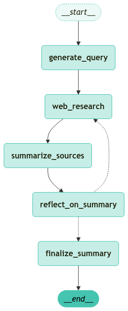

<style>
.custom {
    background-color: #008d8d;
    color: white;
    padding: 0.25em 0.5em 0.25em 0.5em;
    white-space: pre-wrap;       /* css-3 */
    white-space: -moz-pre-wrap;  /* Mozilla, since 1999 */
    white-space: -pre-wrap;      /* Opera 4-6 */
    white-space: -o-pre-wrap;    /* Opera 7 */
    word-wrap: break-word;
}

pre {
    background-color: #027c7c;
    padding-left: 0.5em;
}

</style>

# Ollama Deep Researcher (Deepseek-R1)

- Author: [Youngin Kim](https://github.com/Normalist-K)
- Design: 
- Peer Review: 
- This is a part of [LangChain Open Tutorial](https://github.com/LangChain-OpenTutorial/LangChain-OpenTutorial)

[](https://colab.research.google.com/github/LangChain-OpenTutorial/LangChain-OpenTutorial/blob/main/99-TEMPLATE/00-BASE-TEMPLATE-EXAMPLE.ipynb) [](https://github.com/LangChain-OpenTutorial/LangChain-OpenTutorial/blob/main/99-TEMPLATE/00-BASE-TEMPLATE-EXAMPLE.ipynb)

## Overview

This tutorial explores how to **build a fully local AI-powered research agent** using **Ollama** and **Deepseek-R1** , an open-source large language model. The research agent is designed based on **Iterative Demonstration-Based Retrieval-Augmented Generation (IterDRAG)** , a methodology that enhances complex query resolution through **iterative query decomposition, retrieval, and synthesis** . By leveraging this structured approach, we can enable AI to **autonomously refine queries, retrieve relevant documents, and synthesize  high-quality research outputs** — all while running **entirely on your local machine** .

**DISCLAIMER** : This tutorial code is heavily based on **Ollama Deep Researcher** [link](https://github.com/langchain-ai/ollama-deep-researcher).

### Key Technologies
- **[Ollama](https://ollama.com)** : A local runtime for efficiently running open-source LLMs.
- **[Deepseek-R1](https://github.com/deepseek-ai/DeepSeek-R1)** : A powerful open-source model optimized for reasoning and research.
- **[IterDRAG (Iterative Demonstration-Based RAG)](https://arxiv.org/html/2410.04343v1#:~:text=To%20tackle%20this%20issue%2C%20we,used%20to%20generate%20intermediate%20answers.)** : A retrieval and generation method that improves AI-driven research by **breaking down complex queries into manageable sub-queries, retrieving relevant context, and synthesizing iterative answers** .

---

### **What You’ll Learn**
🔹 **How to set up Ollama & Deepseek-R1 for local AI research**  
🔹 **How to optimize Deepseek-R1 models**  
🔹 **How to implement an IterDRAG-based research workflow**  


By the end of this tutorial, you’ll be able to **build a fully local, AI-enhanced research agent** that applies **IterDRAG principles** to enable **incremental knowledge refinement, retrieval-aware generation, and dynamic query optimization**—all while maintaining full **privacy, speed, and control** over the research process. 🚀

### Table of Contents

- [Overview](#overview)
- [Environment Setup](#environment-setup)
- [Getting Started with Ollama and DeepSeek-R1](#getting-started-with-ollama-and-deepseek-r1)
- [Using ChatOllama with DeepSeek-R1](#using-chatollama-with-deepseek-r1)
- [Using DeepSeek-R1](#using-deepseek-r1)
- [Ollama Deep Researcher powered by IterDRAG](#ollama-deep-researcher-powered-by-iterdrag)
- [Defining the Deep Researcher Nodes](#defining-the-deep-researcher-nodes)
- [Running the Deep Researcher Graph](#running-the-deep-researcher-graph)

### References

- [LangChain](https://blog.langchain.dev/)
- [ollama-deep-researcher](https://github.com/langchain-ai/ollama-deep-researcher)
- [Ollama](https://ollama.com)
- [Deepseek-R1](https://github.com/deepseek-ai/DeepSeek-R1)
- [IterDRAG (Iterative Demonstration-Based RAG)](https://arxiv.org/html/2410.04343v1#:~:text=To%20tackle%20this%20issue%2C%20we,used%20to%20generate%20intermediate%20answers.)
- [substratus's blog](https://www.substratus.ai/blog/calculating-gpu-memory-for-llm)
- [Language Models & Co.](https://newsletter.languagemodels.co/p/the-illustrated-deepseek-r1?utm_campaign=post&utm_medium=web)

----

## Environment Setup

Setting up your environment is the first step. See the [Environment Setup](https://wikidocs.net/257836) guide for more details.


**[Note]**

The langchain-opentutorial is a package of easy-to-use environment setup guidance, useful functions and utilities for tutorials.
Check out the  [`langchain-opentutorial`](https://github.com/LangChain-OpenTutorial/langchain-opentutorial-pypi) for more details.

```python
%%capture --no-stderr
%pip install langchain-opentutorial
```

```python
# Install required packages
from langchain_opentutorial import package

package.install(
    [
        "langsmith",
        "langchain",
        "langgraph",
        "langchain_core",
        "langchain-ollama",
        "langchain_community",
        "tavily-python",
    ],
    verbose=False,
    upgrade=False,
)
```

You can set API keys in a ` .env` file or set them manually.

[Note] If you’re not using the ` .env` file, no worries! Just enter the keys directly in the cell below, and you’re good to go.

```python
from dotenv import load_dotenv
from langchain_opentutorial import set_env

# Attempt to load environment variables from a .env file; if unsuccessful, set them manually.
if not load_dotenv():
    set_env(
        {
            "OPENAI_API_KEY": "",
            "LANGCHAIN_API_KEY": "",
            "LANGCHAIN_TRACING_V2": "true",
            "LANGCHAIN_ENDPOINT": "https://api.smith.langchain.com",
            "LANGCHAIN_PROJECT": "LangGraph-Ollama-Deep-Researcher",
        }
    )
```

## Getting Started with Ollama and DeepSeek-R1

Ollama allows us to run **Deepseek-R1** (or other models) **directly on a local machine** , removing the need for cloud-based APIs.  
- The model can be accessed via:  
  ✅ **`ollama` command-line interface**  
  ✅ **LangChain’s `ChatOllama` class** , enabling structured AI workflows  
- Supports multiple output formats, including **text, JSON, and multimodal outputs**  

By using **Ollama** to serve Deepseek-R1, we can execute this **entire workflow locally** , ensuring **privacy, efficiency, and full control** over the research process.

---

### Step 1: Install Ollama

Ollama is available for macOS, Linux, and Windows. You can download and install it from the official website:

🔗 **[Download Ollama](https://ollama.com/download)**

Once installed, verify that Ollama is working by running the following command in your terminal:

```sh
$ ollama --version
```
If the installation was successful, this command should return the installed Ollama version.

---

### Step 2: Download DeepSeek-R1 Models

After installing Ollama, you can download a DeepSeek-R1 model. These models vary in size, so it’s important to check your GPU memory before selecting one.

To pull a model, use:
```sh
$ ollama pull deepseek-r1:8b
```

This command will download the 8 billion parameter model (8B), which we tested on a MacBook Pro M1 (16GB RAM) and confirmed to be working properly.

💡 If you experience performance issues, consider using a smaller model, depending on your hardware.

---

### Check GPU Memory Requirements

[Ollama's DeepSeek-R1 models](https://ollama.com/library/deepseek-r1:8b) support Q4_K_M quantization, which reduces the required GPU memory by compressing the model to 4-bit precision.

You can use the table below to determine if your hardware can support a particular model.
For most users, 4-bit precision (Q4_K_M) is the recommended setting.

📌 Calculation Formula:
Refer to [this blog post](https://www.substratus.ai/blog/calculating-gpu-memory-for-llm) for details on how GPU memory is estimated.

| Model Parameters | 16-bit Precision | 8-bit Precision | 4-bit Precision |
|:----------------:|:----------------:|:---------------:|:---------------:|
| 1.5 billion      | ~3.6 GB          | ~1.8 GB         | ~0.9 GB         |
| 7 billion        | ~16.8 GB         | ~8.4 GB         | ~4.2 GB         |
| 8 billion        | ~19.2 GB         | ~9.6 GB         | ~4.8 GB         |
| 14 billion       | ~33.6 GB         | ~16.8 GB        | ~8.4 GB         |
| 32 billion       | ~76.8 GB         | ~38.4 GB        | ~19.2 GB        |
| 70 billion       | ~168.0 GB        | ~84.0 GB        | ~42.0 GB        |
| 671 billion      | ~1610.4 GB       | ~805.2 GB       | ~402.6 GB       |

## Using ChatOllama with DeepSeek-R1

In this section, we'll explore how to utilize the `ChatOllama` class with the **deepseek-r1** model to generate web search queries in JSON format. Additionally, we'll delve into the use of `<think>` tags in **deepseek-r1** to structure the model's reasoning process.

This tutorial does not cover the basics of **Ollama** and `ChatOllama` . 

If you need more information, please refer to the following tutorial: **"/04-MODEL/10-Ollama.ipynb"**

### Generating Web Search Queries in JSON Format

To generate structured search queries, we can prompt **deepseek-r1** to output responses in JSON format. This ensures that the generated queries are well-structured and easy to parse in automated workflows.

When requesting search queries, you can specify the format explicitly, ensuring that the AI returns a properly formatted JSON object. This is useful for integrating AI-generated search queries into research pipelines.

```python
import json
from langchain_ollama import ChatOllama


search_query_prompt = """Your goal is to generate targeted web search query.

The query will gather information related to a specific topic.

Topics: {topics}

Return your query as a JSON object:
{{
    "query": "string",
    "aspect": "string",
    "retionale": "string"
}}
"""

llm_json_mode = ChatOllama(model="deepseek-r1:8b", temperature=0.6, format="json")

msg = llm_json_mode.invoke(search_query_prompt.format(topics="cat"))
query = json.loads(msg.content)
query
```


<pre class="custom">{'query': 'how does cat communicate with each other',
     'aspect': 'communication',
     'rationale': 'Understanding how cats communicate can help in better interacting with them and providing appropriate care.'}</pre>


## Using DeepSeek-R1

This section provides an overview of **how to use DeepSeek-R1 effectively** and follow the **recommended best practices** outlined by its authors. We'll also introduce the **\<think> tags** , explain their purpose, and mention a workaround for removing them from agent outputs.

In this tutorial, we will not cover DeepSeek's **architecture or training methodology** .  

If you need more information, please refer to [this blog](https://newsletter.languagemodels.co/p/the-illustrated-deepseek-r1?utm_campaign=post&utm_medium=web).

### Recommended Usage Guidelines
To achieve optimal performance with DeepSeek-R1, [the model's authors](https://github.com/deepseek-ai/DeepSeek-R1?tab=readme-ov-file#usage-recommendations) recommend the following configurations:

- **Set temperature between 0.5 and 0.7** (0.6 is recommended) to ensure coherent responses and prevent repetition.
- **Do not use system prompts.** Instead, provide all instructions within the user prompt.
- **For mathematical problems, explicitly instruct the model** to reason step by step and format the final answer using `\boxed{}` .
- **Encourage structured reasoning** by ensuring the model starts its response with `<think>\n` , as it may sometimes omit its reasoning process.

Following these recommendations will help maintain **consistency and accuracy** when using DeepSeek-R1.

---

Below are code examples comparing cases **without** and **with** the recommended usage guidelines.  

Not following the guidelines does not necessarily lead to poor results, but these examples are provided to illustrate the impact of using best practices.

```python
from pprint import pprint


llm = ChatOllama(model="deepseek-r1:8b", temperature=1.5)
msg = llm.invoke("What is capital of Korea")
pprint(msg.content)
```

<pre class="custom">'<think>\n\n</think>\n\nThe capital of South Korea is **Seoul** (서울).'
</pre>

```python
llm = ChatOllama(model="deepseek-r1:8b", temperature=0.6)
msg = llm.invoke("What is capital of Korea")
pprint(msg.content)
```

<pre class="custom">'<think>\n\n</think>\n\nThe capital of Korea is **Seoul**.'
</pre>

```python
import json
from langchain_core.messages import HumanMessage, SystemMessage
from langchain_core.runnables import RunnableConfig
from langchain_ollama import ChatOllama


query_writer_instructions = """Your goal is to generate a targeted web search query.
The query will gather information related to a specific topic.

<TOPIC>
{research_topic}
</TOPIC>

<FORMAT>
Format your response as a JSON object with ALL three of these exact keys:
   - "query": The actual search query string
   - "aspect": The specific aspect of the topic being researched
   - "rationale": Brief explanation of why this query is relevant
</FORMAT>

<EXAMPLE>
Example output:
{{
    "query": "machine learning transformer architecture explained",
    "aspect": "technical architecture",
    "rationale": "Understanding the fundamental structure of transformer models"
}}
</EXAMPLE>

Provide your response in JSON format:"""


# Format the prompt
query_writer_instructions_formatted = query_writer_instructions.format(
    research_topic="cat vs. dog"
)

# Generate a query
llm_json_mode = ChatOllama(
    model="deepseek-r1:8b",
    temperature=0.6,
    format="json",
)
result = llm_json_mode.invoke(
    [
        SystemMessage(content=query_writer_instructions_formatted),
        HumanMessage(content=f"Generate a query for web search:"),
    ]
)
query = json.loads(result.content)
query
```


<pre class="custom">{'query': 'cat vs dog behavior comparison',
     'aspect': 'behavioral differences',
     'rationale': 'To understand how cats and dogs differ in their behaviors and characteristics.'}</pre>


```python
result = llm_json_mode.invoke(
    [
        HumanMessage(
            content=f"{query_writer_instructions_formatted} \n\n Generate a query for web search:"
        )
    ]
)
query = json.loads(result.content)
query
```


<pre class="custom">{'query': 'cat vs dog comparison',
     'aspect': 'animal behavior',
     'rationale': 'To understand the differences in behavior and characteristics between cats and dogs.'}</pre>


```python
math_problem = """Problem:
There are 35 candies and 4 children. Each child must receive the same number of candies, and all candies must be distributed.
	1.	How many candies does each child get?
	2.	How many candies are left after the distribution?
"""
```

```python
msg = llm.invoke(math_problem)
pprint(msg.content)
```

<pre class="custom">('<think>\n'
     'First, I need to determine how many candies each child can receive when '
     'distributing 35 candies among 4 children equally.\n'
     '\n'
     "To do this, I'll divide the total number of candies by the number of "
     "children: 35 ÷ 4 = 8.75. Since it's not possible to have a fraction of a "
     'candy, I recognize that we need to adjust the distribution to ensure all '
     'candies are used up and each child receives an equal whole number.\n'
     '\n'
     'To resolve this, one child will receive 9 candies while the remaining three '
     'children will receive 8 candies each. This way, the total distributed is 9 + '
     '3 × 8 = 35 candies, which uses up all available candies.\n'
     '\n'
     "Next, I'll address how many candies are left after the distribution. Since "
     'all 35 candies have been given out to the children, there are no leftovers '
     'remaining.\n'
     '</think>\n'
     '\n'
     '**Solution:**\n'
     '\n'
     'We need to distribute **35 candies** among **4 children** such that each '
     'child receives the same number of candies, and all candies are used up.\n'
     '\n'
     '1. **Calculating Candies per Child:**\n'
     '   \n'
     '   To find how many candies each child gets, divide the total number of '
     'candies by the number of children:\n'
     '   \n'
     '   \\[\n'
     '   \\frac{35 \\text{ candies}}{4 \\text{ children}} = 8.75 \\text{ candies '
     'per child}\n'
     '   \\]\n'
     '   \n'
     "   Since we can't have a fraction of a candy, we need to adjust the "
     'distribution so that each child receives an equal whole number of candies '
     'and all candies are used up.\n'
     '\n'
     '2. **Determining Equal Distribution:**\n'
     '   \n'
     '   - One child will receive **9 candies**.\n'
     '   - The remaining three children will each receive **8 candies**.\n'
     '   \n'
     '   This ensures:\n'
     '   \n'
     '   \\[\n'
     '   1 \\times 9 + 3 \\times 8 = 9 + 24 = 35 \\text{ candies}\n'
     '   \\]\n'
     '   \n'
     '   All candies are distributed, and the distribution is as equal as '
     'possible.\n'
     '\n'
     '3. **Candies Left After Distribution:**\n'
     '   \n'
     '   Since all **35 candies** have been given out to the children, there are '
     'no candies left.\n'
     '   \n'
     '   \\[\n'
     '   \\boxed{0}\n'
     '   \\]\n'
     '\n'
     '**Final Answers:**\n'
     '\n'
     '1. Each child receives \\(\\boxed{8}\\) candies (with one child receiving an '
     'additional candy).\n'
     '2. No candies are left after distribution, so the answer is '
     '\\(\\boxed{0}\\).')
</pre>

```python
math_problem_instruction = f"""Answer the below problem. 
Please reason step by step, and put your final answer within \\boxed{{}}.
{math_problem}
"""

msg = llm.invoke(math_problem_instruction)
pprint(msg.content)
```

<pre class="custom">('<think>\n'
     'I need to determine how many candies each child receives when there are 35 '
     'candies and 4 children.\n'
     '\n'
     "First, I'll divide the total number of candies by the number of children: 35 "
     '÷ 4 = 8.75.\n'
     '\n'
     "Since each child must receive an equal whole number of candies, I can't have "
     "a fraction of a candy. Therefore, I'll round down to the nearest whole "
     'number, which is 8 candies per child.\n'
     '\n'
     "Next, I'll calculate how many candies are left after distributing 8 candies "
     'to each child: 35 - (4 × 8) = 35 - 32 = 3 candies remaining.\n'
     '</think>\n'
     '\n'
     '**Solution:**\n'
     '\n'
     'We need to distribute **35 candies** among **4 children** such that each '
     'child receives the same number of candies, and all candies are distributed.\n'
     '\n'
     '### Step 1: Determine How Many Candies Each Child Receives\n'
     'To find out how many candies each child gets, divide the total number of '
     'candies by the number of children:\n'
     '\n'
     '\\[\n'
     '\\text{Candies per child} = \\frac{\\text{Total Candies}}{\\text{Number of '
     'Children}} = \\frac{35}{4} = 8.75\n'
     '\\]\n'
     '\n'
     'Since each child must receive a whole number of candies, we **round down** '
     'to the nearest whole number:\n'
     '\n'
     '\\[\n'
     '\\text{Candies per child} = 8\n'
     '\\]\n'
     '\n'
     '### Step 2: Calculate the Remaining Candies After Distribution\n'
     'Subtract the total number of candies distributed from the original total:\n'
     '\n'
     '\\[\n'
     '\\text{Remaining Candies} = \\text{Total Candies} - (\\text{Number of '
     'Children} \\times \\text{Candies per Child}) \n'
     '\\]\n'
     '\n'
     '\\[\n'
     '\\text{Remaining Candies} = 35 - (4 \\times 8) = 35 - 32 = 3\n'
     '\\]\n'
     '\n'
     '### Final Answer:\n'
     '1. **Each child receives** \\(\\boxed{8}\\) **candies.**\n'
     '2. **There are** \\(\\boxed{3}\\)** candies left after the distribution.**')
</pre>

### **What Are `<think>` Tags?**
DeepSeek-R1 utilizes **structured reasoning** through `<think>` tags. These tags encapsulate the model’s internal thought process before delivering a final answer.

The `<think>` tags exist because of the **way DeepSeek-R1 was trained**:
-  **Reinforcement Learning (RL) for Reasoning Tasks:** During training, the model was rewarded for explicitly stating its thought process within `<think>` tags.

---

### **Handling `<think>` Tags in Outputs**
While `<think>` tags enhance interpretability, there are cases where you may **want to remove them** for cleaner output in applications.

The following code is a hack to remove the `<think>` tags from the output.

```python
think_output = msg.content

while "<think>" in think_output and "</think>" in think_output:
    start = think_output.find("<think>")
    end = think_output.find("</think>") + len("</think>")
    think_output = think_output[:start] + think_output[end:]
    think_output = think_output.strip()

pprint(think_output)
```

<pre class="custom">('**Solution:**\n'
     '\n'
     'We need to distribute **35 candies** among **4 children** such that each '
     'child receives the same number of candies, and all candies are distributed.\n'
     '\n'
     '### Step 1: Determine How Many Candies Each Child Receives\n'
     'To find out how many candies each child gets, divide the total number of '
     'candies by the number of children:\n'
     '\n'
     '\\[\n'
     '\\text{Candies per child} = \\frac{\\text{Total Candies}}{\\text{Number of '
     'Children}} = \\frac{35}{4} = 8.75\n'
     '\\]\n'
     '\n'
     'Since each child must receive a whole number of candies, we **round down** '
     'to the nearest whole number:\n'
     '\n'
     '\\[\n'
     '\\text{Candies per child} = 8\n'
     '\\]\n'
     '\n'
     '### Step 2: Calculate the Remaining Candies After Distribution\n'
     'Subtract the total number of candies distributed from the original total:\n'
     '\n'
     '\\[\n'
     '\\text{Remaining Candies} = \\text{Total Candies} - (\\text{Number of '
     'Children} \\times \\text{Candies per Child}) \n'
     '\\]\n'
     '\n'
     '\\[\n'
     '\\text{Remaining Candies} = 35 - (4 \\times 8) = 35 - 32 = 3\n'
     '\\]\n'
     '\n'
     '### Final Answer:\n'
     '1. **Each child receives** \\(\\boxed{8}\\) **candies.**\n'
     '2. **There are** \\(\\boxed{3}\\)** candies left after the distribution.**')
</pre>

## Ollama Deep Researcher powered by IterDRAG

### Why IterDRAG for Research?

Research queries often require **multi-hop reasoning** , meaning a single AI-generated answer is insufficient for complex topics. **IterDRAG addresses this challenge** by:  

✅ **Decomposing complex research topics** into structured sub-queries  
✅ **Iteratively retrieving, summarizing, and refining** relevant documents  
✅ **Generating intermediate answers** for each sub-query before final synthesis  
✅ **Scaling up knowledge extraction** by incorporating multiple iterations of retrieval  


This tutorial introduces a **modular research agent** designed to iteratively refine research queries and synthesize structured reports. The research process follows an **IterDRAG-based methodology** , ensuring thorough information retrieval and refinement through multiple iterations.

---

### How the Ollama Deep Researcher Works
1. **Query Generation** → The AI **generates an initial web search query** based on the research topic.
2. **Web Research** → The agent **fetches relevant documents** using a search API (Tavily or Perplexity).
3. **Summarization** → Retrieved documents are **summarized into a structured format** for further analysis.
4. **Reflection & Knowledge Gap Detection** → The agent **analyzes knowledge gaps** and **generates a follow-up query** if needed.
5. **Iterative Research Loop** → Steps 2–4 are **repeated up to a set number of times** to refine the research.
6. **Final Report Generation** → Once the loop limit is reached, the agent **compiles all gathered insights and sources into a structured report** .

---

### Configuration & State management

Before constructing the graph, let’s first define the configuration and state. 

For the configuration,
- `Configuration` manages customizable settings such as the number of research iterations ( `max_web_research_loops` ) and the choice of the local LLM model (e.g., `deepseek-r1:8b` ).
- The `from_runnable_config` method allows dynamic configuration loading from environment variables or provided settings.

```python
import os
from dataclasses import dataclass, fields
from typing import Any, Optional
from langchain_core.runnables import RunnableConfig
from langchain_opentutorial.messages import random_uuid


@dataclass(kw_only=True)
class Configuration:
    """The configurable fields for the research assistant."""

    max_web_research_loops: int = 3
    local_llm: str = "deepseek-r1:8b"  # 1.5b, 7b, 8b, 14b, 32b, 70b, 671b

    @classmethod
    def from_runnable_config(
        cls, config: Optional[RunnableConfig] = None
    ) -> "Configuration":
        """Create a Configuration instance from a RunnableConfig."""
        configurable = (
            config["configurable"] if config and "configurable" in config else {}
        )
        values: dict[str, Any] = {
            f.name: os.environ.get(f.name.upper(), configurable.get(f.name))
            for f in fields(cls)
            if f.init
        }
        return cls(**{k: v for k, v in values.items() if v})
```

For state management, 
- `SummaryState` keeps track of the research process, including the topic, search queries, gathered sources, and the final summary.
- It also defines `SummaryStateInput` and `SummaryStateOutput` to structure input and output data clearly.

```python
import operator
from dataclasses import dataclass, field
from typing_extensions import Annotated


@dataclass(kw_only=True)
class SummaryState:
    research_topic: str = field(default=None)  # Report topic
    search_query: str = field(default=None)  # Search query
    web_research_results: Annotated[list, operator.add] = field(default_factory=list)
    sources_gathered: Annotated[list, operator.add] = field(default_factory=list)
    research_loop_count: int = field(default=0)  # Research loop count
    running_summary: str = field(default=None)  # Final report


@dataclass(kw_only=True)
class SummaryStateInput:
    research_topic: str = field(default=None)  # Report topic


@dataclass(kw_only=True)
class SummaryStateOutput:
    running_summary: str = field(default=None)  # Final report
```

## Defining the Deep Researcher Nodes

Now, let’s build the graph.

First, we’ll define the five core nodes that make up the **Ollama Deep Researcher** . These nodes represent key stages of the research process. Once the nodes are defined, we’ll connect them with edges to form a structured graph workflow that guides the research execution step by step.

Here are the five core nodes:

- `generate_query` : Generates an initial web search query based on the research topic.  
- `web_research` : Searches the web using the generated query and retrieves relevant information.  
- `summarize_sources` : Summarizes the gathered sources into a structured format.  
- `reflect_on_summary` : Identifies knowledge gaps and formulates a follow-up query if needed.  
- `finalize_summary` : Compiles all findings into a well-structured final research report.  


### Node to generate a query for web search

**Generating the Search Query**  
- The agent **constructs an optimized web search query** using `ChatOllama` in JSON format.  
- It ensures that the generated query is structured for efficient retrieval.

```python
import json
from langchain_core.messages import HumanMessage, SystemMessage
from langchain_core.runnables import RunnableConfig
from langchain_ollama import ChatOllama


query_writer_instructions = """Your goal is to generate a targeted web search query.
The query will gather information related to a specific topic.

<TOPIC>
{research_topic}
</TOPIC>

<FORMAT>
Format your response as a JSON object with ALL three of these exact keys:
   - "query": The actual search query string
   - "aspect": The specific aspect of the topic being researched
   - "rationale": Brief explanation of why this query is relevant
</FORMAT>

<EXAMPLE>
Example output:
{{
    "query": "machine learning transformer architecture explained",
    "aspect": "technical architecture",
    "rationale": "Understanding the fundamental structure of transformer models"
}}
</EXAMPLE>

Provide your response in JSON format:"""


def generate_query(state: SummaryState, config: RunnableConfig):
    """Generate a query for web search"""

    # Format the prompt
    query_writer_instructions_formatted = query_writer_instructions.format(
        research_topic=state.research_topic
    )

    # Generate a query
    configurable = Configuration.from_runnable_config(config)
    llm_json_mode = ChatOllama(
        model=configurable.local_llm,
        temperature=0.6,
        format="json",
    )
    result = llm_json_mode.invoke(
        [
            HumanMessage(
                content=f"{query_writer_instructions_formatted}\n\nGenerate a query for web search:"
            ),
        ]
    )
    query = json.loads(result.content)

    return {"search_query": query["query"]}
```

### Node to conduct web search using Tavily

**Conducting Web Research**  
- The system fetches information using either **Tavily** or **Perplexity** search APIs.  
- The search results are **formatted and deduplicated** to ensure high-quality input.

```python
from langsmith import traceable
from tavily import TavilyClient


def deduplicate_and_format_sources(
    search_response, max_tokens_per_source, include_raw_content=False
):
    """
    Takes either a single search response or list of responses from search APIs and formats them.
    Limits the raw_content to approximately max_tokens_per_source.
    include_raw_content specifies whether to include the raw_content from Tavily in the formatted string.

    Args:
        search_response: Either:
            - A dict with a 'results' key containing a list of search results
            - A list of dicts, each containing search results

    Returns:
        str: Formatted string with deduplicated sources
    """
    # Convert input to list of results
    if isinstance(search_response, dict):
        sources_list = search_response["results"]
    elif isinstance(search_response, list):
        sources_list = []
        for response in search_response:
            if isinstance(response, dict) and "results" in response:
                sources_list.extend(response["results"])
            else:
                sources_list.extend(response)
    else:
        raise ValueError(
            "Input must be either a dict with 'results' or a list of search results"
        )

    # Deduplicate by URL
    unique_sources = {}
    for source in sources_list:
        if source["url"] not in unique_sources:
            unique_sources[source["url"]] = source

    # Format output
    formatted_text = "Sources:\n\n"
    for i, source in enumerate(unique_sources.values(), 1):
        formatted_text += f"Source {source['title']}:\n===\n"
        formatted_text += f"URL: {source['url']}\n===\n"
        formatted_text += (
            f"Most relevant content from source: {source['content']}\n===\n"
        )
        if include_raw_content:
            # Using rough estimate of 4 characters per token
            char_limit = max_tokens_per_source * 4
            # Handle None raw_content
            raw_content = source.get("raw_content", "")
            if raw_content is None:
                raw_content = ""
                print(f"Warning: No raw_content found for source {source['url']}")
            if len(raw_content) > char_limit:
                raw_content = raw_content[:char_limit] + "... [truncated]"
            formatted_text += f"Full source content limited to {max_tokens_per_source} tokens: {raw_content}\n\n"

    return formatted_text.strip()


def format_sources(search_results):
    """Format search results into a bullet-point list of sources.

    Args:
        search_results (dict): Tavily search response containing results

    Returns:
        str: Formatted string with sources and their URLs
    """
    return "\n".join(
        f"* {source['title']} : {source['url']}" for source in search_results["results"]
    )


@traceable
def tavily_search(query, include_raw_content=True, max_results=3):
    """Search the web using the Tavily API.

    Args:
        query (str): The search query to execute
        include_raw_content (bool): Whether to include the raw_content from Tavily in the formatted string
        max_results (int): Maximum number of results to return

    Returns:
        dict: Search response containing:
            - results (list): List of search result dictionaries, each containing:
                - title (str): Title of the search result
                - url (str): URL of the search result
                - content (str): Snippet/summary of the content
                - raw_content (str): Full content of the page if available"""

    tavily_client = TavilyClient()
    return tavily_client.search(
        query, max_results=max_results, include_raw_content=include_raw_content
    )


def web_research(state: SummaryState, config: RunnableConfig):
    """Gather information from the web"""

    # Search the web
    search_results = tavily_search(
        state.search_query, include_raw_content=True, max_results=1
    )
    search_str = deduplicate_and_format_sources(
        search_results, max_tokens_per_source=1000, include_raw_content=True
    )

    return {
        "sources_gathered": [format_sources(search_results)],
        "research_loop_count": state.research_loop_count + 1,
        "web_research_results": [search_str],
    }
```

### Node to summarize the web search results

**Summarizing the Findings**  
- The AI **extracts key insights** from retrieved documents.  
- It **removes redundant information** and maintains coherence across iterations.

```python
summarizer_instructions = """
<GOAL>
Generate a high-quality summary of the web search results and keep it concise / related to the user topic.
</GOAL>

<REQUIREMENTS>
When creating a NEW summary:
1. Highlight the most relevant information related to the user topic from the search results
2. Ensure a coherent flow of information

When EXTENDING an existing summary:                                                                                                                 
1. Read the existing summary and new search results carefully.                                                    
2. Compare the new information with the existing summary.                                                         
3. For each piece of new information:                                                                             
    a. If it's related to existing points, integrate it into the relevant paragraph.                               
    b. If it's entirely new but relevant, add a new paragraph with a smooth transition.                            
    c. If it's not relevant to the user topic, skip it.                                                            
4. Ensure all additions are relevant to the user's topic.                                                         
5. Verify that your final output differs from the input summary.                                                                                                                                                            
< /REQUIREMENTS >

< FORMATTING >
- Start directly with the updated summary, without preamble or titles. Do not use XML tags in the output.  
< /FORMATTING >"""


def summarize_sources(state: SummaryState, config: RunnableConfig):
    """Summarize the gathered sources"""

    # Existing summary
    existing_summary = state.running_summary

    # Most recent web research
    most_recent_web_research = state.web_research_results[-1]

    # Build the human message
    if existing_summary:
        human_message_content = (
            f"<User Input> \n {state.research_topic} \n <User Input>\n\n"
            f"<Existing Summary> \n {existing_summary} \n <Existing Summary>\n\n"
            f"<New Search Results> \n {most_recent_web_research} \n <New Search Results>"
        )
    else:
        human_message_content = (
            f"<User Input> \n {state.research_topic} \n <User Input>\n\n"
            f"<Search Results> \n {most_recent_web_research} \n <Search Results>"
        )

    # Run the LLM
    configurable = Configuration.from_runnable_config(config)
    llm = ChatOllama(model=configurable.local_llm, temperature=0.6)
    result = llm.invoke(
        [
            HumanMessage(
                content=f"{summarizer_instructions}\n\n{human_message_content}"
            ),
        ]
    )

    running_summary = result.content

    # TODO: This is a hack to remove the <think> tags w/ Deepseek models
    # It appears very challenging to prompt them out of the responses
    while "<think>" in running_summary and "</think>" in running_summary:
        start = running_summary.find("<think>")
        end = running_summary.find("</think>") + len("</think>")
        running_summary = running_summary[:start] + running_summary[end:]

    return {"running_summary": running_summary}
```

### Node to generate a refined query reflecting a existing summary

**Refining Through Reflection**  
- The model **analyzes knowledge gaps** in the existing summary.  
- If necessary, it **generates a refined follow-up query** to gather missing information.

```python
reflection_instructions = """You are an expert research assistant analyzing a summary about {research_topic}.

<GOAL>
1. Identify knowledge gaps or areas that need deeper exploration
2. Generate a follow-up question that would help expand your understanding
3. Focus on technical details, implementation specifics, or emerging trends that weren't fully covered
</GOAL>

<REQUIREMENTS>
Ensure the follow-up question is self-contained and includes necessary context for web search.
</REQUIREMENTS>

<FORMAT>
Format your response as a JSON object with these exact keys:
- knowledge_gap: Describe what information is missing or needs clarification
- follow_up_query: Write a specific question to address this gap
</FORMAT>

<EXAMPLE>
Example output:
{{
    "knowledge_gap": "The summary lacks information about performance metrics and benchmarks",
    "follow_up_query": "What are typical performance benchmarks and metrics used to evaluate [specific technology]?"
}}
</EXAMPLE>

Provide your analysis in JSON format:"""


def reflect_on_summary(state: SummaryState, config: RunnableConfig):
    """Reflect on the summary and generate a follow-up query"""

    # Generate a query
    configurable = Configuration.from_runnable_config(config)
    llm_json_mode = ChatOllama(
        model=configurable.local_llm, temperature=0.6, format="json"
    )
    content = f"""{reflection_instructions.format(research_topic=state.research_topic)}
    Identify a knowledge gap and generate a follow-up web search query based on our existing knowledge: {state.running_summary}
    """
    result = llm_json_mode.invoke(
        [
            HumanMessage(content=content),
        ]
    )
    follow_up_query = json.loads(result.content)

    # Get the follow-up query
    query = follow_up_query.get("follow_up_query")

    # JSON mode can fail in some cases
    if not query:

        # Fallback to a placeholder query
        return {"search_query": f"Tell me more about {state.research_topic}"}

    # Update search query with follow-up query
    return {"search_query": follow_up_query["follow_up_query"]}
```

### Node to finalize summary

**Finalizing the Summary**  
- The node **compiles all research findings** into a structured report.  
- Sources are formatted into a **bulleted list for transparency** .

```python
def finalize_summary(state: SummaryState):
    """Finalize the summary"""

    # Format all accumulated sources into a single bulleted list
    all_sources = "\n".join(source for source in state.sources_gathered)
    state.running_summary = (
        f"## Summary\n\n{state.running_summary}\n\n ### Sources:\n{all_sources}"
    )
    return {"running_summary": state.running_summary}
```

### Building the Deep Researcher Graph

Now we'll create the deep researcher graph that orchestrates the research workflow.

```python
from typing_extensions import Literal
from langgraph.graph import START, END, StateGraph
from langgraph.checkpoint.memory import MemorySaver


def route_research(
    state: SummaryState, config: RunnableConfig
) -> Literal["finalize_summary", "web_research"]:
    """Route the research based on the follow-up query"""

    configurable = Configuration.from_runnable_config(config)
    if state.research_loop_count <= configurable.max_web_research_loops:
        return "web_research"
    else:
        return "finalize_summary"


# Add nodes and edges
builder = StateGraph(
    SummaryState,
    input=SummaryStateInput,
    output=SummaryStateOutput,
    config_schema=Configuration,
)
builder.add_node("generate_query", generate_query)
builder.add_node("web_research", web_research)
builder.add_node("summarize_sources", summarize_sources)
builder.add_node("reflect_on_summary", reflect_on_summary)
builder.add_node("finalize_summary", finalize_summary)

# Add edges
builder.add_edge(START, "generate_query")
builder.add_edge("generate_query", "web_research")
builder.add_edge("web_research", "summarize_sources")
builder.add_edge("summarize_sources", "reflect_on_summary")
builder.add_conditional_edges("reflect_on_summary", route_research)
builder.add_edge("finalize_summary", END)

# Create memory
memory = MemorySaver()

graph = builder.compile(checkpointer=memory)
```

```python
from langchain_opentutorial.graphs import visualize_graph

# Visualize the graph
visualize_graph(graph)
```


    

    


## Running the Deep Researcher Graph

This code runs a research agent using the invoke_graph function. 

It initializes the agent with the DeepSeek-R1 (8B) model, sets a research topic, and configures the agent to perform up to 3 web research iterations. The agent then executes the research workflow, gathering information, summarizing findings, and refining queries automatically. 🚀

[NOTE] This process takes approximately 3 to 5 minutes on an M1 Pro.

```python
from langchain_opentutorial.messages import invoke_graph

topic = "Give me a summary of DeepSeek-r1 model."

inputs = {"research_topic": topic}

config = RunnableConfig(
    configurable={
        "thread_id": random_uuid(),
        "local_llm": "deepseek-r1:8b",
        "max_web_research_loops": 3,
    },
)

invoke_graph(graph, inputs, config)
```

<pre class="custom">
    ==================================================
    🔄 Node: generate_query 🔄
    - - - - - - - - - - - - - - - - - - - - - - - - - 
    search_query:
    DeepSeek-R1 model overview
    ==================================================
    
    ==================================================
    🔄 Node: web_research 🔄
    - - - - - - - - - - - - - - - - - - - - - - - - - 
    * DeepSeek R-1 Model Overview and How it Ranks Against OpenAI's o1 : https://www.prompthub.us/blog/deepseek-r-1-model-overview-and-how-it-ranks-against-openais-o1
    research_loop_count:
    1
    Sources:
    
    Source DeepSeek R-1 Model Overview and How it Ranks Against OpenAI's o1:
    ===
    URL: https://www.prompthub.us/blog/deepseek-r-1-model-overview-and-how-it-ranks-against-openais-o1
    ===
    Most relevant content from source: We’ll then move on to DeepSeek-R1, how it’s reasoning works, and some prompt engineering best practices for reasoning models. DeepSeek-R1-Zero stands out from most other state-of-the-art models because it was trained using only reinforcement learning (RL), no supervised fine-tuning (SFT). The training process for DeepSeek-R1-Zero involved presenting the model with various reasoning tasks, ranging from math problems to abstract logic challenges. To train DeepSeek-R1-Zero to generate structured chain of thought sequences, the researchers used the following prompt training template, replacing {{prompt}} with the reasoning question. Next we’ll look at a table comparing DeepSeek-R1-Zero’s performance across multiple reasoning datasets against OpenAI’s reasoning models. Reinforcement learning-only training: R1-Zero demonstrates the feasibility of RL-alone approaches for building high-performing reasoning models
    ===
    Full source content limited to 1000 tokens: DeepSeek R-1 Model Overview and How it Ranks Against OpenAI's o1
    
    BlogLog in
    BlogLog inBook DemoSign up
    DeepSeek R-1 Model Overview and How it Ranks Against OpenAI's o1
    Last updated on 
    January 23, 2025
    Table of Contents
    ‍
    ‍DeepSeek is a Chinese AI company “dedicated to making AGI a reality” and open-sourcing all its models. They started in 2023, but have been making waves over the past month or so, and especially this past week with the release of their two latest reasoning models: DeepSeek-R1-Zero and the more advanced DeepSeek-R1, also known as DeepSeek Reasoner.
    They’ve released not only the models but also the code and evaluation prompts for public use, along with a detailed paper outlining their approach.
    Aside from creating 2 highly performant models that are on par with OpenAI’s o1 model, the paper has a lot of valuable information around reinforcement learning, chain of thought reasoning, prompt engineering with reasoning models, and more.
    We’ll start by focusing on the training process of DeepSeek-R1-Zero, which uniquely relied solely on reinforcement learning, instead of traditional supervised learning. We’ll then move on to DeepSeek-R1, how it’s reasoning works, and some prompt engineering best practices for reasoning models.
    Training DeepSeek-R1-Zero: A reinforcement learning-only approach
    DeepSeek-R1-Zero stands out from most other state-of-the-art models because it was trained using only reinforcement learning (RL), no supervised fine-tuning (SFT). This challenges the current conventional approach and opens up new opportunities to train reasoning models with less human intervention and effort.
    DeepSeek-R1-Zero is the first open-source model to validate that advanced reasoning capabilities can be developed purely through RL.
    Without pre-labeled datasets, the model learns through trial and error, refining its behavior, parameters, and weights based solely on feedback from the solutions it generates.
    DeepSeek-R1-Zero is the base model for DeepSeek-R1.
    The RL process for DeepSeek-R1-Zero
    The training process for DeepSeek-R1-Zero involved presenting the model with various reasoning tasks, ranging from math problems to abstract logic challenges. The model generated outputs and was evaluated based on its performance.
    DeepSeek-R1-Zero received feedback through a reward system that helped guide its learning process:
    
    Accuracy rewards: Evaluates whether the output is correct. Used for when there are deterministic results (math problems).
    Format rewards: Encouraged the model to structure its reasoning within <think> and </think> tags
    
    Training prompt template
    To train DeepSeek-R1-Zero to generate structured chain of thought sequences, the researchers used the following prompt training template, replacing {{prompt}} with the reasoning question. You can access it in PromptHub here.
    ‍
    
    ‍
    This template prompted the model to explicitly outline its thought process within <think> tags before delivering the final answer in <answer> tags.
    The power of RL in reasoning
    With this training process DeepSeek-R1-Zero began to produce sophisticated reasoning chains.
    Through thousands of training steps, DeepSeek-R1-Zero evolved to solve increasingly complex problems. It learned to:
    
    Generate long reasoning chains that enabled deeper and more structured problem-solving
    Perform self-verification to cross-check its own answers (more on this later)
    Correct its own mistakes, showcasing emergent self-reflective behaviors
    
    ‍
    DeepSeek R1-Zero performance
    While DeepSeek-R1-Zero is primarily a precursor to DeepSeek-R1, it still achieved high performance on several benchmarks. Let’s dive into some of the experiments ran.
    Accuracy improvements during training
    ‍
    
    ‍
    
    Pass@1 accuracy began at 15.6% and by the end of the training it improved to 71.0%, comparable to OpenAI’s o1-0912 model
    The red solid line represents performance with majority voting (similar to ensembling and self-consistency techniques), which increased accuracy further to 86.7%, surpassi... [truncated]
    ==================================================
    
    ==================================================
    🔄 Node: summarize_sources 🔄
    - - - - - - - - - - - - - - - - - - - - - - - - - 
    running_summary:
    
    
    DeepSeek-R1-Zero, developed by the Chinese AI company DeepSeek, is a cutting-edge reasoning model trained exclusively using reinforcement learning (RL), breaking away from traditional supervised methods. This approach allowed it to learn advanced reasoning skills through trial and error without relying on labeled datasets or human intervention. The model excelled in tasks ranging from math problems to abstract logic challenges, generating structured chains of thought guided by a specific prompt template. DeepSeek-R1-Zero demonstrated remarkable accuracy, improving from 15.6% to 71% during training, comparable to OpenAI's o1-0912 model. With the addition of majority voting techniques, its accuracy surged to 86.7%, showcasing its potential in structured problem-solving and self-reflective behaviors.
    ==================================================
    
    ==================================================
    🔄 Node: reflect_on_summary 🔄
    - - - - - - - - - - - - - - - - - - - - - - - - - 
    search_query:
    What are the specific mathematical, logical, or real-world problem types that DeepSeek-R1-Zero demonstrated its reasoning skills on?
    ==================================================
    
    ==================================================
    🔄 Node: web_research 🔄
    - - - - - - - - - - - - - - - - - - - - - - - - - 
    * The Mathematics Behind DeepSeek-R1 | by Harjot Kaur | Jan, 2025 ... : https://pub.towardsai.net/the-mathematics-behind-deepseek-r1-954102f9b9c6
    research_loop_count:
    2
    Sources:
    
    Source The Mathematics Behind DeepSeek-R1 | by Harjot Kaur | Jan, 2025 ...:
    ===
    URL: https://pub.towardsai.net/the-mathematics-behind-deepseek-r1-954102f9b9c6
    ===
    Most relevant content from source: The Mathematics Behind DeepSeek-R1 | by Harjot Kaur | Jan, 2025 | Towards AI DeepSeek-R1 represents a new frontier in AI training — one that prioritizes reinforcement learning (RL) over human imitation and mathematical reasoning over conversational fluency. This article breaks down the mathematical foundations that make DeepSeek-R1 unique, using step-by-step explanations of its training pipeline, key algorithms, and optimization techniques. i) Reinforcement Learning (RL) on the Base Model — This step trains the initial model, DeepSeek-R1-Zero, without relying on human-labelled data. Unlike traditional AI models that start with supervised fine-tuning (SFT) and then apply reinforcement learning for refinement, DeepSeek uses RL-first training, which means it learns to optimize its reasoning independently before being exposed to human-generated data. Published in Towards AI -----------------------
    ===
    Full source content limited to 1000 tokens: The Mathematics Behind DeepSeek-R1 | by Harjot Kaur | Jan, 2025 | Towards AI
    Open in app
    Sign up
    Sign in
    
    Write
    
    Sign up
    Sign in
    
    Member-only story
    The Mathematics Behind DeepSeek-R1
    A Technical Breakdown!
    
    
    Harjot Kaur
    ·Follow
    Published in
    Towards AI
    ·
    7 min read
    ·
    1 hour ago
    
    --
    
    Listen
    Share
    Introduction
    DeepSeek-R1 represents a new frontier in AI training — one that prioritizes reinforcement learning (RL) over human imitation and mathematical reasoning over conversational fluency. This article breaks down the mathematical foundations that make DeepSeek-R1 unique, using step-by-step explanations of its training pipeline, key algorithms, and optimization techniques.
    
    Source: https://news.sky.com/story/what-is-deepseek-the-low-cost-chinese-ai-firm-that-has-turned-the-tech-world-upside-down-13298039
    1. Training Pipeline Overview
    DeepSeek-R1’s training consists of three major phases:
    i) Reinforcement Learning (RL) on the Base Model — This step trains the initial model, DeepSeek-R1-Zero, without relying on human-labelled data.
    ii) Multi-Stage RL with Cold-Start Data — The model is fine-tuned with a small, high-quality dataset and further refined using reinforcement learning.
    iii) Distillation to Smaller Models — Knowledge from the large model is transferred to smaller models using supervised learning.
    Unlike traditional AI models that start with supervised fine-tuning (SFT) and then apply reinforcement learning for refinement, DeepSeek uses RL-first training, which means it learns to optimize its reasoning independently before being exposed to human-generated data.
    
    --
    
    --
    
    
    
    Follow
    Published in Towards AI -----------------------
    72K Followers
    ·Last published just now
    The leading AI community and content platform focused on making AI accessible to all. Check out our new course platform: https://academy.towardsai.net/courses/beginner-to-advanced-llm-dev
    Follow
    
    
    Follow
    Written by Harjot Kaur ----------------------
    67 Followers
    ·29 Following
    I’m a non-engineer on a mission to simplify AI. I share accessible insights to help beginners break into this field. Let's learn and demystify AI together!
    Follow
    No responses yet
    
    What are your thoughts?
    Cancel
    Respond
    Respond
    Also publish to my profile
    Help
    Status
    About
    Careers
    Press
    Blog
    Privacy
    Terms
    Text to speech
    Teams
    ==================================================
    
    ==================================================
    🔄 Node: summarize_sources 🔄
    - - - - - - - - - - - - - - - - - - - - - - - - - 
    running_summary:
    
    
    DeepSeek-R1-Zero, developed by the Chinese AI company DeepSeek, is a cutting-edge reasoning model trained exclusively using reinforcement learning (RL), breaking away from traditional supervised methods. This approach allowed it to learn advanced reasoning skills through trial and error without relying on labeled datasets or human intervention. The model excelled in tasks ranging from math problems to abstract logic challenges, generating structured chains of thought guided by a specific prompt template. DeepSeek-R1-Zero demonstrated remarkable accuracy, improving from 15.6% to 71% during training, comparable to OpenAI's o1-0912 model. With the addition of majority voting techniques, its accuracy surged to 86.7%, showcasing its potential in structured problem-solving and self-reflective behaviors.
    
    The training process of DeepSeek-R1 involves three major phases: (i) Reinforcement Learning (RL) on the Base Model, which trains the initial model without human-labelled data; (ii) Multi-Stage RL with Cold-Start Data, where the model is fine-tuned with a small, high-quality dataset and further refined using reinforcement learning; and (iii) Distillation to Smaller Models, where knowledge from the large model is transferred to smaller models using supervised learning. Unlike traditional AI models that start with supervised fine-tuning (SFT) and then apply reinforcement learning for refinement, DeepSeek uses RL-first training, allowing the model to learn to optimize its reasoning independently before being exposed to human-generated data.
    ==================================================
    
    ==================================================
    🔄 Node: reflect_on_summary 🔄
    - - - - - - - - - - - - - - - - - - - - - - - - - 
    search_query:
    What are the specific tasks and domains in which DeepSeek-R1 has been tested or applied, and are there any real-world case studies or applications highlighting its capabilities?
    ==================================================
    
    ==================================================
    🔄 Node: web_research 🔄
    - - - - - - - - - - - - - - - - - - - - - - - - - 
    * DeepSeek-R1: Features, Use Cases, and Comparison with OpenAI : https://www.mygreatlearning.com/blog/deepseek-r1-features-use-cases/
    research_loop_count:
    3
    Sources:
    
    Source DeepSeek-R1: Features, Use Cases, and Comparison with OpenAI:
    ===
    URL: https://www.mygreatlearning.com/blog/deepseek-r1-features-use-cases/
    ===
    Most relevant content from source: Great Learning Blog AI and Machine Learning DeepSeek-R1: Features, Use Cases, and Its Comparison with OpenAI AspectDeepSeek-R1OpenAIBenchmark PerformanceHigher pass rates on AIME, MATH-500, and coding challengesCompetitive but generally lower pass rates in the same testsAIME Pass Rate95%89%MATH-500 Pass Rate93%88%Coding Challenge Pass Rate92%85%Reinforcement Learning ApproachPure RL training for optimized task-specific learningPrimarily supervised fine-tuningMixture of Experts (MoE)Advanced MoE architecture, activates relevant parametersDoes not utilize MoE; full model activation requiredExplainabilityBuilt-in tools for explainable AI (XAI) enhancing transparencyLimited transparency in decision-making processesCost EfficiencySignificantly more cost-effective, optimized for resource useHigher operational costs due to intensive resource requirementsCustomizabilitySeamless integration with TensorFlow, PyTorch, and pre-trained modulesFlexible but often requires more effort for fine-tuningStrengthsCost-effective, transparent, high performance in benchmarksStronger in natural language tasks, more versatile across domainsWeaknessesLags behind in complex reasoning and creative tasksMore expensive and less efficient in specialized benchmarksGeneralization Across DomainsStrong in specific benchmarks (e.g., coding, math)Excellent generalization across a wide range of domains
    ===
    Full source content limited to 1000 tokens: DeepSeek-R1: Features, Use Cases, and Its Comparison with OpenAI
    Skip to content
    
    Blog
    Search for: 
    
    Browse Topics Menu Toggle
    AI and Machine Learning
    Data Science and Business Analytics
    IT/Software Development
    Digital Marketing
    Business Management
    Career Development
    Cybersecurity
    Cloud Computing
    Design Thinking
    Study Abroad
    Research and Studies
    
    
    Free Courses Menu Toggle
    IT & Software Free Courses
    Interview Preparation Free Courses
    Data Science Free Courses
    Artificial Intelligence Free Courses
    Machine Learning Free Courses
    Digital Marketing Free Courses
    Management Free Courses
    Cyber Security Free Courses
    Cloud Computing Free Courses
    Big Data Free Courses
    
    
    Study Abroad Menu Toggle
    Study in USA
    Study In Germany
    
    
    Career Menu Toggle
    Career Paths
    
    
    
    
    Blog
    Search for: 
    Main Menu
    
    Articles
    Tutorials
    Interview Questions
    Free Courses
    Videos
    Projects
    Career Guide
    
    Great Learning Blog AI and Machine Learning DeepSeek-R1: Features, Use Cases, and Its Comparison with OpenAI
    Recommended AI Courses
    
    MIT No Code AI and Machine Learning Program
    Learn Artificial Intelligence & Machine Learning from University of Texas. Get a completion certificate and grow your professional career.
    4.70 ★ (4,175 Ratings)
    : 12 Weeks
    View Program
    
    AI and ML Program from UT Austin
    Enroll in the PG Program in AI and Machine Learning from University of Texas McCombs. Earn PG Certificate and and unlock new opportunities
    4.73 ★ (1,402 Ratings)
    : 7 months
    View Program
    Table of Contents
    
    What is DeepSeek-R1?
    DeepSeek-R1 Takes the Lead Over OpenAI in the U.S. App Store
    Unique Features of DeepSeek-R1
    Comparison of Performance Metrics Against OpenAI's Models
    Use Cases of DeepSeek-R1
    Future Prospects of DeepSeek-R1
    Conclusion
    
    DeepSeek-R1: Features, Use Cases, and Its Comparison with OpenAI
    Is DeepSeek-R1 the future of AI, or does OpenAI still hold the crown? Explore DeepSeek-R1’s innovative features, practical use cases, and compare its performance with OpenAI’s models to make an informed decision.
    By Great Learning Editorial Team Published on Jan 28, 2025
    
    Table of contents
    
    What is DeepSeek-R1?
    DeepSeek-R1 Takes the Lead Over OpenAI in the U.S. App Store
    Unique Features of DeepSeek-R1
    Comparison of Performance Metrics Against OpenAI's Models
    Use Cases of DeepSeek-R1
    Future Prospects of DeepSeek-R1
    Conclusion
    
    Is DeepSeek-R1 the future of AI, or is OpenAI still the go-to choice?
    With advancements in AI happening at lightning speed, it’s crucial to understand what makes DeepSeek-R1 a noteworthy contender.
    In this article, we’ll break down the core features and use cases and compare the performance of DeepSeek-R1 with OpenAI to help you make an informed decision.
    What is DeepSeek-R1?
    DeepSeek-R1 is an innovative reasoning model designed to surpass the boundaries of what AI can accomplish, offering superior performance on numerous critical tasks.
    It employs large-scale reinforcement learning (RL) and multi-phase training to deliver high-calibre results.
    The model’s variants, including DeepSeek-R1-Zero, extend its capabilities even further.
    One of DeepSeek’s boldest moves is its decision to open-source not just its main model but also six smaller distilled variants, which vary between 1.5 billion and 70 billion parameters.
    These models are released under the MIT license, delivering researchers & developers the freedom to adapt, enhance, as well as commercialize their innovations.
    Suggested: What is Generative AI?
    DeepSeek-R1 Takes the Lead Over OpenAI in the U.S. App Store
    DeepSeek recently surpassed OpenAI’s ChatGPT in the Apple App Store, claiming the top spot for free apps in the U.S. as of January 2025.
    This follows the launch of DeepSeek-R1, an AI model that outperforms OpenAI’s o1 in several benchmarks, including AIME and MATH-500.
    DeepSeek-R1’s success is credited to its innovative reasoning capabilities and cost-effective development, estimated at just $6 million, far less than its competitors.
    With its open-source model, DeepSeek is gaining traction among develope... [truncated]
    ==================================================
    
    ==================================================
    🔄 Node: summarize_sources 🔄
    - - - - - - - - - - - - - - - - - - - - - - - - - 
    running_summary:
    
    
    **Summary of DeepSeek-R1 Model**
    
    The DeepSeek-R1 model represents a significant advancement in artificial intelligence, offering innovative capabilities that set it apart from competitors like OpenAI. Here's an overview of its key features and implications:
    
    1. **Innovative Architecture**: 
       - The model employs large-scale reinforcement learning (RL) and a multi-phase training approach, which includes RL-first training, fine-tuning with cold-start data, and distillation into smaller models.
    
    2. **Performance Metrics**:
       - DeepSeek-R1 has demonstrated superior performance in benchmarks such as AIME and MATH-500, outperforming OpenAI's ChatGPT in the Apple App Store rankings. It achieved higher pass rates in these critical tasks.
    
    3. **Unique Features**:
       - **Cost Efficiency**: Developed at a fraction of the cost compared to competitors (approximately $6 million), making it more accessible for various applications.
       - **Explainability**: The model's decisions can be understood, enhancing trust and transparency in its operations.
       - **Customization**: Allows for extensive adaptation and enhancement through open-source availability under the MIT license.
    
    4. **Comparison with OpenAI**:
       - While OpenAI models are known for their performance, DeepSeek-R1 offers a more budget-friendly option with comparable or superior results in specific tasks. This makes it an attractive choice for cost-conscious users and developers.
    
    5. **Use Cases**:
       - The model is applicable across various domains, including education, professional fields, research, and product development, due to its versatility and high performance in critical thinking tasks.
    
    6. **Open-Source Availability**:
       - DeepSeek has released six distilled variants of the model under the MIT license, facilitating collaboration and customization among researchers and developers.
    
    In conclusion, DeepSeek-R1 is poised as a strong contender in AI, offering cutting-edge performance at a fraction of the cost, with significant potential for various applications across different industries.
    ==================================================
    
    ==================================================
    🔄 Node: reflect_on_summary 🔄
    - - - - - - - - - - - - - - - - - - - - - - - - - 
    search_query:
    What specific tasks or benchmarks have shown DeepSeek-R1 to be more effective than OpenAI's models?
    ==================================================
    
    ==================================================
    🔄 Node: web_research 🔄
    - - - - - - - - - - - - - - - - - - - - - - - - - 
    * Can DeepSeek R1 Take On OpenAI o1? Benchmarks Say Yes : https://www.techopedia.com/can-deepseek-r1-take-on-openai-o1
    research_loop_count:
    4
    Sources:
    
    Source Can DeepSeek R1 Take On OpenAI o1? Benchmarks Say Yes:
    ===
    URL: https://www.techopedia.com/can-deepseek-r1-take-on-openai-o1
    ===
    Most relevant content from source: Can DeepSeek R1 Take On OpenAI o1? Can DeepSeek R1 Take On OpenAI o1? New to the playing field is DeepSeek, which released a powerful large language model (LLM) in January 2025 that displays “remarkable reasoning capabilities” and performance comparable to OpenAI o1 on AI reasoning tasks. DeepSeek R1 is an open source AI model, which according to benchmarks performs on par with OpenAI across mathematics, coding, and reasoning tasks. DeepSeek R1 is a powerful open-source large language model (LLM) launched in January 2025 that competes with OpenAI o1 in AI benchmarks. DeepSeek R1 performs similarly to OpenAI o1 in reasoning, math, and coding tasks, but is much cheaper to use, costing just 3% of o1’s API price.
    ===
    Full source content limited to 1000 tokens: Can DeepSeek R1 Take On OpenAI o1? Benchmarks Say Yes - Techopedia
    Skip to the content
    
    
    Dictionary
    Trending Terms
    Cellular
    Binary
    Viral
    Podcast
    Web
    Website
    App
    Online
    Media
    Soft Copy
    
    
    Techopedia Terms
    #
    A
    B
    C
    D
    E
    F
    G
    H
    I
    J
    K
    L
    M
    N
    O
    P
    Q
    R
    S
    T
    U
    V
    W
    X
    Y
    Z
    
    
    
    
    Artificial Intelligence
    Cryptocurrency
    Cybersecurity
    Data Management
    Networking
    
    English
    Languages 
    English Deutsch Español Français Italiano Nederlands Norsk Svenska 한국어 日本語
    
    SUGGESTED SEARCHES
    Is Toronto the Next Silicon Valley? Borderless AI CEO Suggests ‘Yes’ InterviewHow ChatGPT is Revolutionizing Smart Contract and Blockchain BlockchainWhen is Pi Network's Expected Launch Date? Pioneer's Mainnet 'Lands in Q1 2025' Blockchain
    
    
    
    All Articles
    Artificial Intelligence
    Machine Learning
    
    Can DeepSeek R1 Take On OpenAI o1? Benchmarks Say Yes
    
    by Technology Writer
    Tim Keary
    
    Tim Keary
    Technology Writer
    
    
    
    
    Tim Keary is a technology writer and reporter covering AI, cybersecurity, and enterprise technology. Before joining Techopedia full-time in 2023, his work appeared on VentureBeat,…
    All Articles by Tim Keary
    Fact Checked by Eddie Wrenn
    
    Eddie Wrenn
    Senior Content Editor
    
    
    
    Eddie is Techopedia's Senior Editor who has previously worked in local, national, and international newsrooms in the UK and Australia, including Mail Online and Sydney's…
    All Articles by Eddie Wrenn
    Updated on 24 January 2025
    
     Email Facebook X Whatsapp LinkedIn Telegram Reddit
    Why Trust Techopedia
    We uphold a strict editorial policy. Our content, created by leading industry experts, is reviewed by a team of seasoned editors to ensure compliance with the highest standards in reporting and publishing.
    Ad Disclosure
     When you buy through affiliate links in our content, we may earn a commission at no extra cost to you. Learn how our funding model works. By using this website you agree to our terms and conditions and privacy policy.
    
    As time goes on, artificial intelligence is increasingly going open source.
    New to the playing field is DeepSeek, which released a powerful large language model (LLM) in January 2025 that displays “remarkable reasoning capabilities” and performance comparable to OpenAI o1 on AI reasoning tasks.
    DeepSeek, a Chinese company founded by Liang Wenfang in 2023, demonstrates with its model that open-source AI isn’t just capable of competing with proprietary AI products but can even surpass them in key areas, especially in the hot topic of price.
    But can DeepSeek take on OpenAI? If R1 is any indicator, this Hangzhou-based startup will be a key player in the generative AI market for the foreseeable future. Here’s why.
    Key Takeaways
    
    In January 2025 DeepSeek Launched R1, a powerful LLM with 671 billion parameters,
    The model uses techniques like reinforcement learning and chain-of-thought reasoning to improve the accuracy of responses.
    DeepSeek’s model is so powerful that it displays performance comparable to OpenAI o1 on reasoning tasks.
    Experts have reacted positively to R1’s open-source approach and low overall cost.
    
    Table of Contents Table of Contents
    
    
    Key Takeaways
    
    
    Everything We Know About DeepSeek R1 So Far
    
    
    R1 vs o1: Key Performance Metrics
    
    
    Could R1 Threaten OpenAI?
    
    
    Expert Reactions to DeepSeek R1 So Far
    
    
    The Bottom Line
    
    
    FAQs
    
    
    References
    
    
    Show Full Guide
    
    Table of Contents
    
    
    Key Takeaways
    
    
    Everything We Know About DeepSeek R1 So Far
    
    
    R1 vs o1: Key Performance Metrics
    
    
    Show Full Guide5.  Could R1 Threaten OpenAI?
    
    
    Expert Reactions to DeepSeek R1 So Far
    
    
    The Bottom Line
    
    
    FAQs
    
    
    References
    
    
    Everything We Know About DeepSeek R1 So Far
    DeepSeek R1 is an open source AI model, which according to benchmarks performs on par with OpenAI across mathematics, coding, and reasoning tasks. The model is available via the company’s official website or via API.
    According to DeepSeek’s research paper, R1 has been trained using techniques like reinforcement learning and chain of thought reasoning to increase the accuracy of the model’s responses.
    Advertisements
    One of the core sel... [truncated]
    ==================================================
    
    ==================================================
    🔄 Node: summarize_sources 🔄
    - - - - - - - - - - - - - - - - - - - - - - - - - 
    running_summary:
    
    
    **DeepSeek-R1 Model Summary**
    
    The DeepSeek-R1 model is an open-source large language model developed by the Chinese company DeepSeek, founded in 2023 by Liang Wenfang. Launched in January 2025, R1 has demonstrated remarkable reasoning capabilities and performance comparable to OpenAI's GPT-4 (o1) in AI reasoning tasks.
    
    **Architecture and Training Techniques**
    
    DeepSeek-R1 is equipped with 671 billion parameters, making it a powerful tool for generating accurate responses. The model employs techniques such as reinforcement learning and chain-of-thought reasoning to enhance its precision and effectiveness. These methods allow R1 to not only match but sometimes surpass the performance of OpenAI's o1 in areas like mathematics, coding, and logical reasoning.
    
    **Performance Metrics**
    
    In benchmarks, DeepSeek-R1 has shown comparable results to OpenAI o1 across various tasks. Its ability to handle complex problem-solving and generate coherent, contextually appropriate responses positions it as a strong competitor in the generative AI market. The model's performance is particularly notable in mathematical computations and coding challenges.
    
    **Cost Advantage**
    
    One of R1's significant strengths is its affordability compared to OpenAI's models. This cost-effectiveness makes R1 accessible to a broader range of applications, including education, research, and industry, where budget constraints are often a limiting factor.
    
    **Impact on AI Market**
    
    The release of R1 underscores the potential of open-source AI models to compete with and even surpass proprietary alternatives like OpenAI's products. This approach not only democratizes access to advanced AI technologies but also challenges traditional monopolies in the AI sector, fostering innovation and competition.
    
    In conclusion, DeepSeek-R1 represents a significant milestone in AI development, offering both powerful performance and accessible solutions. Its impact on the market is expected to be profound, influencing future advancements in generative AI.
    ==================================================
    
    ==================================================
    🔄 Node: reflect_on_summary 🔄
    - - - - - - - - - - - - - - - - - - - - - - - - - 
    search_query:
    What are the key architectural and technical details of the DeepSeek-R1 model, including the types of neural networks, layer configurations, and training methodologies employed?
    ==================================================
    
    ==================================================
    🔄 Node: finalize_summary 🔄
    - - - - - - - - - - - - - - - - - - - - - - - - - 
    running_summary:
    ## Summary
    
    
    
    **DeepSeek-R1 Model Summary**
    
    The DeepSeek-R1 model is an open-source large language model developed by the Chinese company DeepSeek, founded in 2023 by Liang Wenfang. Launched in January 2025, R1 has demonstrated remarkable reasoning capabilities and performance comparable to OpenAI's GPT-4 (o1) in AI reasoning tasks.
    
    **Architecture and Training Techniques**
    
    DeepSeek-R1 is equipped with 671 billion parameters, making it a powerful tool for generating accurate responses. The model employs techniques such as reinforcement learning and chain-of-thought reasoning to enhance its precision and effectiveness. These methods allow R1 to not only match but sometimes surpass the performance of OpenAI's o1 in areas like mathematics, coding, and logical reasoning.
    
    **Performance Metrics**
    
    In benchmarks, DeepSeek-R1 has shown comparable results to OpenAI o1 across various tasks. Its ability to handle complex problem-solving and generate coherent, contextually appropriate responses positions it as a strong competitor in the generative AI market. The model's performance is particularly notable in mathematical computations and coding challenges.
    
    **Cost Advantage**
    
    One of R1's significant strengths is its affordability compared to OpenAI's models. This cost-effectiveness makes R1 accessible to a broader range of applications, including education, research, and industry, where budget constraints are often a limiting factor.
    
    **Impact on AI Market**
    
    The release of R1 underscores the potential of open-source AI models to compete with and even surpass proprietary alternatives like OpenAI's products. This approach not only democratizes access to advanced AI technologies but also challenges traditional monopolies in the AI sector, fostering innovation and competition.
    
    In conclusion, DeepSeek-R1 represents a significant milestone in AI development, offering both powerful performance and accessible solutions. Its impact on the market is expected to be profound, influencing future advancements in generative AI.
    
     ### Sources:
    * DeepSeek R-1 Model Overview and How it Ranks Against OpenAI's o1 : https://www.prompthub.us/blog/deepseek-r-1-model-overview-and-how-it-ranks-against-openais-o1
    * The Mathematics Behind DeepSeek-R1 | by Harjot Kaur | Jan, 2025 ... : https://pub.towardsai.net/the-mathematics-behind-deepseek-r1-954102f9b9c6
    * DeepSeek-R1: Features, Use Cases, and Comparison with OpenAI : https://www.mygreatlearning.com/blog/deepseek-r1-features-use-cases/
    * Can DeepSeek R1 Take On OpenAI o1? Benchmarks Say Yes : https://www.techopedia.com/can-deepseek-r1-take-on-openai-o1
    ==================================================
</pre>

```python
final_state = graph.get_state(config)
```

Display completed research summary in markdown

```python
from IPython.display import Markdown

Markdown(final_state.values["running_summary"])
```


## Summary


**DeepSeek-R1 Model Summary**

The DeepSeek-R1 model is an open-source large language model developed by the Chinese company DeepSeek, founded in 2023 by Liang Wenfang. Launched in January 2025, R1 has demonstrated remarkable reasoning capabilities and performance comparable to OpenAI's GPT-4 (o1) in AI reasoning tasks.

**Architecture and Training Techniques**

DeepSeek-R1 is equipped with 671 billion parameters, making it a powerful tool for generating accurate responses. The model employs techniques such as reinforcement learning and chain-of-thought reasoning to enhance its precision and effectiveness. These methods allow R1 to not only match but sometimes surpass the performance of OpenAI's o1 in areas like mathematics, coding, and logical reasoning.

**Performance Metrics**

In benchmarks, DeepSeek-R1 has shown comparable results to OpenAI o1 across various tasks. Its ability to handle complex problem-solving and generate coherent, contextually appropriate responses positions it as a strong competitor in the generative AI market. The model's performance is particularly notable in mathematical computations and coding challenges.

**Cost Advantage**

One of R1's significant strengths is its affordability compared to OpenAI's models. This cost-effectiveness makes R1 accessible to a broader range of applications, including education, research, and industry, where budget constraints are often a limiting factor.

**Impact on AI Market**

The release of R1 underscores the potential of open-source AI models to compete with and even surpass proprietary alternatives like OpenAI's products. This approach not only democratizes access to advanced AI technologies but also challenges traditional monopolies in the AI sector, fostering innovation and competition.

In conclusion, DeepSeek-R1 represents a significant milestone in AI development, offering both powerful performance and accessible solutions. Its impact on the market is expected to be profound, influencing future advancements in generative AI.

 ### Sources:
* DeepSeek R-1 Model Overview and How it Ranks Against OpenAI's o1 : https://www.prompthub.us/blog/deepseek-r-1-model-overview-and-how-it-ranks-against-openais-o1
* The Mathematics Behind DeepSeek-R1 | by Harjot Kaur | Jan, 2025 ... : https://pub.towardsai.net/the-mathematics-behind-deepseek-r1-954102f9b9c6
* DeepSeek-R1: Features, Use Cases, and Comparison with OpenAI : https://www.mygreatlearning.com/blog/deepseek-r1-features-use-cases/
* Can DeepSeek R1 Take On OpenAI o1? Benchmarks Say Yes : https://www.techopedia.com/can-deepseek-r1-take-on-openai-o1


