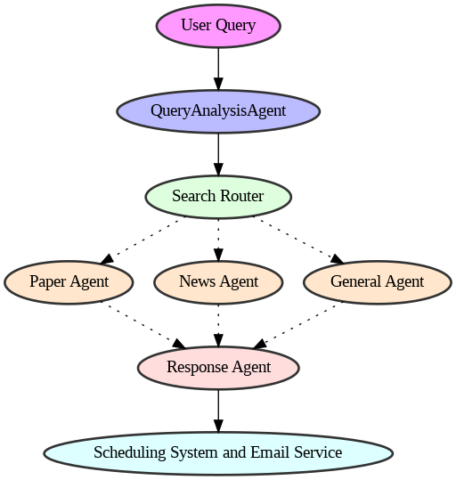

<style>
.custom {
    background-color: #008d8d;
    color: white;
    padding: 0.25em 0.5em 0.25em 0.5em;
    white-space: pre-wrap;       /* css-3 */
    white-space: -moz-pre-wrap;  /* Mozilla, since 1999 */
    white-space: -pre-wrap;      /* Opera 4-6 */
    white-space: -o-pre-wrap;    /* Opera 7 */
    word-wrap: break-word;
}

pre {
    background-color: #027c7c;
    padding-left: 0.5em;
}

</style>

# Multi-Agent Scheduler System

- Author: [Ilgyun Jeong](https://github.com/johnny9210)
- Design: 
- Peer Review: [Mark()](https://github.com/obov), [Taylor(Jihyun Kim)](https://github.com/Taylor0819)
- This is a part of [LangChain Open Tutorial](https://github.com/LangChain-OpenTutorial/LangChain-OpenTutorial)


[](https://colab.research.google.com/github/LangChain-OpenTutorial/LangChain-OpenTutorial/blob/main/19-Cookbook/03-MultiAgentSystem/01-MultiAgentScheduler.ipynb) [](https://github.com/LangChain-OpenTutorial/LangChain-OpenTutorial/blob/main/19-Cookbook/03-MultiAgentSystem/01-MultiAgentScheduler.ipynb)


## Overview

The Multi-Agent Scheduler System represents an innovative approach to automating information retrieval and delivery through a coordinated network of specialized AI agents. At its core, this system transforms simple natural language requests into scheduled, automated search and delivery operations, making it particularly valuable for researchers, analysts, and anyone needing regular, scheduled information updates.

Imagine asking "Find me the latest RAG papers at 7 AM tomorrow." Instead of manually searching and compiling information early in the morning, the system automatically handles the entire process - from understanding your request to delivering a well-formatted email with relevant research papers at precisely 7 AM. This automation eliminates the need for manual intervention while ensuring timely delivery of crucial information.

### System Architecture

The system's architecture is built around five specialized agents, each handling a crucial aspect of the information retrieval and delivery process:

1. `Query Analysis Agent`
   This agent serves as the system's front door, interpreting natural language queries to extract critical information 

2. `Search Router`
   Acting as the system's traffic controller, the Search Router directs queries to the most appropriate specialized search agent:
   
3. `Response Agent`
   This agent transforms raw search results into well-structured, readable content by:

4. `Scheduling System and Email Service`
   The scheduling component manages the temporal aspects of the system:
   This ensures that all operations occur at their specified times without conflicts.
   The system implements a robust email delivery service using yagmail that provides:

### System Flow

The entire process follows this sequence:



This architecture ensures reliable, automated information retrieval and delivery, with each agent optimized for its specific role in the process.

### Table of Contents
- [Overview](#overview)
- [System Architecture](#system-architecture)
- [Environment Setup](#environment-setup)
- [Query Analysis Agent](#query-analysis-agent)
- [Search Router and Specialized Agents](#Search-Router-and-Specialized-Agents)
- [Response Agent](#response-agent)
- [Scheduling System and Email Service](#Scheduling-System-and-Email-Service)  

The system's modular design allows for easy expansion and customization, making it adaptable to various use cases while maintaining consistent performance and reliability. Whether you're tracking research papers, monitoring news, or gathering general information, the Multi-Agent Scheduler System automates the entire process from query to delivery, saving time and ensuring consistent, timely access to important information.

### References
- [How to get NewsAPI](https://newsapi.org)
- [How to get SerpAPI](https://serpapi.com/)
- [How to get Google password](https://support.google.com/accounts/answer/185833?visit_id=638745290390245053-2925662375&p=InvalidSecondFactor&rd=1)

## Environment Setup

Set up the environment. You may refer to [Environment Setup](https://wikidocs.net/257836) for more details.

**[Note]**

- `langchain-opentutorial` is a package that provides a set of easy-to-use environment setup, useful functions and utilities for tutorials.
- You can checkout the [`langchain-opentutorial`](https://github.com/LangChain-OpenTutorial/langchain-opentutorial-pypi) for more details.


```python
%%capture --no-stderr
%pip install langchain-opentutorial
```

```python
# Install required packages
from langchain_opentutorial import package

package.install(
    [
        "langsmith",
        "langchain",
        "chromadb",
        "langchain_chroma",
        "langchain_openai",
        "langchain_community",
        "pytz",
        "google-search-results",
        "yagmail",
        "schedule",
    ],
    verbose=False,
    upgrade=False,
)
```

<pre class="custom">
    [notice] A new release of pip is available: 24.0 -> 25.0
    [notice] To update, run: pip install --upgrade pip
</pre>

```python
# Set environment variables
from langchain_opentutorial import set_env

set_env(
    {
        "OPENAI_API_KEY": "",
        "LANGCHAIN_API_KEY": "",
        "LANGCHAIN_TRACING_V2": "true",
        "LANGCHAIN_ENDPOINT": "https://api.smith.langchain.com",
        "LANGCHAIN_PROJECT": "21-Multi-AgentSchedulerSystem",
        "NEWS_API_KEY": "",
        "SERPAPI_API_KEY": "",
    }
)
```

```python
from dotenv import load_dotenv

load_dotenv(override=True)
```


<pre class="custom">True</pre>


### Query Analysis Agent
The QueryAnalysisAgent serves as the initial interpreter in our multi-agent scheduler system, transforming natural language queries into structured data that other agents can process. This agent employs advanced language understanding capabilities through GPT-4 to accurately parse user intentions and timing requirements.

### Core Components
The agent is built around three essential classes:
- Time Extraction Processor: Handles temporal information
- Task Analysis Engine: Understands search requirements
- Query Coordinator: Combines and validates results


### Core Functionality
The agent performs two primary functions:

1. Time Extraction
```python
def extract_time(self, query: str) -> datetime:
    """Extracts time information from queries"""
    time_extraction_chain = self.time_extraction_prompt | self.llm
    time_str = time_extraction_chain.invoke({"query": query})
    # Converts to standardized datetime format
    return self._process_time(time_str)
```

2. Task Analysis
```python
def analyze_task(self, query: str) -> dict:
    """Analyzes query content for search parameters"""
    task_analysis_chain = self.task_analysis_prompt | self.llm
    response = task_analysis_chain.invoke({"query": query})
    return self._parse_response(response)
```

### Usage Example

```python
# Initialize agent
agent = QueryAnalysisAgent()

# Process a sample query
query = "Find RAG papers tomorrow at 9 AM"  
result = agent.analyze_query(query)

Expected output:
```json
{
    "target_time": "2025-02-06 09:00:00+0000",
    "execution_time": "2025-02-06 08:55:00+0000",
    "task_type": "search",
    "search_type": "research_paper",
    "keywords": ["RAG", "papers"],  
    "requirements": "minimum 5 results",
    "time_sensitivity": "normal",
    "original_query": "Find RAG papers tomorrow at 9 AM", 
    "status": "success"
}
```

This structured approach ensures reliable query interpretation while maintaining flexibility for various query types and formats.

Install and Import Required Libraries

```python
# Cell 1: Importing Required Libraries
from langchain_core.prompts import PromptTemplate
from langchain_openai import ChatOpenAI
from datetime import datetime, timedelta
import pytz
import json
import os
```

The QueryAnalysisAgent class represents a specialized natural language query processor that utilizes OpenAI's language models. Let's break down its core components:
The initialization method sets up the language model with temperature=0 to ensure consistent, deterministic responses:

The setup_prompt_templates method defines two essential templates:

1. Time Extraction Template
This template focuses solely on extracting and standardizing time information from queries.

2. Task Analysis Template
This template structures the query analysis with specific rules:

- Categorizes searches into three types: research_paper, news, or general
- Distinguishes between normal and urgent time sensitivity
- Separates search keywords from temporal terms
- Maintains consistent task typing as "search"

These templates work together to transform natural language queries into structured, actionable data that the rest of the system can process efficiently. The clear separation between time extraction and task analysis allows for precise handling of each aspect of the query.

For example, a query like "Find RAG papers at 7 AM" would be processed to extract both the time (07:00) and the search parameters (research papers about RAG), while filtering out temporal terms from the actual search keywords.

```python
# Cell 2: Class Definition and __init__, setup_prompt_templates Methods
class QueryAnalysisAgent:
    def __init__(self, model_name="gpt-4o"):
        self.llm = ChatOpenAI(model_name=model_name, temperature=0)
        self.setup_prompt_templates()

    def setup_prompt_templates(self):
        self.time_extraction_prompt = PromptTemplate.from_template(
            "Extract time and convert to 24h format from: {query}\nReturn HH:MM only"
        )

        self.task_analysis_prompt = PromptTemplate.from_template(
            """Analyze the query and return only a JSON object. For the query: {query}

        Return this exact format:
        {{
            "task_type": "search",
            "search_type": "research_paper",
            "keywords": ["rag", "papers"],
            "requirements": "minimum 5 results",
            "time_sensitivity": "normal",
            "search_terms": ["rag", "papers"]  # Actual keywords to use for search
        }}

        Rules:
        - search_type must be one of: "research_paper", "news", "general"
        - time_sensitivity must be one of: "normal", "urgent"
        - keywords should include all words from query including time-related terms
        - search_terms should exclude time-related terms and only include actual search keywords
        - task_type should always be "search"
        """
        )
```

Core Methods 1

`extract_time()`
- Functionality: Extracts and processes time information from natural language queries
- Features:
  - Converts various time formats (e.g., "morning 7", "afternoon 3:30") to standardized datetime objects
  - Maintains timezone awareness using pytz for accurate scheduling
  - Automatically schedules for next day if requested time has already passed
  - Strips unnecessary time components (seconds, microseconds) for cleaner scheduling
- Error Handling: Raises ValueError with detailed error messages for invalid time formats
- Returns: UTC-aware datetime object representing the target execution time

```python
# Cell 3: Adding extract_time Method
def extract_time(self, query: str) -> datetime:
    """Extracts time information from the query and returns a datetime object."""
    time_extraction_chain = self.time_extraction_prompt | self.llm
    time_str = time_extraction_chain.invoke({"query": query})

    try:
        # Extract the actual time string from the ChatCompletion response
        time_str = time_str.content.strip()

        # Calculate the next scheduled time based on the current time
        current_time = datetime.now(pytz.utc)
        hour, minute = map(int, time_str.split(":"))

        target_time = current_time.replace(
            hour=hour, minute=minute, second=0, microsecond=0
        )

        # If the extracted time has already passed, set it for the next day
        if target_time <= current_time:
            target_time += timedelta(days=1)

        return target_time
    except Exception as e:
        raise ValueError(f"Time extraction failed: {e}")


# After executing this cell, the method should be added to the class
QueryAnalysisAgent.extract_time = extract_time
```

Core Methods 2

`analyze_task()`
- Functionality: Breaks down queries into structured task components
- Features:
  - Identifies search type (research_paper, news, general)
  - Extracts relevant keywords while filtering temporal terms
  - Determines task urgency (normal vs urgent)
  - Identifies specific requirements (e.g., minimum result count)
- Error Handling: Handles JSON parsing errors and invalid query formats
- Returns: Dictionary containing parsed task information and parameters

```python
# Cell 4: Adding analyze_task Method
def analyze_task(self, query: str) -> dict:
    """Extracts task intent and keywords from the query."""
    task_analysis_chain = self.task_analysis_prompt | self.llm
    response = task_analysis_chain.invoke({"query": query})

    try:
        # Clean response content to ensure valid JSON format
        content = response.content.strip()
        content = content.replace("```json", "").replace("```", "")
        return json.loads(content)
    except json.JSONDecodeError as e:
        print(f"Original response: {response.content}")
        raise ValueError(f"Failed to parse task analysis result: {e}")


# Adding the method to the class
QueryAnalysisAgent.analyze_task = analyze_task
```

Core Methods 3

`analyze_query()`
- Functionality: Combines time extraction and task analysis into a complete query interpretation
- Features:
  - Coordinates between time extraction and task analysis
  - Sets execution time 5 minutes before target time
  - Validates and combines all query components
- Error Handling: Catches and reports errors from both time and task processing
- Returns: Combined dictionary with timing and task information

```python
def analyze_query(self, query: str) -> dict:
    """Performs a full query analysis and returns the results.

    Args:
        query (str): The user query to analyze.

    Returns:
        dict: A dictionary containing the analysis results.
    """
    try:
        # Extract time information
        target_time = self.extract_time(query)

        # Analyze task information
        task_info = self.analyze_task(query)

        # Return the results including all necessary details
        return {
            "target_time": target_time,
            "execution_time": target_time - timedelta(minutes=5),
            "task_type": task_info["task_type"],
            "search_type": task_info["search_type"],  # Newly added
            "keywords": task_info["keywords"],
            "requirements": task_info["requirements"],
            "time_sensitivity": task_info["time_sensitivity"],  # Newly added
            "original_query": query,
            "status": "success",
        }
    except Exception as e:
        return {"status": "error", "error_message": str(e), "original_query": query}


# Adding the method to the class
QueryAnalysisAgent.analyze_query = analyze_query
```

Core Methods 4

`datetime_handler(obj)`
* Functionality: Converts datetime objects to JSON-serializable string format
* Features:
   * Accepts any object and checks if it's a datetime instance
   * Converts datetime to standardized string format (YYYY-MM-DD HH:MM:SS+ZZZZ)
   * Maintains timezone information in the output string
* Error Handling: Raises TypeError with descriptive message for non-datetime objects
* Returns: String representation of datetime in consistent format
* Use Cases:
   * JSON serialization for API responses
   * Database storage of temporal data
   * Logging and debugging timestamp formatting
* Examples:
   * Input: `datetime(2024, 2, 6, 15, 30, tzinfo=pytz.UTC)`
   * Output: `"2024-02-06 15:30:00+0000"`

The function serves as a critical utility for converting Python's datetime objects into a standardized string format that can be easily stored, transmitted, and later reconstructed. This is particularly important in our scheduling system where accurate time representation and timezone awareness are essential for reliable task execution.

```python
# Cell 6: Testing QueryAnalysisAgent
def datetime_handler(obj):
    """Handler to convert datetime objects into JSON serializable strings.

    Args:
        obj: The object to convert.

    Returns:
        str: A formatted datetime string (Format: YYYY-MM-DD HH:MM:SS+ZZZZ).

    Raises:
        TypeError: Raised if the object is not a datetime instance.
    """
    if isinstance(obj, datetime):
        return obj.strftime("%Y-%m-%d %H:%M:%S%z")
    raise TypeError(f"Object of type {type(obj)} is not JSON serializable")
```

Test

```python
def run_query_test():
    """Runs a test for QueryAnalysisAgent and returns the results.

    Returns:
        str: The analysis result in JSON format.
    """
    # Create an instance of QueryAnalysisAgent
    agent = QueryAnalysisAgent()

    # Test query
    test_query = "Find and recommend news related to RAG at 7 AM."

    # Execute query analysis
    result = agent.analyze_query(test_query)

    # Convert the result to JSON format
    return json.dumps(result, indent=2, ensure_ascii=False, default=datetime_handler)


# Execute test and print results
if __name__ == "__main__":
    test_result = run_query_test()
    print("\n=== QueryAnalysisAgent Test Result ===")
    print(test_result)
```

<pre class="custom">
    === QueryAnalysisAgent Test Result ===
    {
      "target_time": "2025-02-08 07:00:00+0000",
      "execution_time": "2025-02-08 06:55:00+0000",
      "task_type": "search",
      "search_type": "news",
      "keywords": [
        "rag",
        "7 AM"
      ],
      "requirements": "minimum 5 results",
      "time_sensitivity": "normal",
      "original_query": "Find and recommend news related to RAG at 7 AM.",
      "status": "success"
    }
</pre>

### Search Router and Specialized Agents

The Search Router system acts as an intelligent traffic controller, directing queries to the most appropriate specialized search agent based on the query analysis. This architecture ensures that each type of search request is handled by an agent specifically optimized for that domain.

### Core Components

```python
class SearchRouter:
    def __init__(self):
        # Initialize specialized search agents
        self.paper_search_agent = PaperSearchAgent()
        self.news_search_agent = NewsSearchAgent()
        self.general_search_agent = GeneralSearchAgent()
```
Each specialized agent is designed to handle specific types of searches:

1. `Paper Search Agent`
This agent specializes in academic paper searches, interfacing with arXiv's API to retrieve scholarly articles and research papers.

2. `News Search Agent`
This agent handles news-related searches, connecting to NewsAPI to gather current events and news articles.

3. `General Search Agent`
This agent manages general web searches using SerpAPI, handling broader information gathering needs.

This routing system ensures that each query is handled by the most appropriate agent while maintaining consistent error handling and result formatting across all search types. The modular design allows for easy addition of new specialized agents as needed, making the system highly extensible and maintainable.

Each agent provides standardized outputs despite their different data sources and search methodologies, enabling seamless integration with the rest of the system components.

`PaperSearchAgent`

This agent focuses on academic content retrieval. It interfaces with the arXiv API to fetch scholarly papers and research documents. Key features include filtering papers by relevance, date ranges, and processing XML responses into structured data. The agent is particularly useful for researchers and academics needing current papers in their field.

```python
import urllib.request
import xml.etree.ElementTree as ET
from typing import Dict, Any, List
from datetime import datetime


class PaperSearchAgent:
    def __init__(self):
        self.base_url = "http://export.arxiv.org/api/query"

    def perform_search(self, query_info: Dict[str, Any]) -> Dict[str, Any]:
        try:
            keywords = self._process_keywords(query_info["keywords"])
            max_results = self._extract_max_results(query_info.get("requirements", ""))

            url = f"{self.base_url}?search_query=all:{keywords}&start=0&max_results={max_results}"
            response = urllib.request.urlopen(url)
            data = response.read().decode("utf-8")

            results = self._parse_arxiv_results(data)

            return {
                "status": "success",
                "results": results,
                "total_found": len(results),
                "returned_count": len(results),
                "query_info": query_info,
            }
        except Exception as e:
            return {
                "status": "error",
                "error_message": str(e),
                "query_info": query_info,
            }

    def _process_keywords(self, keywords: List[str]) -> str:
        # Remove time-related keywords
        filtered_keywords = [
            k
            for k in keywords
            if not any(
                time in k.lower()
                for time in ["hour", "morning", "afternoon", "evening"]
            )
        ]
        return "+".join(filtered_keywords)

    def _extract_max_results(self, requirements: str) -> int:
        import re

        # extracting numbers
        numbers = re.findall(r"\d+", requirements)
        return int(numbers[0]) if numbers else 5

    def _parse_arxiv_results(self, data: str) -> List[Dict[str, Any]]:
        root = ET.fromstring(data)
        results = []

        for entry in root.findall("{http://www.w3.org/2005/Atom}entry"):
            title = entry.find("{http://www.w3.org/2005/Atom}title").text
            url = entry.find("{http://www.w3.org/2005/Atom}id").text
            published = entry.find("{http://www.w3.org/2005/Atom}published").text
            summary = entry.find("{http://www.w3.org/2005/Atom}summary").text

            results.append(
                {
                    "type": "research_paper",
                    "title": title,
                    "url": url,
                    "published_date": published[:10],
                    "summary": summary,
                    "source": "arxiv",
                }
            )

        return results
```

`NewsSearchAgent`

This agent handles current events and news article searches. It connects to NewsAPI to access a wide range of news sources. The agent supports features like language filtering, date range specification, and source selection. It's especially valuable for users needing real-time information or tracking specific topics in the news.

```python
import requests
from urllib.parse import urlencode
import os
from datetime import datetime, timedelta
from typing import Dict, Any


class NewsSearchAgent:
    def __init__(self, api_key: str = None):
        """Initializes a news search agent using NewsAPI.

        NewsAPI follows a REST API structure with the base URL 'https://newsapi.org/v2'.
        It provides two main endpoints:
        - /everything: Searches the entire news archive.
        - /top-headlines: Retrieves the latest top headlines.
        """

        self.api_key = os.environ["NEWS_API_KEY"]

        if not self.api_key:
            raise ValueError("NewsAPI key is required")

        self.base_url = "https://newsapi.org/v2"

    def perform_search(
        self, query_info: Dict[str, Any], max_results: int = 5
    ) -> Dict[str, Any]:
        """Performs a news search based on the given query information.

        Args:
            query_info (Dict[str, Any]): Dictionary containing search parameters.
            max_results (int): Maximum number of results to return.

        Returns:
            Dict[str, Any]: A dictionary containing search results or an error message.
        """
        try:
            # Extract actual search terms (excluding time-related keywords)
            search_terms = query_info.get(
                "search_terms", query_info.get("keywords", [])
            )

            # Check if the search is for real-time news
            is_realtime = query_info.get("time_sensitivity") == "urgent"
            from_date = datetime.now() - timedelta(hours=1 if is_realtime else 24)

            # Configure parameters for the 'everything' endpoint
            params = {
                "q": " ".join(search_terms),  # Exclude time-related keywords
                "from": from_date.strftime("%Y-%m-%d"),
                "sortBy": "publishedAt",
                "language": "en",
                "apiKey": self.api_key,
            }

            # Construct API request URL
            url = f"{self.base_url}/everything?{urlencode(params)}"

            # Send API request
            response = requests.get(url)
            data = response.json()

            # Check response status
            if response.status_code != 200:
                return {
                    "status": "error",
                    "error_message": data.get("message", "Unknown error"),
                    "query_info": query_info,
                }

            # Process and format results
            articles = data.get("articles", [])
            formatted_results = []

            for article in articles[:max_results]:
                formatted_results.append(
                    {
                        "title": article.get("title"),
                        "description": article.get("description"),
                        "url": article.get("url"),
                        "published_at": article.get("publishedAt"),
                        "source": article.get("source", {}).get("name"),
                        "content": article.get("content"),
                    }
                )

            return {
                "status": "success",
                "results": formatted_results,
                "total_results": data.get("totalResults", 0),
                "returned_count": len(formatted_results),
                "search_parameters": {
                    "keywords": query_info["keywords"],
                    "from_date": from_date.strftime("%Y-%m-%d"),
                    "language": "en",
                },
            }

        except Exception as e:
            return {
                "status": "error",
                "error_message": str(e),
                "query_info": query_info,
            }

    def get_top_headlines(
        self, country: str = "us", category: str = None
    ) -> Dict[str, Any]:
        """Fetches top news headlines.

        Args:
            country (str): Country code (default: 'us' for the United States).
            category (str, optional): News category (e.g., business, technology).

        Returns:
            Dict[str, Any]: A dictionary containing top headlines.
        """
        params = {"country": country, "apiKey": self.api_key}

        if category:
            params["category"] = category

        url = f"{self.base_url}/top-headlines?{urlencode(params)}"
        response = requests.get(url)

        return response.json()
```

`GeneralSearchAgent`

This agent manages broader web searches through SerpAPI. It handles diverse information needs that don't fit strictly into academic or news categories. The agent includes features like language-specific searches, result ranking, and content type filtering. It's particularly useful for general research, product information, or any broad information gathering needs.

```python
from langchain_community.utilities import SerpAPIWrapper


class GeneralSearchAgent:
    def __init__(self, serpapi_key: str = None):
        if serpapi_key:
            os.environ["SERPAPI_API_KEY"] = serpapi_key
        self.search = SerpAPIWrapper()

    def setup_search_parameters(self, query_info: Dict[str, Any]) -> List[str]:
        """Constructs search queries for general search."""
        keywords = " ".join(query_info["keywords"])

        # Set up base search queries
        search_queries = [
            f"{keywords} lang:ko",
            keywords,
        ]  # Korean results  # General search

        return search_queries

    def perform_search(
        self, query_info: Dict[str, Any], max_results: int = 5
    ) -> Dict[str, Any]:
        """Performs general search and returns results."""
        try:
            search_queries = self.setup_search_parameters(query_info)
            all_results = []

            for query in search_queries:
                raw_results = self.search.run(query)
                parsed_results = self._parse_general_results(raw_results)
                all_results.extend(parsed_results)

            # Sort by relevance score
            sorted_results = sorted(
                all_results, key=lambda x: x.get("relevance_score", 0), reverse=True
            )[:max_results]

            return {
                "status": "success",
                "results": sorted_results,
                "total_found": len(all_results),
                "returned_count": len(sorted_results),
                "query_info": query_info,
            }

        except Exception as e:
            return {
                "status": "error",
                "error_message": str(e),
                "query_info": query_info,
            }

    def _parse_general_results(self, raw_results: str) -> List[Dict[str, Any]]:
        """Parses general search results."""
        parsed_results = []

        for result in raw_results.split("\n"):
            if not result.strip():
                continue

            parsed_results.append(
                {
                    "type": "general",
                    "title": self._extract_title(result),
                    "content": result,
                    "url": self._extract_url(result),
                    "relevance_score": self._calculate_relevance(result),
                }
            )

        return parsed_results

    def _extract_title(self, result: str) -> str:
        """Extracts title from the result."""
        return result.split(".")[0].strip()[:100]

    def _extract_url(self, result: str) -> str:
        """Extracts URL from the result."""
        import re

        urls = re.findall(r"https?://(?:[-\w.]|(?:%[\da-fA-F]{2}))+[^\s]*", result)
        return urls[0] if urls else ""

    def _calculate_relevance(self, result: str) -> float:
        """Calculates relevance score for the search result."""
        relevance_score = 0.5  # Base score

        # Calculate score based on keyword matching
        keywords = ["official", "guide", "tutorial", "review", "recommendation"]
        lower_result = result.lower()

        for keyword in keywords:
            if keyword in lower_result:
                relevance_score += 0.1

        return min(1.0, relevance_score)
```

`SearchRouter`: The System's Traffic Controller

The `SearchRouter` acts as the central coordinator for our multi-agent search system, intelligently directing queries to specialized search agents based on the type of information needed. Think of it as an expert traffic controller at a busy airport, making sure each "flight" (query) goes to the right "runway" (search agent).

The `SearchRouter`'s modular design allows for easy expansion - new specialized search agents can be added without modifying the existing code, making the system highly adaptable to evolving search needs.

Through this central coordination, the `SearchRouter` ensures efficient and reliable information retrieval across different types of searches while maintaining a consistent interface for the rest of the system.

```python
class SearchRouter:
    def __init__(self):
        # Get API key directly or from environment variables
        # Initialize agents for each search type
        self.paper_search_agent = PaperSearchAgent()
        self.news_search_agent = NewsSearchAgent()
        self.general_search_agent = GeneralSearchAgent()

    def route_and_search(self, query_analysis: dict) -> dict:
        """Routes the search request to appropriate search agent based on query analysis

        Args:
            query_analysis (dict): Query analysis results from QueryAnalysisAgent

        Returns:
            dict: Dictionary containing search results, including success/failure status and related info
        """
        try:
            # Check search type
            search_type = query_analysis.get("search_type")

            # Record start time for logging
            start_time = datetime.now(pytz.utc)

            # Perform search
            if search_type == "research_paper":
                print("Performing research paper search...")
                result = self.paper_search_agent.perform_search(query_analysis)
            elif search_type == "news":
                print("Performing news search...")
                result = self.news_search_agent.perform_search(query_analysis)
            elif search_type == "general":
                print("Performing general search...")
                result = self.general_search_agent.perform_search(query_analysis)
            else:
                return {
                    "status": "error",
                    "error_message": f"Unsupported search type: {search_type}",
                    "original_query": query_analysis.get("original_query"),
                }

            # Calculate search duration
            end_time = datetime.now(pytz.utc)
            search_duration = (end_time - start_time).total_seconds()

            # Add metadata to results
            result.update(
                {
                    "search_type": search_type,
                    "search_duration": search_duration,
                    "search_timestamp": end_time.isoformat(),
                    "original_query": query_analysis.get("original_query"),
                }
            )

            return result

        except Exception as e:
            return {
                "status": "error",
                "error_message": str(e),
                "original_query": query_analysis.get("original_query"),
                "search_type": query_analysis.get("search_type"),
            }
```

### Response Agent
Crafting User-Friendly Information Delivery

The ResponseAgent serves as our system's expert communicator, transforming raw search results into well-structured, readable content that meets users' needs. This agent is particularly crucial as it represents the final step in our information delivery pipeline, ensuring that complex search results are presented in a clear, digestible format.

The agent maintains three specialized prompt templates for different types of content:

Key Features of the Response Agent:

1. Content Customization
   - Adapts formatting based on content type (papers, news, general)
   - Maintains consistent structure while accommodating different information types
   - Ensures appropriate context and explanations are included

2. Email Optimization
   - Creates clear, professional email subjects
   - Structures content for easy scanning and reading
   - Includes all necessary context and source information

The ResponseAgent represents the crucial final step in our information delivery pipeline, ensuring that users receive not just raw data, but well-organized, contextually relevant information that directly addresses their queries. Through its careful formatting and organization, it helps users quickly understand and act upon the information they've requested.

This agent demonstrates how automated systems can maintain a human touch in their communications, making complex information accessible and actionable for end users.

```python
class ResponseAgent:
    def __init__(self):
        self.llm = ChatOpenAI(model="gpt-4o")
        self.setup_prompts()

    def setup_prompts(self):
        # Research paper search prompt
        self.paper_prompt = PromptTemplate.from_template(
            """Please organize the following research paper search results in email format.
            Search term: {query}
            Search results: {results}
            
            Format as follows:
            1. Email subject: "Research Paper Search Results for [search term]"
            2. Body:
               - Greeting
               - "Here are the organized research paper results for your search."
               - Number each paper and format as follows:
                 1. Paper title: [title]
                    - Summary: [core research content and key findings]
                    - URL: [link]
               - Closing remarks
            """
        )

        # News search prompt
        self.news_prompt = PromptTemplate.from_template(
            """Please organize the following news search results in email format.
            Search term: {query}
            Search results: {results}
            
            Format as follows:
            1. Email subject: "Latest News Updates for [search term]"
            2. Body:
               - Greeting
               - "Here are the latest news articles related to your search topic."
               - Number each news item and format as follows:
                 1. [title] - [news source]
                    - Main content: [key content summary]
                    - Published date: [date]
                    - URL: [link]
               - Closing remarks
            """
        )

        # General search prompt
        self.general_prompt = PromptTemplate.from_template(
            """Please organize the following search results in email format.
            Search term: {query}
            Search results: {results}
            
            Format as follows:
            1. Email subject: "Search Results for [search term]"
            2. Body:
               - Greeting
               - "Here are the organized results for your search."
               - Number each result and format as follows:
                 1. [title]
                    - Content: [main content summary]
                    - Source: [website or platform name]
                    - URL: [link]
               - Closing remarks
            """
        )

    def format_results(self, search_results):
        try:
            # Handle cases with no results or errors
            if search_results.get("status") == "error":
                return {
                    "subject": "Search Error Notification",
                    "body": f"An error occurred during search: {search_results.get('error_message', 'Unknown error')}",
                }

            # Handle cases with no results
            if not search_results.get("results"):
                return {
                    "subject": "No Search Results",
                    "body": f"No results found for search term '{search_results.get('original_query', '')}'.",
                }

            # Select prompt based on search type
            search_type = search_results.get("search_type", "general")
            if search_type == "research_paper":
                prompt = self.paper_prompt
            elif search_type == "news":
                prompt = self.news_prompt
            else:
                prompt = self.general_prompt

            # Prepare input for result formatting
            formatted_input = {
                "query": search_results.get("original_query", ""),
                "results": json.dumps(
                    search_results.get("results", []), ensure_ascii=False, indent=2
                ),
            }

            # Generate response through LLM
            response = prompt.format(**formatted_input)
            response = self.llm.invoke(response)

            try:
                # Attempt JSON parsing
                return json.loads(response.content)
            except json.JSONDecodeError:
                # Return default format if JSON parsing fails
                return {
                    "subject": f"Search Results for [{formatted_input['query']}]",
                    "body": response.content,
                }

        except Exception as e:
            return {
                "subject": "Result Processing Error",
                "body": f"An error occurred while processing results: {str(e)}\n\nOriginal query: {search_results.get('original_query', '')}",
            }
```

Test Search System

```python
def test_search_system():
    query_analyzer = QueryAnalysisAgent()
    search_router = SearchRouter()
    response_agent = ResponseAgent()  # Added

    test_queries = [
        "recommend place to eat at seoul in 7 pm",
        "find rag persona paper at 3 pm",
        "find news us president speech in 7 am",
    ]

    for query in test_queries:
        print(f"\n{'='*60}")
        print(f"Test Query: {query}")
        print(f"{'='*60}")

        try:
            query_analysis = query_analyzer.analyze_query(query)
            print("\n1. Query Analysis Results:")
            print(
                json.dumps(
                    query_analysis,
                    indent=2,
                    ensure_ascii=False,
                    default=datetime_handler,
                )
            )

            if query_analysis["status"] != "success":
                print("Query analysis failed!")
                continue

            search_results = search_router.route_and_search(query_analysis)
            print("\n2. Search Results:")
            print(
                json.dumps(
                    search_results,
                    indent=2,
                    ensure_ascii=False,
                    default=datetime_handler,
                )
            )

            # Added: Result formatting
            print("\n3. Formatted Results:")
            formatted_results = response_agent.format_results(search_results)
            print(json.dumps(formatted_results, indent=2, ensure_ascii=False))

        except Exception as e:
            print(f"Error occurred during test: {str(e)}")


if __name__ == "__main__":
    test_search_system()
```

<pre class="custom">
    ============================================================
    Test Query: recommend place to eat at seoul in 7 pm
    ============================================================
    
    1. Query Analysis Results:
    {
      "target_time": "2025-02-08 19:00:00+0000",
      "execution_time": "2025-02-08 18:55:00+0000",
      "task_type": "search",
      "search_type": "general",
      "keywords": [
        "recommend",
        "place",
        "to",
        "eat",
        "at",
        "seoul",
        "in",
        "7",
        "pm"
      ],
      "requirements": "minimum 5 results",
      "time_sensitivity": "normal",
      "original_query": "recommend place to eat at seoul in 7 pm",
      "status": "success"
    }
    Performing general search...
    
    2. Search Results:
    {
      "status": "success",
      "results": [
        {
          "type": "general",
          "title": "['1",
          "content": "['1. Daol Charcoal Grill. (441). Open now · 2. Han-gong-gan. (145). Open now · 3. Bogwangjung Itaewon. (89). Open now · 4. Wolhwa Galbi. (61).', \"The only thing you'll find open will be bakeries like Paris Baguette and Tous Les Jours for Korean style pastries and coffee. Also some cafes.\", \"Folks, let me tell you, when I stumbled upon Seoul's vibrant 24-hour food scene, I thought I'd died and gone to midnight snacking heaven.\", 'This place is a 4 minute walk from Hongik station and open 24hours. The short rib gimbap was my favorite food this entire trip and I probably ate there 7 times ...', \"Gwangjang Market – This old market is one of the greatest culinary destinations in all of Seoul, and if you love food, there's absolutely no way you're going to ...\", 'Myeongdong Kyoja 명동 교자 - serves the most delicious kalguksu in my opinion. The mandu is delicious, too. · Shinseon Seollongtang 신선 설농탕 - ...', \"We've collected the most-often-mentioned 50 places from other articles, including favorites like Mingles, Gwangjang Market, and MOSU Seoul.\", \"I'm even more excited to share my Insider tips on where I think you should go to eat delicious Korean foods.\", \"Try Star Chef, a fusion place. I think it's in Gangnam. Reviews here from Seoul Eats and ZenKimchi, which are good blogs to find other suggestions.\", 'Most hotels and hostels are within walking distance of restaurants. Here are my recommendations though: Itaewon - Foreign food, clubs, and bars.']",
          "url": "",
          "relevance_score": 0.7
        },
        {
          "type": "general",
          "title": "[\"The only thing you'll find open will be bakeries like Paris Baguette and Tous Les Jours for Korean",
          "content": "[\"The only thing you'll find open will be bakeries like Paris Baguette and Tous Les Jours for Korean style pastries and coffee. Also some cafes.\", \"If you wanna eat like a king, I suggest the Bulgogi Whopper but the one with 3 patties. Many locations are open 24 hours. If you're feeling ...\", '1. Daol Charcoal Grill. (441). Open now · 2. Han-gong-gan. (145). Open now · 3. Bogwangjung Itaewon. (89). Open now · 4. Wolhwa Galbi. (61).', 'With favorites like Gwangjang Market, Tosokchon Samgyetang, and Myeongdong Kyoja Main Restaurant and more, get ready to experience the best flavors around ...', \"Folks, let me tell you, when I stumbled upon Seoul's vibrant 24-hour food scene, I thought I'd died and gone to midnight snacking heaven.\", \"We've collected the most-often-mentioned 50 places from other articles, including favorites like Mingles, La Yeon, and Soigné.\", \"Gwangjang Market – This old market is one of the greatest culinary destinations in all of Seoul, and if you love food, there's absolutely no way you're going to ...\", 'Cafe Onion Seongsu manages to balance old and new perfectly, and in doing this, makes for an extremely photogenic hang out. There are multiple ...', 'Traditional Korean soup restaurant specializing in sul lung tang, a beef bone broth soup, with options like beef brisket and a mixed selection excluding tongue.']",
          "url": "",
          "relevance_score": 0.5
        }
      ],
      "total_found": 2,
      "returned_count": 2,
      "query_info": {
        "target_time": "2025-02-08 19:00:00+0000",
        "execution_time": "2025-02-08 18:55:00+0000",
        "task_type": "search",
        "search_type": "general",
        "keywords": [
          "recommend",
          "place",
          "to",
          "eat",
          "at",
          "seoul",
          "in",
          "7",
          "pm"
        ],
        "requirements": "minimum 5 results",
        "time_sensitivity": "normal",
        "original_query": "recommend place to eat at seoul in 7 pm",
        "status": "success"
      },
      "search_type": "general",
      "search_duration": 5.684706,
      "search_timestamp": "2025-02-08T05:01:11.843234+00:00",
      "original_query": "recommend place to eat at seoul in 7 pm"
    }
    
    3. Formatted Results:
    {
      "subject": "Search Results for [recommend place to eat at seoul in 7 pm]",
      "body": "Subject: Search Results for \"recommend place to eat at Seoul in 7 pm\"\n\n---\n\nHello,\n\nHere are the organized results for your search:\n\n1. Daol Charcoal Grill, Han-gong-gan, Bogwangjung Itaewon, Wolhwa Galbi\n   - Content: Popular dining places open now include Daol Charcoal Grill, Han-gong-gan, Bogwangjung Itaewon, and Wolhwa Galbi. Seoul's vibrant 24-hour food scene offers options beyond regular hours, with places like Gwangjang Market and Myeongdong Kyoja also recommended for their culinary delights.\n   - Source: General information\n   - URL: Not provided\n\n2. Bakeries and 24-hour dining options\n   - Content: Besides popular dining places, bakeries like Paris Baguette and Tous Les Jours are open for Korean-style pastries and coffee. For a 24-hour option, consider the Bulgogi Whopper at specific locations. Gwangjang Market and traditional Korean soup restaurants are also notable mentions.\n   - Source: General information\n   - URL: Not provided\n\nThank you for using our service. Should you have any further questions or need additional information, feel free to reach out.\n\nBest regards,\n\n[Your Name]"
    }
    
    ============================================================
    Test Query: find rag persona paper at 3 pm
    ============================================================
    
    1. Query Analysis Results:
    {
      "target_time": "2025-02-08 15:00:00+0000",
      "execution_time": "2025-02-08 14:55:00+0000",
      "task_type": "search",
      "search_type": "research_paper",
      "keywords": [
        "rag",
        "persona",
        "paper",
        "3",
        "pm"
      ],
      "requirements": "minimum 5 results",
      "time_sensitivity": "normal",
      "original_query": "find rag persona paper at 3 pm",
      "status": "success"
    }
    Performing research paper search...
    
    2. Search Results:
    {
      "status": "success",
      "results": [
        {
          "type": "research_paper",
          "title": "PeaCoK: Persona Commonsense Knowledge for Consistent and Engaging\n  Narratives",
          "url": "http://arxiv.org/abs/2305.02364v2",
          "published_date": "2023-05-03",
          "summary": "  Sustaining coherent and engaging narratives requires dialogue or storytelling\nagents to understand how the personas of speakers or listeners ground the\nnarrative. Specifically, these agents must infer personas of their listeners to\nproduce statements that cater to their interests. They must also learn to\nmaintain consistent speaker personas for themselves throughout the narrative,\nso that their counterparts feel involved in a realistic conversation or story.\n  However, personas are diverse and complex: they entail large quantities of\nrich interconnected world knowledge that is challenging to robustly represent\nin general narrative systems (e.g., a singer is good at singing, and may have\nattended conservatoire). In this work, we construct a new large-scale persona\ncommonsense knowledge graph, PeaCoK, containing ~100K human-validated persona\nfacts. Our knowledge graph schematizes five dimensions of persona knowledge\nidentified in previous studies of human interactive behaviours, and distils\nfacts in this schema from both existing commonsense knowledge graphs and\nlarge-scale pretrained language models. Our analysis indicates that PeaCoK\ncontains rich and precise world persona inferences that help downstream systems\ngenerate more consistent and engaging narratives.\n",
          "source": "arxiv"
        },
        {
          "type": "research_paper",
          "title": "In Defense of RAG in the Era of Long-Context Language Models",
          "url": "http://arxiv.org/abs/2409.01666v1",
          "published_date": "2024-09-03",
          "summary": "  Overcoming the limited context limitations in early-generation LLMs,\nretrieval-augmented generation (RAG) has been a reliable solution for\ncontext-based answer generation in the past. Recently, the emergence of\nlong-context LLMs allows the models to incorporate much longer text sequences,\nmaking RAG less attractive. Recent studies show that long-context LLMs\nsignificantly outperform RAG in long-context applications. Unlike the existing\nworks favoring the long-context LLM over RAG, we argue that the extremely long\ncontext in LLMs suffers from a diminished focus on relevant information and\nleads to potential degradation in answer quality. This paper revisits the RAG\nin long-context answer generation. We propose an order-preserve\nretrieval-augmented generation (OP-RAG) mechanism, which significantly improves\nthe performance of RAG for long-context question-answer applications. With\nOP-RAG, as the number of retrieved chunks increases, the answer quality\ninitially rises, and then declines, forming an inverted U-shaped curve. There\nexist sweet points where OP-RAG could achieve higher answer quality with much\nless tokens than long-context LLM taking the whole context as input. Extensive\nexperiments on public benchmark demonstrate the superiority of our OP-RAG.\n",
          "source": "arxiv"
        },
        {
          "type": "research_paper",
          "title": "Speaker Profiling in Multiparty Conversations",
          "url": "http://arxiv.org/abs/2304.08801v2",
          "published_date": "2023-04-18",
          "summary": "  In conversational settings, individuals exhibit unique behaviors, rendering a\none-size-fits-all approach insufficient for generating responses by dialogue\nagents. Although past studies have aimed to create personalized dialogue agents\nusing speaker persona information, they have relied on the assumption that the\nspeaker's persona is already provided. However, this assumption is not always\nvalid, especially when it comes to chatbots utilized in industries like\nbanking, hotel reservations, and airline bookings. This research paper aims to\nfill this gap by exploring the task of Speaker Profiling in Conversations\n(SPC). The primary objective of SPC is to produce a summary of persona\ncharacteristics for each individual speaker present in a dialogue. To\naccomplish this, we have divided the task into three subtasks: persona\ndiscovery, persona-type identification, and persona-value extraction. Given a\ndialogue, the first subtask aims to identify all utterances that contain\npersona information. Subsequently, the second task evaluates these utterances\nto identify the type of persona information they contain, while the third\nsubtask identifies the specific persona values for each identified type. To\naddress the task of SPC, we have curated a new dataset named SPICE, which comes\nwith specific labels. We have evaluated various baselines on this dataset and\nbenchmarked it with a new neural model, SPOT, which we introduce in this paper.\nFurthermore, we present a comprehensive analysis of SPOT, examining the\nlimitations of individual modules both quantitatively and qualitatively.\n",
          "source": "arxiv"
        },
        {
          "type": "research_paper",
          "title": "Personalized Dialogue Generation with Persona-Adaptive Attention",
          "url": "http://arxiv.org/abs/2210.15088v4",
          "published_date": "2022-10-27",
          "summary": "  Persona-based dialogue systems aim to generate consistent responses based on\nhistorical context and predefined persona. Unlike conventional dialogue\ngeneration, the persona-based dialogue needs to consider both dialogue context\nand persona, posing a challenge for coherent training. Specifically, this\nrequires a delicate weight balance between context and persona. To achieve\nthat, in this paper, we propose an effective framework with Persona-Adaptive\nAttention (PAA), which adaptively integrates the weights from the persona and\ncontext information via our designed attention. In addition, a dynamic masking\nmechanism is applied to the PAA to not only drop redundant information in\ncontext and persona but also serve as a regularization mechanism to avoid\noverfitting. Experimental results demonstrate the superiority of the proposed\nPAA framework compared to the strong baselines in both automatic and human\nevaluation. Moreover, the proposed PAA approach can perform equivalently well\nin a low-resource regime compared to models trained in a full-data setting,\nwhich achieve a similar result with only 20% to 30% of data compared to the\nlarger models trained in the full-data setting. To fully exploit the\neffectiveness of our design, we designed several variants for handling the\nweighted information in different ways, showing the necessity and sufficiency\nof our weighting and masking designs.\n",
          "source": "arxiv"
        },
        {
          "type": "research_paper",
          "title": "Improved prompting and process for writing user personas with LLMs,\n  using qualitative interviews: Capturing behaviour and personality traits of\n  users",
          "url": "http://arxiv.org/abs/2310.06391v1",
          "published_date": "2023-10-10",
          "summary": "  This draft paper presents a workflow for creating User Personas with Large\nLanguage Models, using the results of a Thematic Analysis of qualitative\ninterviews. The proposed workflow uses improved prompting and a larger pool of\nThemes, compared to previous work conducted by the author for the same task.\nThis is possible due to the capabilities of a recently released LLM which\nallows the processing of 16 thousand tokens (GPT3.5-Turbo-16k) and also due to\nthe possibility to offer a refined prompting for the creation of Personas. The\npaper offers details of performing Phase 2 and 3 of Thematic Analysis, and then\ndiscusses the improved workflow for creating Personas. The paper also offers\nsome reflections on the relationship between the proposed process and existing\napproaches to Personas such as the data-driven and qualitative Personas.\nMoreover, the paper offers reflections on the capacity of LLMs to capture user\nbehaviours and personality traits, from the underlying dataset of qualitative\ninterviews used for the analysis.\n",
          "source": "arxiv"
        }
      ],
      "total_found": 5,
      "returned_count": 5,
      "query_info": {
        "target_time": "2025-02-08 15:00:00+0000",
        "execution_time": "2025-02-08 14:55:00+0000",
        "task_type": "search",
        "search_type": "research_paper",
        "keywords": [
          "rag",
          "persona",
          "paper",
          "3",
          "pm"
        ],
        "requirements": "minimum 5 results",
        "time_sensitivity": "normal",
        "original_query": "find rag persona paper at 3 pm",
        "status": "success"
      },
      "search_type": "research_paper",
      "search_duration": 1.331628,
      "search_timestamp": "2025-02-08T05:01:30.714947+00:00",
      "original_query": "find rag persona paper at 3 pm"
    }
    
    3. Formatted Results:
    {
      "subject": "Search Results for [find rag persona paper at 3 pm]",
      "body": "Subject: Research Paper Search Results for \"find rag persona paper at 3 pm\"\n\nDear [Recipient's Name],\n\nHere are the organized research paper results for your search.\n\n1. Paper title: \"PeaCoK: Persona Commonsense Knowledge for Consistent and Engaging Narratives\"\n   - Summary: This paper explores the construction of a large-scale persona commonsense knowledge graph, PeaCoK, with around 100K human-validated persona facts. It aims to sustain coherent and engaging narratives by enabling dialogue agents to infer personas of listeners and maintain consistent speaker personas. The PeaCoK graph schematizes five dimensions of persona knowledge, which helps in generating more consistent and engaging narratives.\n   - URL: [PeaCoK Paper](http://arxiv.org/abs/2305.02364v2)\n\n2. Paper title: \"In Defense of RAG in the Era of Long-Context Language Models\"\n   - Summary: This paper revisits retrieval-augmented generation (RAG) in the context of long-context language models (LLMs). It introduces an order-preserve retrieval-augmented generation (OP-RAG) mechanism that enhances RAG's performance in long-context question-answer applications. The study finds that OP-RAG can achieve higher answer quality with fewer tokens than long-context LLMs.\n   - URL: [RAG Defense Paper](http://arxiv.org/abs/2409.01666v1)\n\n3. Paper title: \"Speaker Profiling in Multiparty Conversations\"\n   - Summary: The research explores Speaker Profiling in Conversations (SPC), aiming to summarize persona characteristics for individual speakers in dialogues. It introduces a new dataset, SPICE, and evaluates various baselines with a neural model named SPOT. The paper discusses the tasks of persona discovery, persona-type identification, and persona-value extraction.\n   - URL: [Speaker Profiling Paper](http://arxiv.org/abs/2304.08801v2)\n\n4. Paper title: \"Personalized Dialogue Generation with Persona-Adaptive Attention\"\n   - Summary: This paper presents a Persona-Adaptive Attention (PAA) framework for persona-based dialogue systems, which balances weights between context and persona. The framework uses dynamic masking to drop redundant information and prevent overfitting. The PAA approach excels in low-resource settings and performs equivalently well compared to models trained on full data.\n   - URL: [Persona-Adaptive Attention Paper](http://arxiv.org/abs/2210.15088v4)\n\n5. Paper title: \"Improved prompting and process for writing user personas with LLMs, using qualitative interviews\"\n   - Summary: The paper proposes a workflow for creating User Personas with Large Language Models, using thematic analysis of qualitative interviews. It improves prompting and expands the pool of themes using a recently released LLM. The paper discusses the workflow's phases and provides reflections on the LLMs' ability to capture user behaviors and personality traits.\n   - URL: [User Personas with LLMs Paper](http://arxiv.org/abs/2310.06391v1)\n\nPlease let me know if there is anything else you need.\n\nBest regards,\n\n[Your Name]"
    }
    
    ============================================================
    Test Query: find news us president speech in 7 am
    ============================================================
    
    1. Query Analysis Results:
    {
      "target_time": "2025-02-08 07:00:00+0000",
      "execution_time": "2025-02-08 06:55:00+0000",
      "task_type": "search",
      "search_type": "news",
      "keywords": [
        "news",
        "us",
        "president",
        "speech",
        "in",
        "7",
        "am"
      ],
      "requirements": "minimum 5 results",
      "time_sensitivity": "normal",
      "original_query": "find news us president speech in 7 am",
      "status": "success"
    }
    Performing news search...
    
    2. Search Results:
    {
      "status": "success",
      "results": [
        {
          "title": "Pelosi: Trump Not Sophisticated Enough to Understand What Is Happening",
          "description": "On Thursday on MSNBC’s “Andrea Mitchell Reports,” Rep. Nancy Pelosi (D-CA) said President Donald Trump is not sophisticated enough in terms of the intelligence community to understand what is happening when they comply with his executive orders. Pelosi said, …",
          "url": "https://freerepublic.com/focus/f-news/4295616/posts",
          "published_at": "2025-02-07T01:16:20Z",
          "source": "Freerepublic.com",
          "content": "Skip to comments.\r\nPelosi: Trump Not Sophisticated Enough to Understand What Is HappeningBreitbart ^\r\n | 02/06/2025\r\n | Pam Key\r\nPosted on 02/06/2025 5:16:20 PM PST by ChicagoConservative27\r\nOn Thurs… [+5045 chars]"
        },
        {
          "title": "Share Market Highlights 7 February 2025: Sensex, Nifty settle lower after RBI cuts repo rate to 6.25%; FIIs continue selling spree",
          "description": "Sensex, Nifty updates on 7 February 2025: Equity markets closed lower on Wednesday despite the Reserve Bank of India’s first rate cut since May 2020, as investors remained concerned about global trade tensions and continued foreign institutional investor (FII…",
          "url": "https://www.thehindubusinessline.com/markets/stock-market-updates-february-7-2025/article69188765.ece",
          "published_at": "2025-02-07T01:15:20Z",
          "source": "BusinessLine",
          "content": "<li></li>\r\nFebruary 07, 2025 17:07Stock market live updates today: Markets end lower as RBIs rate cut fails to impress; FIIs continue selling spree \r\nEquity markets closed lower on Wednesday despite … [+141894 chars]"
        }
      ],
      "total_results": 2,
      "returned_count": 2,
      "search_parameters": {
        "keywords": [
          "news",
          "us",
          "president",
          "speech",
          "in",
          "7",
          "am"
        ],
        "from_date": "2025-02-07",
        "language": "en"
      },
      "search_type": "news",
      "search_duration": 0.462204,
      "search_timestamp": "2025-02-08T05:01:55.353650+00:00",
      "original_query": "find news us president speech in 7 am"
    }
    
    3. Formatted Results:
    {
      "subject": "Search Results for [find news us president speech in 7 am]",
      "body": "Subject: Latest News Updates for \"find news us president speech in 7 am\"\n\n---\n\nHello,\n\nHere are the latest news articles related to your search topic.\n\n1. Pelosi: Trump Not Sophisticated Enough to Understand What Is Happening - Freerepublic.com  \n   - Main content: Rep. Nancy Pelosi commented on President Donald Trump's understanding of the intelligence community and his executive orders, suggesting he lacks the sophistication required to fully grasp the implications.\n   - Published date: February 7, 2025\n   - URL: [https://freerepublic.com/focus/f-news/4295616/posts](https://freerepublic.com/focus/f-news/4295616/posts)\n\n2. Share Market Highlights 7 February 2025: Sensex, Nifty settle lower after RBI cuts repo rate to 6.25%; FIIs continue selling spree - BusinessLine  \n   - Main content: Despite the Reserve Bank of India's rate cut, the Sensex and Nifty closed lower, with investor concerns over global trade tensions and ongoing foreign institutional investor selling.\n   - Published date: February 7, 2025\n   - URL: [https://www.thehindubusinessline.com/markets/stock-market-updates-february-7-2025/article69188765.ece](https://www.thehindubusinessline.com/markets/stock-market-updates-february-7-2025/article69188765.ece)\n\nThank you for using our service. If you have any other search queries, feel free to reach out.\n\nBest regards,  \n[Your Name]"
    }
</pre>

### Scheduling System and Email Service

The `ScheduledSearchSystem` manages the complete lifecycle of search tasks, from scheduling to result delivery. Here's its core structure and functionality:

### Key Components

1. Collection Management
2. Task Scheduling
3. Search Execution
4. Email Delivery


The system uses threading for non-blocking operation and includes comprehensive logging for monitoring task progress and debugging issues.

```python
import schedule
import time
import yagmail
import chromadb
from chromadb.config import Settings
import threading
import time
from queue import Queue


class ScheduledSearchSystem:
    def __init__(self, email_config: Dict[str, Any]):
        print(f"\n[{self._get_current_time()}] Initializing system...")
        self.query_analyzer = QueryAnalysisAgent()
        self.search_router = SearchRouter()
        self.response_agent = ResponseAgent()
        self.client = chromadb.PersistentClient(path="./search_data")

        # Email configuration
        self.email_config = email_config
        self.yag = yagmail.SMTP(email_config["username"], email_config["password"])
        print(f"[{self._get_current_time()}] Email client configuration complete")

        self.scheduled_tasks = {}
        self.setup_collections()

        # Add completion flag
        self.is_completed = False
        self.completion_event = threading.Event()

        # Start scheduler
        self.scheduler_thread = threading.Thread(target=self._run_scheduler)
        self.scheduler_thread.daemon = True
        self.scheduler_thread.start()
        print(f"[{self._get_current_time()}] System initialization complete\n")

    def _get_current_time(self):
        """Return current time as string"""
        return datetime.now().strftime("%Y-%m-%d %H:%M:%S")

    def setup_collections(self):
        """Set up ChromaDB collections"""
        print(f"[{self._get_current_time()}] Starting ChromaDB collection setup...")
        self.results_collection = self.client.get_or_create_collection(
            name="search_results", metadata={"description": "Raw search results"}
        )

        self.formatted_collection = self.client.get_or_create_collection(
            name="formatted_responses",
            metadata={"description": "Formatted responses for email delivery"},
        )

        self.schedule_collection = self.client.get_or_create_collection(
            name="scheduled_tasks",
            metadata={"description": "Scheduled search and email tasks"},
        )
        print(f"[{self._get_current_time()}] ChromaDB collection setup complete")

    def schedule_task(self, query: str, user_email: str) -> Dict[str, Any]:
        """Schedule a task"""
        try:
            print(f"\n[{self._get_current_time()}] Starting new task scheduling...")
            print(f"Query: {query}")
            print(f"Email: {user_email}")

            # Query analysis
            query_analysis = self.query_analyzer.analyze_query(query)
            execution_time = query_analysis["execution_time"]
            target_time = query_analysis["target_time"]

            print(f"Scheduled search execution time: {execution_time}")
            print(f"Scheduled email delivery time: {target_time}")

            # Generate task ID
            schedule_id = f"task_{datetime.now(pytz.UTC).timestamp()}"
            print(f"Generated task ID: {schedule_id}")

            # Save task information
            task_info = {
                "query": query,
                "email": user_email,
                "execution_time": execution_time.isoformat(),
                "target_time": target_time.isoformat(),
                "search_type": query_analysis["search_type"],
                "status": "scheduled",
            }

            self.scheduled_tasks[schedule_id] = task_info

            # Save to ChromaDB
            print(
                f"[{self._get_current_time()}] Saving task information to ChromaDB..."
            )
            self.schedule_collection.add(
                documents=[json.dumps(task_info)],
                metadatas=[{"type": "schedule", "status": "pending"}],
                ids=[schedule_id],
            )
            print(f"[{self._get_current_time()}] Task information saved")

            # Schedule search execution
            execution_time_str = execution_time.strftime("%H:%M")
            schedule.every().day.at(execution_time_str).do(
                self.execute_search, schedule_id=schedule_id
            ).tag(schedule_id)

            print(f"[{self._get_current_time()}] Search task scheduling complete")

            return {
                "status": "success",
                "message": "Task successfully scheduled",
                "schedule_id": schedule_id,
                "execution_time": execution_time,
                "target_time": target_time,
            }

        except Exception as e:
            print(f"[{self._get_current_time()}] Task scheduling failed: {str(e)}")
            return {"status": "error", "error_message": str(e)}

    def execute_search(self, schedule_id: str) -> bool:
        """Execute search"""
        try:
            print(
                f"\n[{self._get_current_time()}] Starting search execution (ID: {schedule_id})"
            )

            task_info = self.scheduled_tasks.get(schedule_id)
            if not task_info:
                print(f"[{self._get_current_time()}] Task information not found")
                return False

            print(f"[{self._get_current_time()}] Analyzing search query...")
            query_analysis = self.query_analyzer.analyze_query(task_info["query"])

            print(f"[{self._get_current_time()}] Performing search...")
            search_results = self.search_router.route_and_search(query_analysis)

            print(f"[{self._get_current_time()}] Formatting search results...")
            formatted_response = self.response_agent.format_results(search_results)

            # Save results
            print(f"[{self._get_current_time()}] Saving search results to ChromaDB...")
            response_id = f"response_{schedule_id}"
            self.formatted_collection.add(
                documents=[json.dumps(formatted_response)],
                metadatas=[
                    {
                        "schedule_id": schedule_id,
                        "email": task_info["email"],
                        "target_time": task_info["target_time"],
                    }
                ],
                ids=[response_id],
            )
            print(f"[{self._get_current_time()}] Search results saved")

            # Schedule email delivery
            target_time = datetime.fromisoformat(task_info["target_time"])
            target_time_str = target_time.strftime("%H:%M")

            schedule.every().day.at(target_time_str).do(
                self.send_email, schedule_id=schedule_id
            ).tag(f"email_{schedule_id}")

            print(
                f"[{self._get_current_time()}] Email delivery scheduled (Time: {target_time_str})"
            )
            return True

        except Exception as e:
            print(f"[{self._get_current_time()}] Search execution failed: {str(e)}")
            return False

    def send_email(self, schedule_id: str) -> bool:
        """Send email"""
        try:
            print(
                f"\n[{self._get_current_time()}] Starting email delivery (ID: {schedule_id})"
            )

            response_id = f"response_{schedule_id}"
            print(f"[{self._get_current_time()}] Retrieving saved search results...")
            response_results = self.formatted_collection.get(ids=[response_id])

            if not response_results["documents"]:
                print(f"[{self._get_current_time()}] Search results not found")
                return False

            formatted_response = json.loads(response_results["documents"][0])
            metadata = response_results["metadatas"][0]

            print(f"[{self._get_current_time()}] Sending email...")
            print(f"Recipient: {metadata['email']}")
            print(f"Subject: {formatted_response['subject']}")

            self.yag.send(
                to=metadata["email"],
                subject=formatted_response["subject"],
                contents=formatted_response["body"],
            )
            print(f"[{self._get_current_time()}] Email sent successfully")

            # Update task status
            print(f"[{self._get_current_time()}] Updating task status...")
            task_info = self.scheduled_tasks[schedule_id]
            task_info["status"] = "completed"
            self.schedule_collection.update(
                documents=[json.dumps(task_info)], ids=[schedule_id]
            )

            # Clear schedule
            schedule.clear(f"email_{schedule_id}")
            print(f"[{self._get_current_time()}] Task completion processing complete\n")

            # Set completion flag
            self.is_completed = True
            self.completion_event.set()
            print(
                f"[{self._get_current_time()}] All tasks completed. Shutting down system.\n"
            )

            return True

        except Exception as e:
            print(f"[{self._get_current_time()}] Email delivery failed: {str(e)}")
            return False

    def _run_scheduler(self):
        """Run scheduler"""
        print(f"[{self._get_current_time()}] Scheduler started...")
        while not self.is_completed:
            schedule.run_pending()
            time.sleep(1)  # Check every second

    def wait_for_completion(self, timeout=None):
        """Wait for task completion"""
        try:
            completed = self.completion_event.wait(timeout=timeout)
            if not completed:
                print(f"[{self._get_current_time()}] Task completion timeout")
            if hasattr(self, "yag"):
                self.yag.close()
        except KeyboardInterrupt:
            print(f"\n[{self._get_current_time()}] Terminated by user.")
            if hasattr(self, "yag"):
                self.yag.close()
```

### Multi-Agent Scheduler System Usage Guide
The work starts 5 minutes before the work request time.

1. Email Configuration
- Enable Gmail 2-Step Verification
- Generate App Password: https://myaccount.google.com/security > 2-Step Verification > App passwords
```python
email_config = {
    "username": "your_email@gmail.com",
    "password": "your_app_password",  # Gmail app password
}
```

2. Initialize System and Schedule Task
```python
# Initialize system
system = ScheduledSearchSystem(email_config)

# Schedule task
result = system.schedule_task(
    query="find AI papers at 9 AM",  # Search query to execute
    user_email="your_email@gmail.com"  # Email to receive results
)
```

3. Wait for Completion
```python
# Wait for task completion (max 4 hours)
system.wait_for_completion(timeout=14400)
```

Search results will be automatically emailed to the specified address upon completion.

The system supports various query types:
- Research papers: "find RAG papers at 7 AM"
- News: "find AI news at 9 AM"
- General search: "find restaurants in Seoul at 6 PM"


### Note
You need to get app password from google account.
- [How to get Google password](https://support.google.com/accounts/answer/185833?visit_id=638745290390245053-2925662375&p=InvalidSecondFactor&rd=1)

```python
# System configuration
email_config = {
    "username": "@gmail.com",
    "password": "",
}

print("\n=== Starting Scheduling System Test ===\n")

# Initialize system
system = ScheduledSearchSystem(email_config)

# Schedule task
result = system.schedule_task(
    query="find Modular RAG paper at 14:15 PM",  # Example: 7:45 PM
    user_email="@gmail.com",
)

print("\n=== Scheduling Result ===")
print(json.dumps(result, indent=2, default=str))
print("\n=== Task will execute at scheduled time... ===\n")

# Wait for task completion (maximum 4 hours)
system.wait_for_completion(timeout=14400)  # 4 hours = 14400 seconds
```

<pre class="custom">
    === Starting Scheduling System Test ===
    
    
    [2025-02-08 14:08:50] Initializing system...
    [2025-02-08 14:08:50] Email client configuration complete
    [2025-02-08 14:08:50] Starting ChromaDB collection setup...
    [2025-02-08 14:08:50] ChromaDB collection setup complete
    [2025-02-08 14:08:50] Scheduler started...
    [2025-02-08 14:08:50] System initialization complete
    
    
    [2025-02-08 14:08:50] Starting new task scheduling...
    Query: find Modular RAG paper at 14:15 PM
    Email: jik9210@gmail.com
    Scheduled search execution time: 2025-02-08 14:10:00+00:00
    Scheduled email delivery time: 2025-02-08 14:15:00+00:00
    Generated task ID: task_1738991333.292786
    [2025-02-08 14:08:53] Saving task information to ChromaDB...
    [2025-02-08 14:08:53] Task information saved
    [2025-02-08 14:08:53] Search task scheduling complete
    
    === Scheduling Result ===
    {
      "status": "success",
      "message": "Task successfully scheduled",
      "schedule_id": "task_1738991333.292786",
      "execution_time": "2025-02-08 14:10:00+00:00",
      "target_time": "2025-02-08 14:15:00+00:00"
    }
    
    === Task will execute at scheduled time... ===
    
    
    [2025-02-08 14:10:00] Starting search execution (ID: task_1738991333.292786)
    [2025-02-08 14:10:00] Analyzing search query...
    [2025-02-08 14:10:03] Performing search...
    Performing research paper search...
    [2025-02-08 14:10:04] Formatting search results...
</pre>

    Insert of existing embedding ID: response_task_1738991333.292786
    Add of existing embedding ID: response_task_1738991333.292786
    

    [2025-02-08 14:10:18] Saving search results to ChromaDB...
    [2025-02-08 14:10:18] Search results saved
    [2025-02-08 14:10:18] Email delivery scheduled (Time: 14:15)
    
    [2025-02-08 14:15:00] Starting email delivery (ID: task_1738991333.292786)
    [2025-02-08 14:15:00] Retrieving saved search results...
    [2025-02-08 14:15:00] Sending email...
    Recipient: jik9210@gmail.com
    Subject: Search Results for [find Modular RAG paper at 14:15 PM]
    

```python

```
